**Day 1**
===

- 학습 강의 : P Stage Start! 1 ~ 2강
- Special Mission : EDA

## 1. 강의 복습
### **P Stage Start!** <br/>

**1강 : Competition with AI Stages!**
- Pstage를 통해 전처리, 학습, 추론까지의 과정을 학습할 수 있다.
- 데이터 분석하기 전에 항상 Overview(개요)를 살펴보고 방향성을 잡는 것이 중요하다. -> **Problem Definition(문제 정의)**

<br/>

**2강 : Image Classification & EDA**
- 
<br/>


## 2. 새로 알게된 내용 / 고민한 내용 (강의, 과제, 퀴즈)
- Special Mission인 EDA를 하면서 Problem Definition을 해보고 pandas와 matplotlib를 이용하여 아주 간단하게 시각화를 해봤다.(남녀 비율, 주어진 나이 범위에서의 비율 등)
- Problem Definition : 주어진 문제는 코로나 시대에 적은 인적 자원만을 활용하기 위해 카메라로 비춰진 사람 얼굴 이미지를 통해 마스크를 썼는지와 제대로 썼는지 판별하는 것이 목적이다.
  - data를 살펴보았을 때 train.csv에는 id, gender, race, age, image path에 관한 정보만 존재했다. 결국 우리가 원하는 Input X는 image path 내에 존재하는 7장의 사진이 된다.(5장은 마스크를 올바르게 쓴 이미지, 1장은 마스크를 쓰지 않은 이미지, 1장은 마스크를 제대로 쓰지 않은 이미지)
  - Output Y는 gender, age, mask의 검사 유무에 따라 총 18개의 클래스가 존재한다.
  - 결론적으로 우리는 이미지가 주어졌을 때 성별, 나이, 마스크의 유무, 혹은 잘 썼는지를 판별할 수 있는 모델을 만들어야 한다.

## 3. 참고할 만한 자료
- **부스트코스 제공 자료**
  - [Data Visualization KR 페이스북 그룹](https://www.facebook.com/groups/2542191496047967?group_view_referrer=search)
  - [Aptos 대회 데이터 분석 커널](https://www.kaggle.com/ratthachat/aptos-eye-preprocessing-in-diabetic-retinopathy)
  - [시각화 라이브러리 소개 ](https://mode.com/blog/python-data-visualization-libraries/)
  - [쇼핑 데이터 EDA, Melanoma Classification EDA](https://www.kaggle.com/andradaolteanu/siim-melanoma-competition-eda-augmentations) 
  - [Bengali.AI 대회 전처리 시각화 커널](https://www.kaggle.com/haqishen/gridmask)


## 4. 피어세션
- 김현욱 캠퍼님의 캐글 튜토리얼 및 당일 강의 요약 발표
- 주어진 데이터에서 데이터 불균형을 어떻게 해결하면 좋을까에 대한 토론(7개의 이미지 불균형)
- 라벨링에 대한 토론
- 자세한 내용은 [Peer Session](https://github.com/round26/round26/wiki/Week4_Day1) 참조

---
---

**Day 2**
===

- 학습 강의 : Data Feeding 3 ~ 4강
- Special Mission : Dataset / Data Generation
- 예시 코드 : Special Mission - EDA

## 1. 강의 복습
### **Data Feeding** <br/>

**3강 : Dataset**
- 문제 정의를 통해 얻은 방향성을 적용시킨 데이터셋이 필요하다.
- Vanila Data를 모델이 좋아하는 형태의 Dataset으로 만드는 과정인 Data processing 과정이 필요하다.
- Data Science에서 가장 많은 비중을 차지하는 부분이 Pre-processing(전처리) 부분이다.
  - 정형 데이터의 경우 필드 자체의 의미를 모르는 경우도 존재하고 이상한 값(이상치), NULL 값이 들어가 있는 경우가 존재한다.
  - 좋은 데이터를 만드는 것이 중요하다. -> 모델의 성능 개선에도 큰 효과가 있다.
- 이미지 메타 데이터의 경우에서 이미지 내의 Target만 bounding box로 뽑아내서 학습한다면 좀 더 나은 결과를 얻을 수 있다.

- Resize 기법을 이용해 적당한 크기로 사이즈를 변경한다. -> 작업의 효율화
- 도메인, 데이터 형식에 따라 전처리 하는 방식이 매우 다양하다.
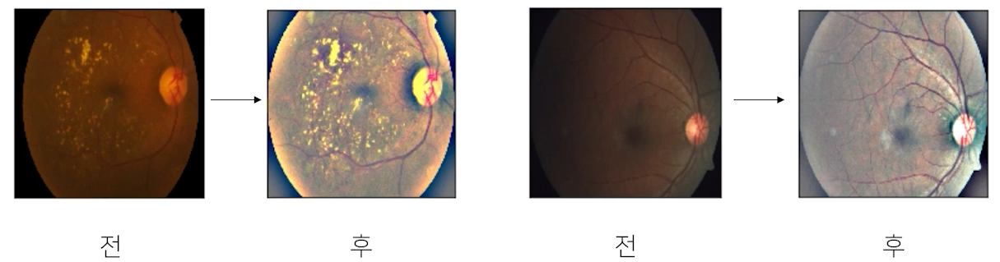
  - ex) 메디컬의 경우 좀 더 밝게 전처리를 해줌으로써 질병 발견 확률을 높일 수 있다.
- Generalization
  - Train/Validation : 훈련 셋 중 일정 부분을 분리해서 검증셋으로 활용 -> 학습에 이용되지 않은 분포가 필요하고 이 분포를 통해 기학습된 모델의 일반화에 대해 확인할 수 있다.
  - Data Augumentation : 주어진 데이터가 가질 수 있는 Case(경우), State(상태)의 다양성
  - torchvision.transforoms : RandomCrop, Flip 함수 이용 -> 마스크의 경우 VerticalFlip이 필요할까?
    - 발열 체크나 마스크 체크를 하는데 거꾸로 찍히는 경우가 있을까를 고려해보면 굳이 필요하지 않다. -> 이러한 변형들이 과연 유용하게 작용될 것인지 고려!!
  - Albumenatations : 이미지 변형하는데 transforms 보다 좀 더 빠르고 다양하다.
- 위의 기법들이 항상 좋은 결과만을 가져다 주는 것은 아니다. 결론적으로 문제 정의를 통해 방향성을 얻고 방향성을 가진 상태에서, 주어진 데이터에 이런 기법을 적용하면 다양성을 얻을 수 있겠다라고 가정하고 **실험으로 증명해야 한다.** 

<br/>

**4강 : Data Generation**
- Dataset을 어떻게 하면 효율적으로 뽑아낼 수 있을까, 데이터를 잘 만들어 준다는 것이 무엇을 의미할까? -> **Data Feeding**
- Feed : 대상의 상태를 고려해서 적정한 양을 준다.
- 모델 자체가 처리할 수 있는 양을 늘리는 것(GPU를 늘린다)은 힘든 부분이기 때문에 모델의 처리량만큼 Data generaing을 하는 것이 가장 중요하다.
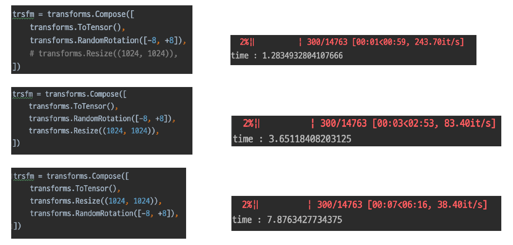 
  - 그림과 같이 Dataset을 생성할 때 Resize를 하고 Rotation하는 것과 Rotation을 하고 Resize하는 것은 시간 차이가 많이 나는 것을 확인할 수 있다.(Rotation에 들어가는 이미지의 크기가 다르기 때문)
  - 이러한 것을 고려하면서 Dataset을 만들어야 한다.
- `from torch.utils.data import Dataset`을 통해 Dataset 클래스를 import 하고 내가 만들 클래스에 상속해준다. 만들어 줄 클래스에는 `__init__, __getitem__, __len__` method를 정의해준다.
- Data generating을 좀 더 효율적으로 할 수 있도록 DataLoader 클래스가 존재한다.
- Data generating 속도가 느리다면 CPU 성능이 중요하게 작용할 수 있다.

<br/>

## 2. 새로 알게된 내용 / 고민한 내용 (강의, 과제, 퀴즈)
- `from glob import glob` 를 통해 폴더 내 파일들을 가져올 수 있다.
- `os.listdir(...)` : path 내에 파일과 디렉토리를 리스트 형태로 반환, `os.path.splitext(...)` : 파일을 확장자명으로 분리한다.(abc.jpg -> [abc, .jpg]), `os.path.join(...)` : 운영체제에 맞게 path들을 합쳐주는 함수


## 3. 참고할 만한 자료
- **부스트코스 제공 자료**
  - [Albumentation](https://albumentations.ai/)
  - [Dataset, DataLoader Tutorials](https://pytorch.org/tutorials/beginner/data_loading_tutorial.html )
  - [catalyst](https://github.com/catalyst-team/catalyst)
  - [깃헙 레포지토리](https://github.com/utkuozbulak/pytorch-custom-dataset-examples) 

## 4. 피어세션
- 이예빈 캠퍼님의 당일 강의 요약
- Pstage에서 어떤 모델을 쓰면 좋을지에 대한 토론
- 자세한 내용은 [Peer Session](https://github.com/round26/round26/wiki/Week4_Day2) 참조

---
---

**Day 3**
===

- 학습 강의 : Model 5 ~ 6강
- Special Mission : Model
- 예시 코드 : Special Mission - Dataset / Data Generation

## 1. 강의 복습
### **Data Feeding** <br/>

**5강 : Model 1 - Model with Pytorch**
- Model : 데이터셋을 이용해 원하는 출력을 만들어주는 것 
  - In general, **a model** is an informative **representation** of an objectm, person or **system.** -> ex) system은 이미지라는 차원을 우리가 원하는 클래스로 변환해주는 것
- PyTorch : Low-level, Pythonic, Flexibility
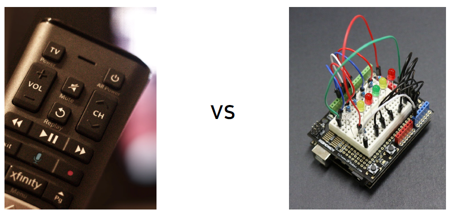
- nn.Module : Pytorch 모델의 모든 레이어는 nn.Module 클래스를 따른다.
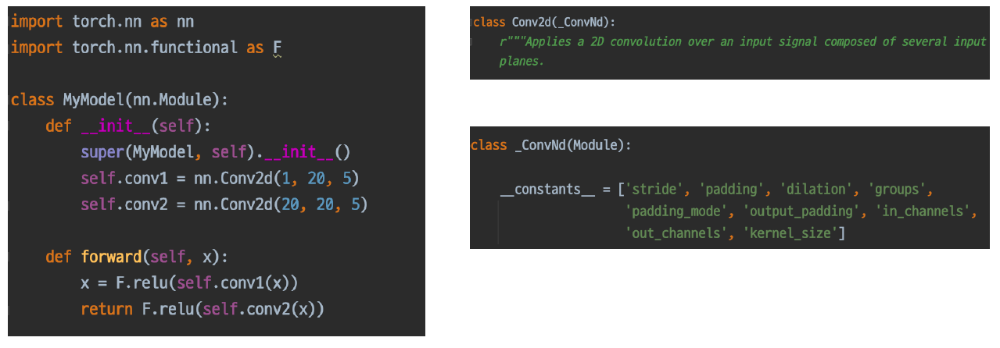
  - `modules()` 라는 함수를 통해 module 내 module 들을 모두 불러올 수 있다.
  - `forward` 함수는 모델(모듈)이 호출되었을 때 실행 되는 함수를 정의한다. 
- **모든 nn.Module은 child modules를 가질 수 있다.** 또한 모델을 정의하는 순간 그 모델과 연결된 모든 module을 확인할 수 있다.
- **모든 nn.Module은 forward() 함수를 가진다.** 또한 정의한 모델의 forward()를 실행하면 그 모델에 연결된 모든 module의 forward()도 함께 실행된다.
- Parameters : module은 parameter의 저장소로 볼 수 있다.
  - state_dict(), parameters() 함수로 parameter들을 확인할 수 있다.
  - 각 모델 parameter들은 data, grad, requires_grad 변수 등을 가지고 있다.

<br/>

**6강 : Model 2 - Pretrained Model**
- ImageNet -> 획기적인 알고리즘 개발과, 검증을 위해 높은 품질의 데이터 셋은 필수적이다.
- Pretrained Model의 배경 : 모델 일반화를 위해 매번 수 많은 이미지를 학습시키는 것은 까다롭고 비효율적이다. 
  - 좋은 품질, 대용량 데이터로 학습한 모델 -> 이 모델을 바탕으로 내 목적에 맞게 다듬어서 사용
- torchvision.models 혹은 TIMM에 많은 Pretrained Model이 존재
- CNN base 모델 구조(simple) : Input + CNN Backbone + Classifier -> Output
  - fc(fully connected) layer == classifier
- ImageNet Pretraining : 실생활에 존재하는 이미지를 1000개의 다른 Class로 구분하자
  - Pretraining 할 때 설정했던 문제와 현재 문제와의 유사성을 고려
- Case by Case
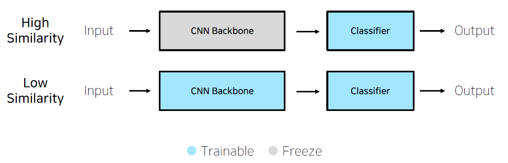
  - Case 1. 문제를 해결하기 위한 학습 데이터가 충분하다. 
    - 높은 유사성을 가질 경우 Backbone 모델을 freezing 하고 Classifier만 변경하는 것을 Feature extraction 이라고 한다.
    - 낮은 유사성을 가져서 Backbone 모델 부분까지 조정하는 경우를 Fine tuning 이라고 한다. 
  - Case 2. 학습 데이터가 충분하지 않은 경우
    - 낮은 유사성을 가진 경우에는 하지 않는 것이 좋을 수도 있다.(underfitting, overfitting 될 확률이 높다.

<br/>

## 2. 새로 알게된 내용 / 고민한 내용 (강의, 과제, 퀴즈)
- glob를 이용해서 이미지를 불러올 수 있는데 이 때 **/*의 형식으로 부르면 주어진 path 내에 모든 디렉토리와 파일들을 가져올 수 있다.
- Albumentations를 사용해서 이미지에 좀 더 다양한 변화를 줄 수 있다.

## 3. 참고할 만한 자료
- **부스트코스 제공 자료**
  - [Facebook AI Research(FAIR) 연구원이자 파이토치 라이트닝 프로젝트 오너인 Falcon 이 작성한 파이토치 성능향상을 위한 7가지 팁 ](https://towardsdatascience.com/7-tips-for-squeezing-maximum-performance-from-pytorch-ca4a40951259)(번역본 :  https://bbdata.tistory.com/9)  
  - [Tesla 자율주행 연구소 Lead 인 Karpathy 가 트위터에 작성한 Pytorch Common Mistakes 해설](https://medium.com/missinglink-deep-learning-platform/most-common-neural-net-pytorch-mistakes-456560ada037)
  - 파이토치 꿀 기능. Autograd 의 official documentation 번역본
    - https://tutorials.pytorch.kr/beginner/blitz/autograd_tutorial.html
    - https://pytorch.org/docs/stable/notes/faq.html
    - https://pytorch.org/docs/stable/notes/modules.html
- **슬랭 공유 자료 및 참고 자료**
  - [Glob 패턴이 뭘까?](https://velog.io/@k7120792/Glob-%ED%8C%A8%ED%84%B4%EA%B3%BC-%EC%A0%95%EA%B7%9C%ED%91%9C%ED%98%84%EC%8B%9D)

## 4. 피어세션
- 김다인 캠퍼님의 당일 강의 요약
- 고재욱 캠퍼님의 채용 관련 이야기
- 자세한 내용은 [Peer Session](https://github.com/round26/round26/wiki/Week4_Day2) 참조

---
---

**Day 4**
===

- 학습 강의 : Training & Inference 7 ~ 8강
- Special Mission : Training & Inference
- 예시 코드 : Special Mission - Model

## 1. 강의 복습
### **Data Feeding** <br/>

**7강 : Train & Inference 1 - Loss, Optimizer, Metric**
- 학습 프로세스에 필요한 요소는 크게 세 가지가 있다.
  - Loss : (오차)역전파, nn.Module
  - Optimizer
  - Metric
- Loss 함수의 종류에 따라서 파라미터 업데이트하는 과정도 달라진다.
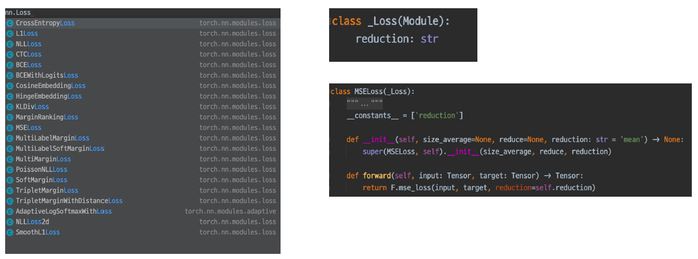
  - loss.backward() 함수를 이용해서 grad 값을 업데이트 한다.
  - Focal Loss : Class Imbalance 문제가 있는 경우, 맞출 확률이 높은 Class는 조금의 loss, 맞출 확률이 낮은 Class는 loss를 훨씬 높게 부여
  - Label Smoothing Loss : One hot 표현보다는 조금 soft하게 표현해서 일반화의 성능을 높인다.
- Optimizer는 Loss값을 가지고 파라미터를 업데이트하는 주체가 된다.(Loss 함수와 구별)
  - LR scheduler : Learning rate를 동적으로 조절하는 것 
    - StepLR : 특정 Step마다 LR 감소
    - CosineAnnealingLR : LR이 급격하게 변하기 때문에 local minimum에서 빠르게 탈출
    - ReduceLROnPlateau : 더 이상 성능 향상이 없을 때 LR 감소
- Metric : 모델에 대한 객관적인 평가 지표
  - Classification : Accuracy, F1-score, precision, recall, ROC&AUC
  - Regression : MAE, MSE
  - Ranking : MRR, NDCG, MAP  

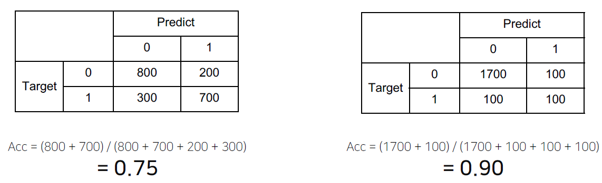
  - 과연 오른쪽 표가 더 성능이 좋다고 할 수 있을까? -> 이러한 점을 고려한 Metric을 선정하는 것이 중요하다.

- Class 별로 밸런스가 적절하다면 Accuracy, 그렇지 않아서 클래스 별 성능을 확인할 때는  F1-score를 선택 
<br/>

**8강 : Train & Inference 1 - Process**
- 학습을 시작하기 전에 만든 결과물
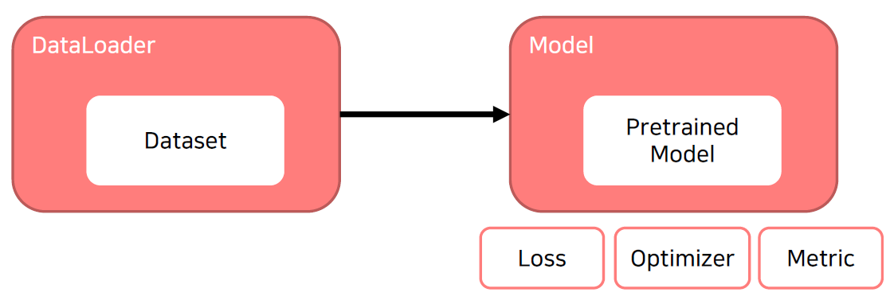
- model.train()을 호출하게 되면 model을 trainable하게 만들어준다.
- optimizer.zero_grad() : 이 함수를 적용하지 않으면 이전 batch의 grad가 남아있어서 계산에 영향을 줄 수 있다.
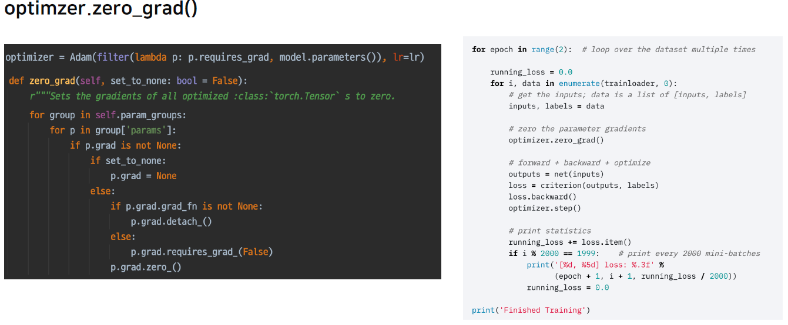
- `criterion = torch.nn.CrossEntropyLoss()`, `loss = criterion(outputs, labels)` 처럼 정의할 수 있다. 결국 criterion도 nn.Module이기 때문에 output이 들어가는 순간 Model의 Input과 chain이 형성되고 이를 통해 backward를 하고 grad를 업데이트 할 수 있다.
  - grad_fn을 통해 chain이 발생된 것을 확인할 수 있다.
- optimizer.step() 함수를 통해 실제 parameter 값를 grad 값을 이용해 업데이트 해준다.
- 위 과정을 응용하면 Gradient Accumulation도 구현할 수 있다. -> 매 batch마다 step해주는 것이 아닌 일정 batch 수만큼 grad를 축적시킨 다음 step을 진행
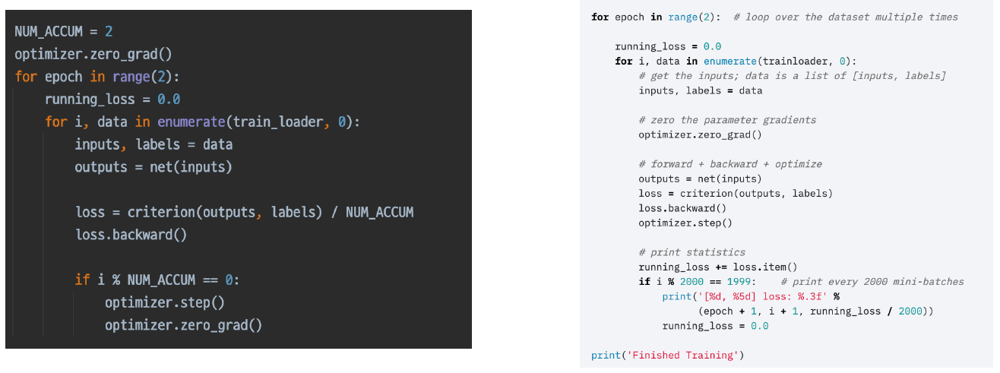
- Inference 프로세스일 때는 model.eval()을 호출하여 evaluation mode로 만들어준다.
  - `with torch.no_grad():`를 사용하여 grad의 변화를 없앤 상태로 만든다.
  - Validation set을 이용해 검증할 수도 있고 checkpoint를 만들어 저장할 수 있다.
- PyTorch에 대한 이해가 수반된 이후에 Pytorch Lightning을 사용하자.

<br/>

## 2. 새로 알게된 내용 / 고민한 내용 (강의, 과제, 퀴즈)
- `torch.tensor`의 경우 채널이 가장 먼저 나오고 (C, H, W) `np.array`의 경우 채널이 가장 뒤에 나온다(H, W, C). matplot으로 이미지를 그릴 때는 `np.array`로 바꿔서 채널이 가장 마지막에 위치하게 하여 `imshow()`를 해야한다. `torch.permute()`나 `transforms.ToPILImage()`로도 가능하다.
- 프로젝트 템플릿을 만들면서 하위 폴더에서 상위 폴더에 접근하는 방법을 알게 되었다. sys 라이브러리를 import 해준 후 `sys.path.append(os.path.dirname(os.path.abspath(os.path.dirname(__file__))))`를 사용하면 된다. -> 상위 폴더의 절대 경로를 참조 path에 추가해주는 것이다.
  - `os.path.abspath(path)`함수는 주어진 path에 대한 절대 경로를 반환해주는 함수이다. 
  - `os.path.dirname(path)`함수는 경로 중 디렉토리 경로를 반환해주는 함수이다. 

## 3. 참고할 만한 자료
- **부스트코스 제공 자료**
  - [Optimizer scheduler plot 분석](https://www.kaggle.com/isbhargav/guide-to-pytorch-learning-rate-scheduling)
  - [Ignite](https://pytorch.org/ignite/), [Catalyst](https://catalyst-team.github.io/catalyst/index.html)
  - [Bengali: SEResNeXt training with pytorch](https://www.boostcourse.org/boostcampaitech2/lecture/1079988?isDesc=false)
  - [PyTorch Image Models](https://github.com/rwightman/pytorch-image-models)
  - [Label Smoothing](https://3months.tistory.com/465), [F1 Loss](https://gist.github.com/SuperShinyEyes/dcc68a08ff8b615442e3bc6a9b55a354), [F1을 목표로 하는 손실함수](https://gist.github.com/SuperShinyEyes/dcc68a08ff8b615442e3bc6a9b55a354)

## 4. 피어세션
- 이예빈 캠퍼님의 직접 싸진 베이스 라인 코드 공유 및 리뷰
- 데이터 전처리 방법에 대한 토론
- 고재욱 캠퍼님의 당일 강의 요약
- 자세한 내용은 [Peer Session](https://github.com/round26/round26/wiki/Week4_Day4) 참조

---
---

**Day 5**
===

- 학습 강의 : More... 9 ~ 10강
- Special Mission : Ensemble / Experiment Toolkits
- 예시 코드 : Special Mission - Training & Inference

## 1. 강의 복습
### **Data Feeding** <br/>

**9강 : Ensemble**
- Ensemble(앙상블) : 싱글 모델보다 더 나은 성능을 위해 서로 다른 모델을 학습시키는 것
- Model Averaging(Voting) : 서로 다른 모델에서 같은 테스트셋에 대해 같은 에러를 발생하는 경우는 거의 없다는 가정 하에 Model Averaging이 효과적이다.
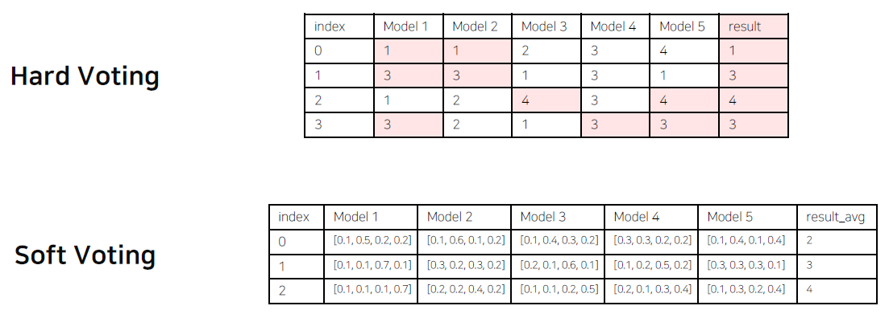
- Cross Validation : 훈련 셋과 검증 셋을 분리하지만, 검증 셋도 학습에 활용하자!
- Stratified K-fold  Cross Validation : 가능한 모든 경우를 고려하고 split 시 class 분포까지 고려한다.
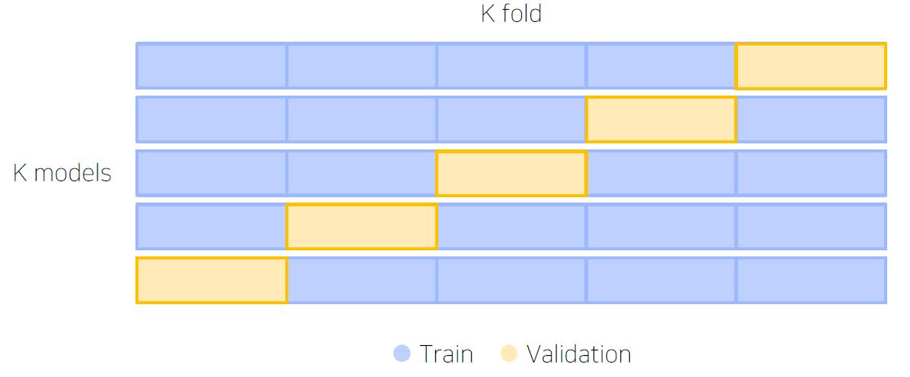
- TTA (Test Time Augumentation) : 테스트 이미지를 Augmentation 후 모델 추론, 출력된 여러 결과를 앙상블
- 앙상블을 할 때에는 성능과 효율의 Trade off를 잘 고려해야 한다.
- Hyperparameter Optimization -> 베이지안 Optimization 기법이 가장 많이 쓰이고 있다.
  - Optuna라는 라이브러리를 이용 -> 파라미터의 범위를 주고 그 범위 안에서 trials만큼 시행

<br/>

**10강 : Experiment Toolkits & Tips**
- Tensorboard를 통해 학습 과정을 기록하고 트래킹 할 수 있다.
```python
from torch.utils.tensorboard import SummaryWritter
logger = SummaryWritter(log_dir = f"results/{name}")
logger.add_scalar("Train/loss", train_loss, epoch * len(train_loader) + idx)
logger.add_scalar("Train/accuracy", train_acc, epoch*len(train_loader) + idx)
```
- 이미지도 추출할 수 있다.
```python
for idx, train_batch in enumerate(train_loader):
  inputs, labels = train_batch
  grid = torchvision.utils.make_grid(inputs)
  logger.add_image('images', grid, 0)
  logger.add_graph(model, inputs)
```
- `tensorboard --logdir PATH`(log가 저장된 경로) `--host ADDR`(원격 서버 사용 시 0.0.0.0(default : localhost)) `--port PORT`(포트번호) 형식으로 사용한다.
- wandb는 딥러닝 학습 기록의 저장소로 볼 수 있다.
```python
import wandb  

# -- wandb initialize with configuration
wandb.init(config = {"batchsize": batch_size,
                     "lr" : lr,
                     "epoch" : num_epoch,
                     "backborn" : name})

# logging wandb train phase
wandb.log({
  "Train loss" : train_loss,
  "Train acc" : train_acc
})

# logging wandb valid phase
wandb.log({
  "Valid loss" : val_loss,
  "Valid acc" : val_acc
})
```
- Jupyter Notebook
  - 코드를 아주 빠르게 cell 단위로 실행할 수 있다.
  - 데이터를 미리 로드해서 재사용할 수 있다.
  - EDA 할 때 매우 편리하다.
- Python IDLE
  - 구현은 한 번, 재사용이 편리
  - 디버깅 툴이 강력하다.
  - 자유로운 실험 핸들링이 가능하다.
- Tips 
  - 분석 코드보다 설명글을 유심히 보자 -> 필자가 생각하고 있는 흐름을 알 수 있다.
  - 코드를 볼 때는 디테일한 부분까지 
  - Paper with Codes를 많이 보자
  - 공유하는 것을 주저하지 말자

<br/>

## 2. 새로 알게된 내용 / 고민한 내용 (강의, 과제, 퀴즈)
- python의 argparse 라이브러리에 대해 알게 되었다. 간단하게 요약하면 add_argument() 함수로 인자를 추가할 수 있고 parse_args() 함수로 입력받은 인자를 넘겨줄 수 있다. Python IDLE를 이용하여 프로젝트 템플릿을 구성할 때 매우 유용하게 쓰일 것 같다. 
- train & inference 코드를 만들면서 batch에 따른 Inputs, labels의 차원값을 직접 print하면서 어떤 식으로 동작하는지 파악할 수 있었다.
- model을 load하느냐 model의 parameter를 load하느냐에 따라 불러오는 방식이 조금 다른 것을 알게 되었다.
- 터미널에서는 matplotlib.pyplot을 바로 확인하기 힘들다. 그래서 마지막에 `fig.savefig('파일명')`를 추가하여 그래프를 저장하여 확인할 수 있다.

## 3. 참고할 만한 자료
- **부스트코스 제공 자료**
  - [k-fold cross validation using dataloaders in pytorch](https://stackoverflow.com/questions/60883696/k-fold-cross-validation-using-dataloaders-in-pytorch)
  - [Pytorch My_TTA Function (easy to understand)](https://www.kaggle.com/luyujia/pytorch-my-tta-function-easy-to-understand)
  - [Tensorboard 사용법(pytorch 공식 자료) - 1](https://tutorials.pytorch.kr/recipes/recipes/tensorboard_with_pytorch.html), [Tensorboard 사용법(pytorch 공식 자료) - 2](https://tutorials.pytorch.kr/intermediate/tensorboard_tutorial.html )
  - [wandb 사용법 - 1](https://docs.wandb.ai/integrations/pytorch), [wandb 사용법 - 2](https://greeksharifa.github.io/references/2020/06/10/wandb-usage/)
  - [Model Validation, Ensemble(OOF, Stacking)](https://www.kaggle.com/kcs93023/kakr-4th-seminar-model-validation-ensemble) ([유튜브 강의](https://www.youtube.com/watch?v=G6i4folb2jo))

- **슬랭 공유 자료 및 참고 자료**
  - [Python argparse 사용법](https://greeksharifa.github.io/references/2019/02/12/argparse-usage/)

## 4. 피어세션
- 문석암 캠퍼님의 당일 강의 요약
- 차주 제출할 WrapUP 리포트 초안 작성
- 자세한 내용은 [Peer Session](https://github.com/round26/round26/wiki/Week4_Day5) 참조

---
---

# **주간 회고**

1. 이번 주는 스스로 베이스 라인 코드를 작성을 했다. 다른 캠퍼들은 이미 코드를 다 작성해서 학습까지 완료해 결과 제출했고 그런 모습을 보면서 부족함을 많이 느낀 것 같다. 초반부터 남들과 비교하게 되면서 따라가기 벅찼고 의기소침해진 것 같다. 팀의 한 캠퍼님이 자신이 직접 짠 베이스 라인 코드를 공유해주시면서 급하게 할 필요없이 자신의 코드 보면서 천천히 공부하면 많은 도움이 될 거라고 하셨고 실제 그 분의 코드를 보면서 많은 공부를 하고 그만큼 희망이 보였다. 정말 피어세션이 내가 생각한 거 이상으로 많은 도움이 되는 것 같다.

2. 스스로 Dataset부터 inference까지 모든 과정을 코드로 구현하려고 했었고 월, 화에는 솔직히 거의 손도 못 댔다. 하지만 Special Mission에서 요구하는 것을 참고하고 예시코드와 한 캠퍼님이 공유해주신 코드를 보면서 모든 코드를 금요일에 완성할 수 있었다. 실제로 만든 코드로 결과물을 제출했었는데 Acc = 76.8%, F1 = 0.708이 나왔다. 솔직히 점수보다도 노베이스로 시작했는데 결과물을 만들었단 사실 그 자체로 너무 뿌듯했다(결과도 나름 나쁘지 않았다고 생각한다ㅎㅎ). 정말 일주일 동안 많이 공부했고 그것의 결과물을 얻은 것 같아 행복했다. 

3. 초반에 아무것도 모른 상태에서, 뭔가를 들어도 발전하지 않는 느낌이 많이 들었다. 그런 느낌을 받는다고 포기하지 말자! 주변의 도움을 받고 노력하면 충분히 해낼 수 있다. 이번 주가 딱 그랬다. 피어세션의 소중함을 다시 한 번 느꼈고 하루 빨리 성장해서 도움을 받는 사람에서 도움을 줄 수 있는 사람이 되어야 겠다.

4. 오피스아워 시간에 nni 사용하는 것을 실시간으로 보여주셨다. 모든 코드를 다 찾아보는 것보다 원하는 키워드를 통해 그것과 연관된 것을 파악했다. 그리고 파악한 것들을 내가 원하는 방향으로 변화를 주었고 그게 곧바로 적용이 되서 실제 결과가 나왔다. 그 과정에서 모든 라이브러리들의 코드를 세세하게 이해할 필요는 없다는 걸 깨달았다. 내가 원하는 것을 응용할 수 있을 정도면 충분하다.(~~결론은 약간의 눈치싸움 : 대충 여기서 이 부분만 바꾸면 될 것 같다~~)

5. 파이참을 한 번 사용해보면 좋을 것 같다. 

6. 이미지 분류 대회에 대한 공부로 인해 시각화 강의가 많이 밀렸다. 차주는 강의가 제공되지 않기 때문에 이를 이용해 밀린 강의를 들어야 할 것 같다. 시각화도 EDA에 많이 사용되는 것 같아서 집중해서 공부하면 많은 도움이 될 것 같다.