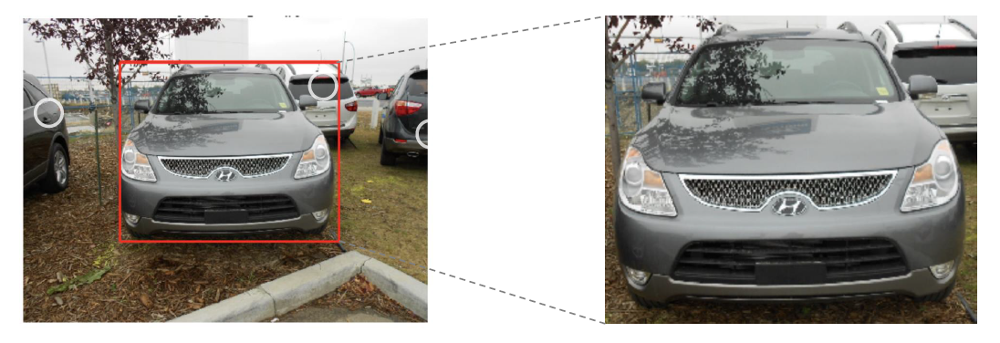

**Day 1**
===

- 학습 강의 : P Stage Start! 1 ~ 2강
- Special Mission : EDA

## 1. 강의 복습
### **P Stage Start!**  

**1강 : Competition with AI Stages!**
- Pstage를 통해 전처리, 학습, 추론까지의 과정을 학습할 수 있다.
- 데이터 분석하기 전에 항상 Overview(개요)를 살펴보고 방향성을 잡는 것이 중요하다. -> **Problem Definition(문제 정의)**

 

**2강 : Image Classification & EDA**
- 
 

## 2. 새로 알게된 내용 / 고민한 내용 (강의, 과제, 퀴즈)
- Special Mission인 EDA를 하면서 Problem Definition을 해보고 pandas와 matplotlib를 이용하여 아주 간단하게 시각화를 해봤다.(남녀 비율, 주어진 나이 범위에서의 비율 등)
- Problem Definition : 주어진 문제는 코로나 시대에 적은 인적 자원만을 활용하기 위해 카메라로 비춰진 사람 얼굴 이미지를 통해 마스크를 썼는지와 제대로 썼는지 판별하는 것이 목적이다.
  - data를 살펴보았을 때 train.csv에는 id, gender, race, age, image path에 관한 정보만 존재했다. 결국 우리가 원하는 Input X는 image path 내에 존재하는 7장의 사진이 된다.(5장은 마스크를 올바르게 쓴 이미지, 1장은 마스크를 쓰지 않은 이미지, 1장은 마스크를 제대로 쓰지 않은 이미지)
  - Output Y는 gender, age, mask의 검사 유무에 따라 총 18개의 클래스가 존재한다.
  - 결론적으로 우리는 이미지가 주어졌을 때 성별, 나이, 마스크의 유무, 혹은 잘 썼는지를 판별할 수 있는 모델을 만들어야 한다.

## 3. 참고할 만한 자료
- **부스트코스 제공 자료**
  - [Data Visualization KR 페이스북 그룹](https://www.facebook.com/groups/2542191496047967?group_view_referrer=search){:target="_blank"}
  - [Aptos 대회 데이터 분석 커널](https://www.kaggle.com/ratthachat/aptos-eye-preprocessing-in-diabetic-retinopathy){:target="_blank"}
  - [시각화 라이브러리 소개 ](https://mode.com/blog/python-data-visualization-libraries/){:target="_blank"}
  - [쇼핑 데이터 EDA, Melanoma Classification EDA](https://www.kaggle.com/andradaolteanu/siim-melanoma-competition-eda-augmentations){:target="_blank"} 
  - [Bengali.AI 대회 전처리 시각화 커널](https://www.kaggle.com/haqishen/gridmask){:target="_blank"}

## 4. 피어세션
- 김현욱 캠퍼님의 캐글 튜토리얼 및 당일 강의 요약 발표
- 주어진 데이터에서 데이터 불균형을 어떻게 해결하면 좋을까에 대한 토론(7개의 이미지 불균형)
- 라벨링에 대한 토론
- 자세한 내용은 [Peer Session](https://github.com/round26/round26/wiki/Week4_Day1){:target="_blank"} 참조

---
---

**Day 2**
===

- 학습 강의 : Data Feeding 3 ~ 4강
- Special Mission : Dataset / Data Generation

## 1. 강의 복습
### **Data Feeding**  

**3강 : Dataset**
- 문제 정의를 통해 얻은 방향성을 적용시킨 데이터셋이 필요하다.
- Vanila Data를 모델이 좋아하는 형태의 Dataset으로 만드는 과정인 Data processing 과정이 필요하다.
- Data Science에서 가장 많은 비중을 차지하는 부분이 Pre-processing(전처리) 부분이다.
  - 정형 데이터의 경우 필드 자체의 의미를 모르는 경우도 존재하고 이상한 값(이상치), NULL 값이 들어가 있는 경우가 존재한다.
  - 좋은 데이터를 만드는 것이 중요하다. -> 모델의 성능 개선에도 큰 효과가 있다.
- 이미지 메타 데이터의 경우에서 이미지 내의 Target만 bounding box로 뽑아내서 학습한다면 좀 더 나은 결과를 얻을 수 있다.

- Resize 기법을 이용해 적당한 크기로 사이즈를 변경한다. -> 작업의 효율화
- 도메인, 데이터 형식에 따라 전처리 하는 방식이 매우 다양하다.

  - ex) 메디컬의 경우 좀 더 밝게 전처리를 해줌으로써 질병 발견 확률을 높일 수 있다.
- Generalization
  - Train/Validation : 훈련 셋 중 일정 부분을 분리해서 검증셋으로 활용 -> 학습에 이용되지 않은 분포가 필요하고 이 분포를 통해 기학습된 모델의 일반화에 대해 확인할 수 있다.
  - Data Augumentation : 주어진 데이터가 가질 수 있는 Case(경우), State(상태)의 다양성
  - torchvision.transforoms : RandomCrop, Flip 함수 이용 -> 마스크의 경우 VerticalFlip이 필요할까?
    - 발열 체크나 마스크 체크를 하는데 거꾸로 찍히는 경우가 있을까를 고려해보면 굳이 필요하지 않다. -> 이러한 변형들이 과연 유용하게 작용될 것인지 고려!!
  - Albumenatations : 이미지 변형하는데 transforms 보다 좀 더 빠르고 다양하다.
- 위의 기법들이 항상 좋은 결과만을 가져다 주는 것은 아니다. 결론적으로 문제 정의를 통해 방향성을 얻고 방향성을 가진 상태에서, 주어진 데이터에 이런 기법을 적용하면 다양성을 얻을 수 있겠다라고 가정하고 **실험으로 증명해야 한다.** 

 

**4강 : Data Generation**
- 
 

## 2. 새로 알게된 내용 / 고민한 내용 (강의, 과제, 퀴즈)
- 

## 3. 참고할 만한 자료
- **부스트코스 제공 자료**
  - [Data Visualization KR 페이스북 그룹](https://www.facebook.com/groups/2542191496047967?group_view_referrer=search){:target="_blank"}
  - [Aptos 대회 데이터 분석 커널](https://www.kaggle.com/ratthachat/aptos-eye-preprocessing-in-diabetic-retinopathy){:target="_blank"}
  - [시각화 라이브러리 소개 ](https://mode.com/blog/python-data-visualization-libraries/){:target="_blank"}
  - [쇼핑 데이터 EDA, Melanoma Classification EDA](https://www.kaggle.com/andradaolteanu/siim-melanoma-competition-eda-augmentations){:target="_blank"} 
  - [Bengali.AI 대회 전처리 시각화 커널](https://www.kaggle.com/haqishen/gridmask){:target="_blank"}

## 4. 피어세션
- 김현욱 캠퍼님의 캐글 튜토리얼 및 당일 강의 요약 발표
- 주어진 데이터에서 데이터 불균형을 어떻게 해결하면 좋을까에 대한 토론(7개의 이미지 불균형)
- 라벨링에 대한 토론
- 자세한 내용은 [Peer Session](https://github.com/round26/round26/wiki/Week4_Day1){:target="_blank"} 참조

---
---