# **Day 1**

- 학습 강의 : KLUE 1 ~ 2강

## 1. 강의 복습

### **KLUE** <br/>

**1강 : 인공지능과 자연어처리**
- 자연어처리의 응용분야
  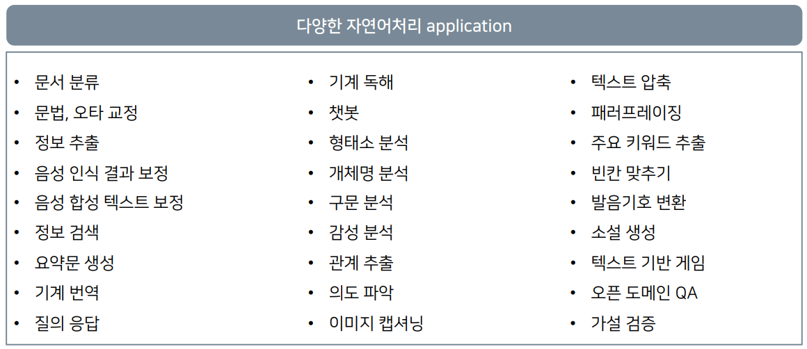

- 인간의 자연어처리 : 화자는 떠올린 객체를 Text로 전달(인코딩) -> 청자는 Text를 객체로 전환(디코딩)
- 컴퓨터의 자연어처리 : Encoder가 벡터 형태로 자연어를 인코딩 -> Decoder는 벡터를 자연어로 디코딩

|                인간의 자연어처리                |               컴퓨터의 자연어처리               |
| :---------------------------------------------: | :---------------------------------------------: |
| 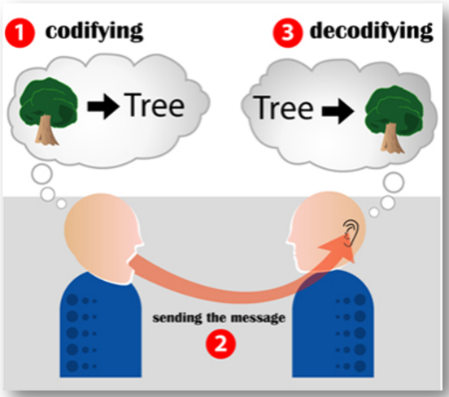 | 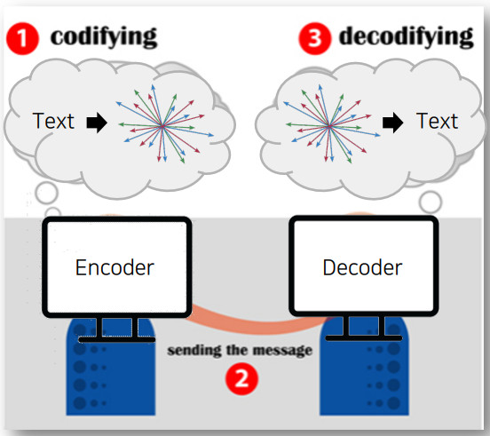 |

- 기존 자연어 임베딩 방식은 one-hot encoding 방식을 사용했다. But, 단어 벡터가 sparse해서 단어가 가지는 의미를 벡터 공간에 표현 불가능 -> Word2Vec 알고리즘 사용
  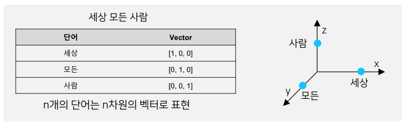
- Word2Vec 알고리즘 : 자연어의 의미를 벡터 공간에 임베딩, 주변 단어를 통해 단어의 의미 파악. But, 단어의 subword information을 무시하고 OOV에서 적용이 불가능하다. -> FastText 사용
- FastText : 단어를 n-gram으로 분리를 한 후, 모든 n-gram vector를 합산한 후 평균을 통해 단어 벡터를 획득, 오탈자, OOV, 등장 횟수가 적은 학습 단어에 대해 강세
  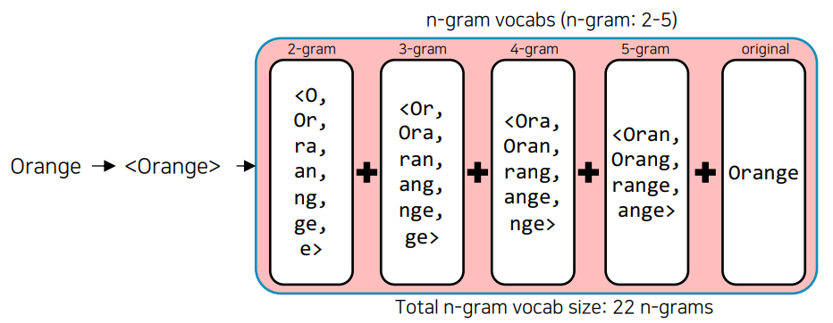
- 단어 임베딩 방식의 한계점 : 주변 단어를 통해 학습하기 때문에 문맥을 고려할 수 없다.
- 문맥을 고려하기 위해서 **언어모델**이 등장했다.
- 언어모델의 발전 과정
  1. Markov 기반의 언어모델 : Markov Chain Model로 다음의 단어나 문장이 나올 확률을 통게와 단어의 n-gram을 기반으로 계산
  2. 딥러닝을 활용한 RNN 기반의 언어모델 : 이전 state 정보가 다음 state를 예측하는데 사용
  3. 최종 context vector를 활용한 RNN 기반의 Seq2seq 언어모델 : Encoder layer에서 context vector를 획득하고 이를 Decoder layer에서 활용
     - 문제점 : 긴 문장의 경우 처음 token에 대한 정보가 희석, 하나의 context vector로 인한 병목 문제 -> Attention module
  4. Seq2seq with Attention 언어모델 : dynamic context vector 획득
     - 문제점 : RNN 기반이기 때문에 순차적으로 연산이 이뤄짐에 따라 연산 속도가 느림
  5. Self-attention 언어모델(Transformer)

<br/>

**2강 : 자연어의 전처리**

- 자연어 전처리 : raw data를 기계 학습 모델이 학습하는데 적합하게 만드는 프로세스
  - Task의 성능을 가장 확실하게 올릴 수 있는 방법!
- 자연어처리의 단계 :
  - Task 설계
  - 필요 데이터 수집
  - 통계학적 분석 : Token 개수 -> 아웃라이어 제거, 빈도 확인 -> 사전 정의
  - 전처리 : 개행문자, 특수문자, 공백, 중복표현, 불용어, 조사 등등 제거
  - Tagging
  - Tokenizing : 자연어를 어떤 단위로 살펴볼 것인가(어절, 형태소)
  - 모델 설계, 구현
  - 성능 평가, 완료
- Python string 관련 함수 : 대소문자 변환 / 편집, 치환(strip, replace) / 분리, 결합(split, join) / 구성 문자열 판별(isdigit) / 검색(count)
- 한국어 토큰화는 교착어이기 때문에 띄어쓰기 기준이 아니라 형태소 단위로 분리한다.

<br/>

## 2. 새로 알게된 내용 / 고민한 내용 (강의, 과제, 퀴즈)

- **실습코드 : (2강) 자연어의 전처리 - 0\_한국어전처리**
  - 파이썬의 정규표현식 사용법 : `r"<[^>]+>\s+(?=<)|<[^>]+>"`을 해석해보면 다음과 같다.
    - [^>]는 ">" 문자가 아닌 문자와 매칭이 된다.
    - "(?+<)"의 경우는 긍정형 전방 탐색으로 (?=...) - ...에 해당되는 정규식과 매치되어야 하며 조건이 통과해도 문자열이 소비되지 않는다. 즉, 검색에는 포함되지만 검색 결과에는 제외된다.
    ```python
    >>> p = re.compile(".+(?=:)")
    >>> m = p.search("http://google.com")
    >>> print(m.group())
    http
    ```
  - 한국어 문장분리기 중, [kss 라이브러리](https://github.com/hyunwoongko/kss)를 많이 사용
  - 파이썬의 정규표현식 중 `\b, \B`가 있는데 이는 단어 구분자(Word boundary), 비단어 구분자를 의미한다. 자세한 내용은 [여기](https://wikidocs.net/4309)를 읽어보자
  - `re.compile(r"\((.*?)\)")`이런 형태로 `*?`을 결합하면 가능한 한 가장 최소한의 반복을 수행하도록 도와주는 역할을 한다.
- **실습코드 : (2강) 자연어의 전처리 - 1*한국어*토크나이징**
  - 한국어의 tokenizing 방식에는 어절 단위 : `split(" ")`, 형태소 단위 : `Mecab()`, 음절 단위 : `list(sentence)`, 자소 단위 : `hgtk`, WordPiece : `transformers` 등이 존재한다.
  - WordPiece tokenizing으로 `BertWordPieceTokenizer`가 존재하고 이 tokenizer에 vocab를 추가할 수 있다.
    ```python
    # Initialize an empty tokenizer
    tokenizer = BertWordPieceTokenizer(
      clean_text=True, # 토큰화 할 때 띄어쓰기 제거
      handle_chinease_chars=True, # 한자의 경우는 음절 단위로
      strip_accents=False, # True: [YepHamza] -> [Yep, Hamza]
      lowercase=False
    )
    # Train
    tokenizer.train(
      files = "./data.txt",
      vocab_size=10000,
      min_frequency=2,
      show_progress=True,
      special_tokens=["[PAD]", "[UNK]", "[CLS]", "[SEP]", "[MASK]"],
      limit_alphabet=1000,
      wordpieces_prefix="##"
    )
    # Save
    tokenizer.save_model("Folder", "Name")
    ```

## 3. 참고할 만한 자료

- **Reference**
  - [서브워드 구축하기 ](https://keep-steady.tistory.com/37)
  - [Huggingface Transformers의 attention mask 문서](https://huggingface.co/transformers/glossary.html#attention-mask)
  - [Huggingface Transformers의 attention mask 구현](https://github.com/huggingface/tokenizers/tree/2fbd6779f6bdeb55c0fb9cceb3716ec20fc92646/bindings/python/py_src/tokenizers/implementations)
  - [한국어 전처리 위한 Huggingface + KoNLPy 실습](https://gist.github.com/lovit/259bc1d236d78a77f044d638d0df300c)
- **Further Reading**
  - [자연어처리](https://www.youtube.com/watch?v=jlCerj5eI4c)
  - [FastText](https://www.youtube.com/watch?v=7UA21vg4kKE)
  - [Seq2Seq](https://www.youtube.com/watch?v=4DzKM0vgG1Y)
  - [Seq2Seq + attention](https://www.youtube.com/watch?v=WsQLdu2JMgI)
  - [청와대 국민청원 데이터 전처리 (소개)](https://www.youtube.com/watch?v=9QW7QL8fvv0)
  - [청와대 국민청원 데이터 전처리 (실습)](https://www.youtube.com/watch?v=HIcXyyzefYQ)

## 4. 피어세션
- 강의 계획 설정
- Pstage 계획 설정
- 자세한 내용은 [Peer Session](https://diagnostic-offer-ddb.notion.site/9-27-bef48c2ea53e4b8e8705548cd7e1bd31) 참조

---
---

# **Day 2**
- 학습 강의 : KLUE 3 ~ 4강

## 1. 강의 복습
### **KLUE** <br/>

**3강 : BERT 언어모델 소개**
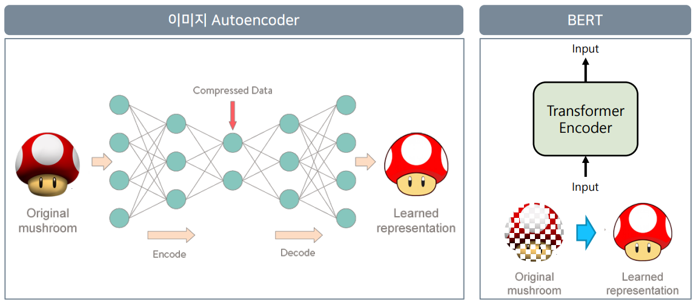
- Autoencoder에서 Encoder는 입력된 이미지를 압축된 형태로 표현하고(RNN에서의 context vector) Decoder는 원본 이미지를 복원하는 것이 목적이다. -> Compressed Data 정보를 가져오는 것은 입력된 이미지에 대한 벡터값이 된다.(자기 자신을 표현하도록 학습되었기 때문)
- BERT에서도 입력된 정보를 그대로 표현한다는 점에서 Autoencoder와 같은 맥락이지만 입력된 정보를 MASKING을 한다는 차이가 있다. -> 즉, masked된 자연어를 원본 자연어로 복원
- NLP 실험들에 대해 BERT 모델의 구조는 다음과 같다.
  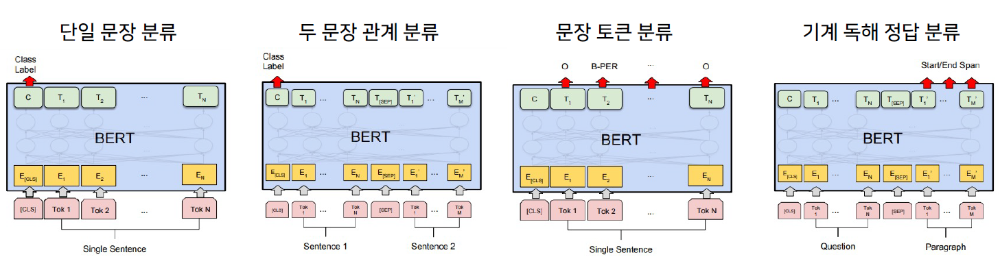
  - 단일 문장 분류 : 감성 분석, 관계 추출
  - 두 문장 관계 분류 : 의미 비교
  - 문장 토큰 분류 : 개체명 분석
  - 기계 독해 정답 분류 : 기계 독해
- text를 토큰화할 때 형태소 단위로 분리한 후 Word Piece를 적용하는 것이 성능이 좋다.
- 관계 추출의 경우 Entity embedding layer를 추가하여 학습시켰을 때 성능이 훨씬 상승했다.
  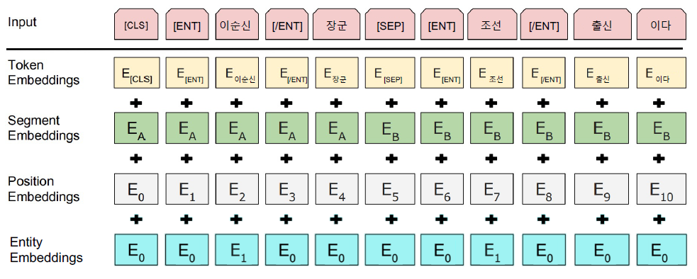
  <br/>

**4강 : 한국어 BERT 언어 모델 학습**
- BERT 학습의 단계
  1. Tokenizer 만들기
  2. 데이터셋 확보
  3. Next Sentence Prediction(NSP)
  4. Masking
- 왜 새로 학습을 할까? : 도메인 특화 task의 경우, 도메인 특화 된 학습 데이터만 사용하는 것이 성능이 더 좋다!  
  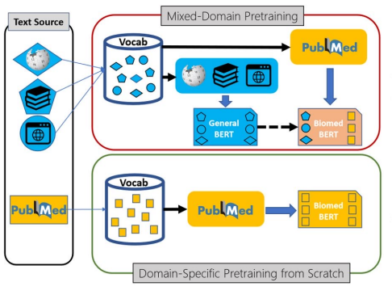
- 다음과 같은 과정을 통해 학습에 필요한 Dataset과 Dataloader를 구성해야 한다.
  - text를 tokenize해서 input_ids, token_type_ids형태로 구성하여 모델이 학습할 수 있는 Dataset 형태로 만들어 준다.
    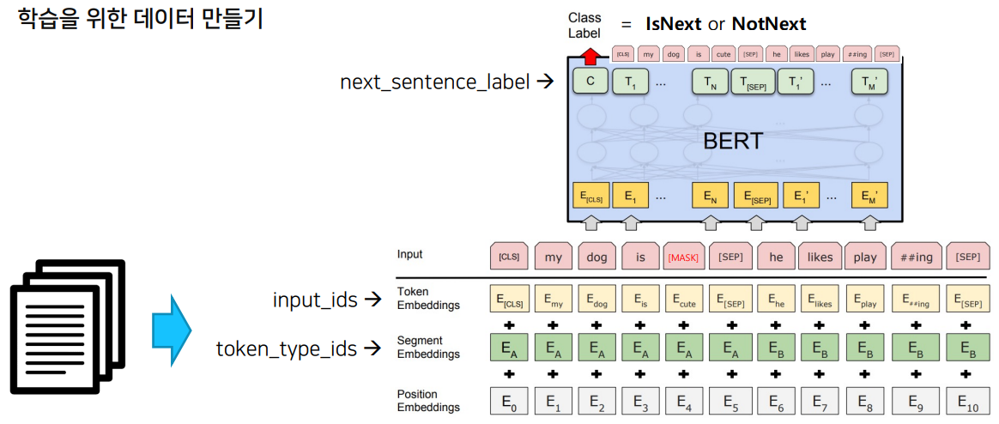
  - BERT 모델에 맞게 masking 처리를 한다.
    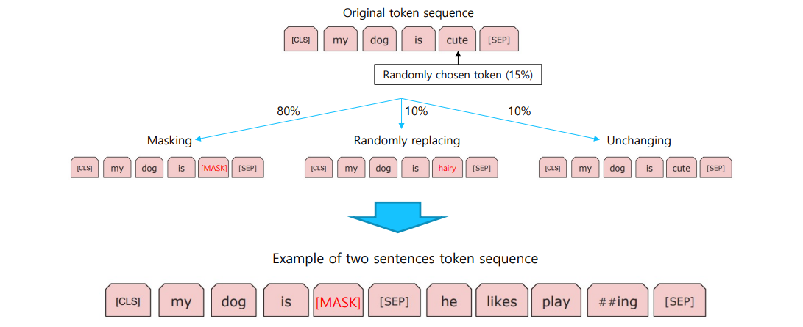
    <br/>

## 2. 새로 알게된 내용 / 고민한 내용 (강의, 과제, 퀴즈)
- **실습코드 : (3강) BERT 언어 모델 소개 - 0_Huggingface**
  - 3줄의 코드로 pre-trained model과 tokenizer를 가져올 수 있다.
    ```python
    from transformers import AutoModel, AutoTokenizer
    model = TFAutoModel.from_pretrained("<model-name>")
    tokenizer = AutoTokenizer.from_pretrained("<model-name>")
    ```
  - `tokenizer = AutoTokenizer.from_pretrained(MODEL_NAME)`의 형식으로 tokenizer를 불러오고 tokenizer에 text를 태우면 input_ids, token_type_ids, attention_mask를 key값으로 가지는 encoding vector가 생성된다.(BertTokenizer의 경우)
  - `tokenizer.tokenize, tokenizer.encode, tokenizer.decode`등의 함수를 이용해서 순차적으로 토큰화가 어떻게 되는지 확인할 수 있다.
  - `tokenizer.tokenize()`에서 add_special_token, max_length, truncation, padding 등을 인자로 받을 수 있다.
  - `tokenizer.add_tokens()`를 통해 token을 추가해줄 수 있다.
    - token을 추가해줄 경우 `model.resize_token_embeddings(len(tokenizer))`를 통해 embedding layer의 size를 변경해줘야 한다.
    - `tokenizer.vocab_size`는 token이 추가되기 전 vocab size가 출력된다.
  - tokenizer를 태운 값 : `input = tokenizer(text, return_tensors="pt")`이 model의 input으로 들어가면 출력값 : `outputs = model(**input)`이 나온다.
    - last_hidden_state는 `outputs.last_hidden_state`, [CLS] token에 대한 hidden state는 `outputs.pooler_output`으로 구할 수 있다.
  - `nn.CosineSimilarity(dim=1, eps=1e-6)`으로 문장의 유사도를 측정할 수 있다.
- **실습코드 : (3강) BERT 언어 모델 소개 - 1*BERT*유사도*기반*챗봇**
  - transformers 라이브러리에서 model을 받은 후 `model.paramters`를 하면 model의 구조를 확인할 수 있다.
  - bert pre-trained model의 outputs에서 last_hidden_state의 0번 째 index([CLS] token)를 pooler layer 통과시킨 결과가 pooler_output이다. pooler layer는 linear layer와 tanh가 결합된 layer이다.
  - `from sklearn.metrics.pairwise import cosine_similarity`을 이용해서 유사도를 계산할 수 있다.
- **실습코드 : (4강) 한국어 BERT 언어모델 학습 - 0_BERT_MASK_Attack**
  - `from transformers import pipeline`을 통해서 특정 task에 대해 쉽게 결과를 확인할 수 있다.
    ```python
    nlp_fill = pipeline('fill-mask', top_k=5, model=model, tokenizer=tokenizer)
    nlp_fill('Martin is living in [MASK].')
    >>>
    [{'sequence': 'Martin is living in London.',
    'score': 0.04413441941142082,
    'token': 10829,
    'token_str': 'London'},
    {'sequence': 'Martin is living in Southampton.',
    'score': 0.016097432002425194,
    'token': 45113,
    'token_str': 'Southampton'},
    {'sequence': 'Martin is living in Italy.',
    'score': 0.01311422511935234,
    'token': 11619,
    'token_str': 'Italy'},
    {'sequence': 'Martin is living in a.',
    'score': 0.012310952879488468,
    'token': 169,
    'token_str': 'a'},
    {'sequence': 'Martin is living in Rome.',
    'score': 0.010854917578399181,
    'token': 14592,
    'token_str': 'Rome'}]
    ```
- **실습코드 : (4강) 한국어 BERT 언어모델 학습 - 1\_한국어\_BERT_pre_training**
  - `from tokenizers import BertWordPieceTokenizer`을 통해 학습시킬 tokenizer를 불러올 수 있다.
  - BertWordPieceTokenizer의 parameter로는 clean_text(띄어쓰기 같은 공백 제거), handle_chinese_chars(한자는 char 단위로 쪼개기), strip_accents, lowercase 등이 있다.
  - 위와 같이 설정한 tokenizer를 files, vocab_size, min_frequency, special_tokens, wordpieces_prefix 등의 인자를 통해 학습 시킬 수 있다.
  - Pretrain을 하기 위해서는 NSP로 이루어진 Dataset, Masking 된 Dataset이 필요하다. Masking dataset의 경우 Transformers에서 DataCollatorForLanguageModeling이란 함수를 제공해준다.
  - pipeline을 사용하여 Pretrain model을 확인할 때 cpu인지, gpu인지 확인해야 한다.(gpu일 경우, pipeline의 인자로 `device=0`)
  - 요약해보면 Tokenizer를 학습시켜 나만의 Tokenizer를 만들고 이에 따라 BertConfig를 설정하고 `BertForPreTraining(config=config)`로 Bert 껍데기를 불러올 수 있다. 그런 후 Masking과 NSP에 맞는 Dataset를 구성하고 Trainer의 여러 arg를 설정해서 모델을 학습시킨 후 값을 저장한다(config.json, pytorch_model.bin). 그런 다음 `BertForMaskedLM.from_pretrained('model_output')`로 학습시킨 모델을 불러와서 테스트할 수 있다.

## 3. 참고할 만한 자료

- **Reference**
  - Paper: ["BERT: Pre-training of Deep Bidirectional Transformers for Language Understanding"](https://arxiv.org/abs/1810.04805)
  - [BERT 톺아보기](https://docs.likejazz.com/bert/)
  - [LM training from scratch](https://colab.research.google.com/github/huggingface/blog/blob/master/notebooks/01_how_to_train.ipynb#scrollTo=5oESe8djApQw)
  - 나만의 BERT Wordpiece Vocab 만들기
    - [Wordpiece Vocab 만들기](https://monologg.kr/2020/04/27/wordpiece-vocab/)
    - [Wordpiece Tokenizer 만들기](https://velog.io/@nawnoes/Huggingface-tokenizers%EB%A5%BC-%EC%82%AC%EC%9A%A9%ED%95%9C-Wordpiece-Tokenizer-%EB%A7%8C%EB%93%A4%EA%B8%B0) -[Extracting training data from large language model](https://www.youtube.com/watch?v=NGoDUEz3tZg)
  - [BERT 추가 설명](https://jiho-ml.com/weekly-nlp-28/)

## 4. 피어세션

- 4강 강의까지 질의 응답
- 멘토님에게 할 질문 리스트하기
- 자세한 내용은 [Peer Session](https://diagnostic-offer-ddb.notion.site/9-28-ae4becdb086b4f2b996de28a0b12ff81) 참조

---
---

# **Day 3**

- 학습 강의 : KLUE 5 ~ 6강

## 1. 강의 복습

### **KLUE** <br/>

**5강 : BERT 기반 단일 문장 분류 모델 학습**
- KLUE : 한국어 자연어 이해 밴치마크
  - 단일 문장 분류 : 문장 분류, 관계 추출
  - 문장 임베딩 벡터의 유사도([CLS]) : 문장 유사도
  - 두 문장 관계 분류 : 자연어 추론
  - 문장 토큰 분류 : 개체명 인식, 품사 태깅, 질의 응답
  - 목적형 대화, 의존 구문 분석
- 의존 구문 분석 : 단어들 사이의 관계를 분석하는 task
  - 의존소와 지배소를 이용해 단어들 사이의 관계를 분석
  - Sequence labeling 방식으로 처리한다.  
  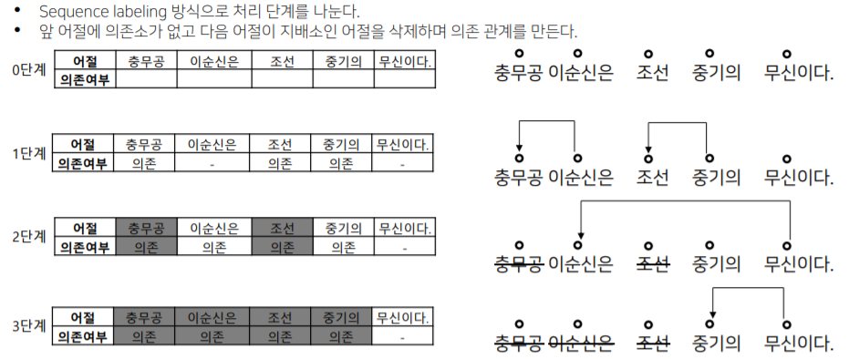
  - **복잡한 자연어 형태를 그래프로 구조화해서 표현이 가능! 각 대상에 대한 정보 추출이 가능**
- 단일 문장 분류 task란 주어진 문장이 어떤 종류의 범주에 속하는지를 구분하는 task
  - 감정분석(Sentiment Analysis), 주제 라벨링(Topic Labeling), 언어감지(Language Detection), 의도 분류(Intent Classification)
  - Kor_hate, Kor_sarcasm, Kor_sae, Kor_3i4k 등의 문장 분류 데이터가 존재
- 단일 문장 분류에서 모델 구조도를 살펴보면 다음과 같다.
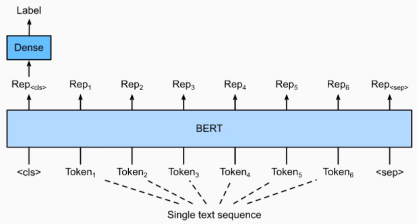
  - Bert의 [CLS] token의 vector를 classification 하는 Dense Layer에 사용한다.
  - 주요 매개변수는 다음과 같다.
    - input_ids : sequence token을 입력
    - attention_mask : [0,1]로 패딩 토큰 구분
    - token_type_ids : [0,1]로 첫 번째, 두 번째 문장 구분
    - position_ids : 각 입력 시퀀스의 임베딩 인덱스
    - inputs_embeds : input_ids 대신 직접 임베딩 표현을 할당
    - labels : loss 계산을 위한 레이블
    - Next_sentence_label : 다음 문장 예측 loss 계산을 위한 레이블
- 학습 과정을 다음과 같다.
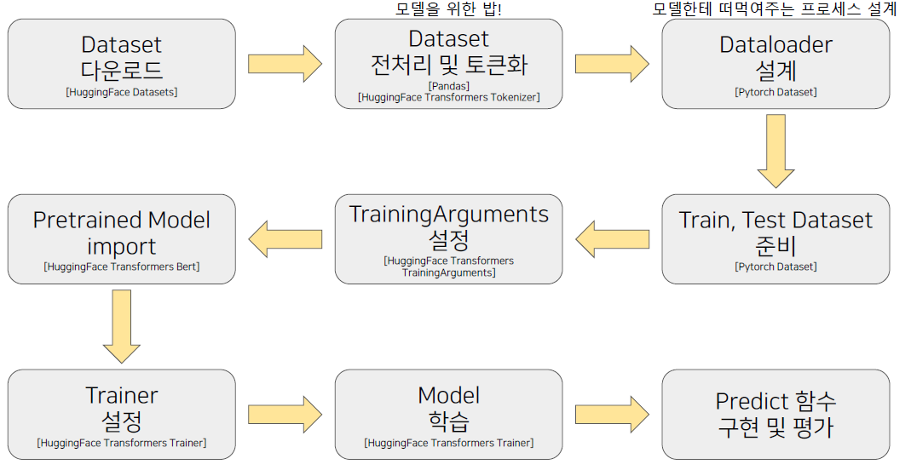

<br/>

**6강 : BERT 기반 두 문장 관계 분류 모델 학습**
- 두 문장 관계 분류 task란 주어진 2개의 문장에 대해, 두 문장의 자연어 추론과 의미론적 유사성을 측정하는 task
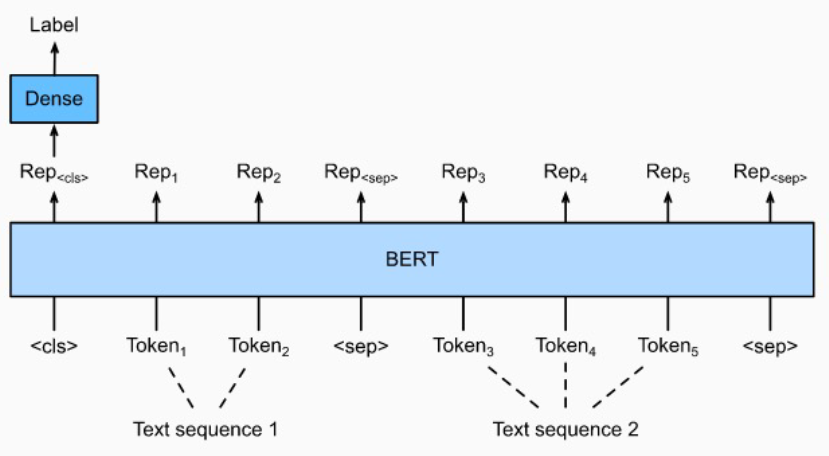
  - Bert의 [CLS] token 위에 Head를 부착하여 분류를 한다.
- Natural Language Inference(NLI)
  - 언어모델이 자연어의 맥락을 이해할 수 있는지 검증하는 task
  - 전제문장(Premise)과 가설문장(Hypothesis)을 Entailment(함의), Contradiction(모순), Neutral(중립)으로 분류
  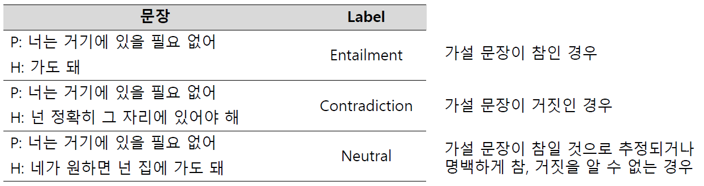
- Semantic text pair
  - 두 문장의 의미가 서로 같은 문장인지 검증하는 task
- Information Retrieval Question and Answering(IRQA)
  - 챗봇을 위한 task로써 사전에 정의해놓은 QA set에서 가장 적절한 답변을 찾는 task
<br/>

## 2. 새로 알게된 내용 / 고민한 내용 (강의, 과제, 퀴즈)
- **실습코드 : (5강) BERT 기반 단일 문장 분류 모델 학습 - 0_단일문장분류**
  - HuggingFace의 datasets를 이용하면 다양한 dataset을 쉽게 불러올 수 있다.
  - `datasets.load_datasets('nsmc')`로 nsmc(네이버 영화 리뷰 감정 데이터)를 불러올 수 있다.
  - 불러온 데이터셋은 train, test로 나누어져 있다.
  - pandas 함수 중 drop_duplicates를 이용하면 중복값을 제거할 수 있다. dropna를 이용하면 null값을 제거할 수 있다.
  - 문장 분류를 위해서 BERT model 위에 classification을 위한 Head를 부착해야 하는데 transformers 라이브러리에 이미 구현되어 있다. --> BertForSequenceClassification 
  - HuggingFace의 Trainer를 사용할 때, compute_metrics 함수를 구현하면 evaluate로 성능 평가를 할 수 있다.
  ```python
  trainer = Trainer(
    model=model,
    args=training_args,
    compute_metrics=compute_metrics)
  trainer.evaluate(eval_dataset=test_dataset)
  ```
- **실습코드 : (6강) BERT 기반 두 문장 관계 분류 모델 학습 - 0_학습_데이터_구축**
  -  단순히 다른 문장을 랜덤하게 가져오는 것은 학습의 난이도가 매우 쉽다. --> key로 설정된 문장과 관련없는 문장들을 embedding하고 cosine similarity가 높은 문장을 선택해서 이를 학습시킨다. 
  - 문장의 embedding vector는 유사하지만 의미론적으로 다른 문장이기 때문에 학습 난이도가 올라간다. 
  - keyword는 비슷하지만 의미론적으로 다른 문장들을 구분하는 것이 중요하다.
- **실습코드 : (6강) BERT 기반 두 문장 관계 분류 모델 학습 - 1_두_문장_관계_분류_학습**
  - 위 실습을 통해 구성한 dataset의 구조는 `sentence1 \t sentence2 \t label \n`이고 이를 train, test로 나누어 준다.
  - pandas의 groupby().ngroups를 하면 group의 개수가 나온다.
  - tokenizer에 문장 2개를 입력으로 주면 자동으로 [CLS], [SEP] token을 붙여주고 token_type_ids를 생성해준다.
  ```python
  tokenized_train_sentences = tokenizer(
    list(train_data['sent_a'][0:]),
    list(train_data['sent_b'][0:]),
    return_tensors="pt",
    padding=True,
    truncation=True,
    add_special_tokens=True,
    max_length=64
    )
  ```
- **실습코드 : (6강) BERT 기반 두 문장 관계 분류 모델 학습 - 2_BERT_IRQA_챗봇**
  - 첫 번째 모델을 이용해 입력된 문장과 다른 문장의 [CLS] token의 유사도를 통해 Top-n개의 QA set을 뽑는다.
  - 이 뽑힌 데이터를 Paraphrase Detection하는 두 번째 모델에 태워 실제 Query와 QA set의 Question이 유사한지 확인하고 유사하다면 QA set의 Answer를 결과로 출력한다.
  - 챗봇의 경우, 어떤 질문에 대해 실습과 같이 사전정의(QA set)를 해놓고 IRQA 모델을 태워 답변을 출력하고 답변을 출력할 수 없는 질문의 경우 생성 모델을 태워 답변을 생성하는 방식으로 챗봇을 구성한다.
## 3. 참고할 만한 자료
- **Reference**
  - classification
    - [BERT Text Classification Using Pytorch](https://towardsdatascience.com/bert-text-classification-using-pytorch-723dfb8b6b5b)
    - [Sentiment Analysis with BERT](https://curiousily.com/posts/sentiment-analysis-with-bert-and-hugging-face-using-pytorch-and-python/)
    - [네이버 영화리뷰 감정분석](https://colab.research.google.com/drive/1tIf0Ugdqg4qT7gcxia3tL7und64Rv1dP)
    - [Sequence Classification using Pytorch Lightning with BERT](https://knswamy.medium.com/sequence-classification-using-pytorch-lightning-with-bert-on-imbd-data-5e9f48baa638)
    - [BERT Fine-Tuning Tutorial with PyTorch](https://mccormickml.com/2019/07/22/BERT-fine-tuning/)
## 4. 피어세션
- 팀원들 간 module 별로 할 일을 나누어서 대회 진행
- 자세한 내용은 [Peer Session](https://diagnostic-offer-ddb.notion.site/9-29-3adcd89d83d4455c826660e9206abd11) 참조

---
---

# **Day 4**

- 학습 강의 : KLUE 7 ~ 8강

## 1. 강의 복습

### **KLUE** <br/>

**7강 : BERT 언어모델 기반의 문장 토큰 분류**
- 문장 토큰 관계 분류 task란 주어진 문장의 각 token이 어떤 범주에 속하는지 분류하는 task
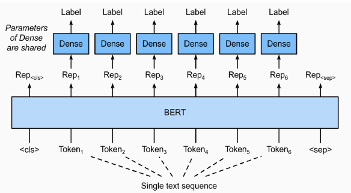
  - 각 token마다 classification layer가 부착되어 token을 분류한다.
- Named Entity Recognition(NER)
  - 개체명 인식은 문맥을 파악해서 인명, 기관명, 지명 등과 같은 문장 또는 문서에서 특정한 의미를 가지고 있는 단어 또는 어구(개체) 등을 인식하는 task
  - 같은 단어라도 문맥에서 다양한 개체(Entity)로 사용된다.
- Part-of-speech tagging(POS TAGGING)
  - 주어진 문장의 각 성분에 대하여 가장 알맞는 품사를 태깅하는 task
- kor_ner이라는 NER task에 맞는 dataset이 존재(pos tagging도 함께 존재)
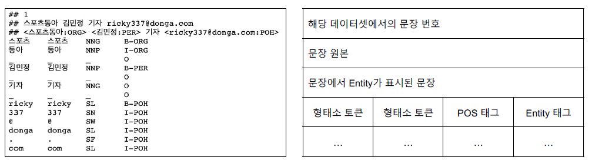
  - Entity tag에서 BIO tag로 구성되어 있다. B는 개체명의 시작(Begin), I는 내부(Inside), O는 다루지 않는 개체명(Outside)를 의미 
  - B-PER은 인물명 개체명의 시작, I-PER는 인물명 개체명의 내부 부분
- 문장 토큰 관계 분류 task의 경우 WordPiece tokenizer를 이용하게 되면 단어를 올바르게 자르지 못해 개체명이 에러가 날 수 있다. --> 음절 단위로 tokenize 하는 것이 좋다. 
<br/>

**8강 : 한국어 BERT 언어 모델 학습**
-
<br/>

## 2. 새로 알게된 내용 / 고민한 내용 (강의, 과제, 퀴즈)
- **실습코드 : (7강) BERT 기반 문장 토큰 분류 모델 학습 - 0_문장_토큰_단위_학습 + (w_KLUE)**
  - pathlib의 Path.read_text()는 파일 하나의 내용을 모두 읽어온다.
  - tag를 분류하기 위해서는 tag또한 id로 바꿔주는 과정이 필요하다.
  - CLS, SEP 등 특수 토큰도 token label에 등록되어야 하기 때문에 'O'로 등록해준다.  
  - HuggingFace의 BertForTokenClassification Class를 호출함으로써 문장 토큰 분류를 쉽게 할 수 있다. (`model = BertForTokenClassification.from_pretrained(MODEL_NAME, num_labels=len(unique_tags))`)
  - 음절 단위 tokenizer를 사용했기 때문에 Inference 과정에서도 음절 단위 tokenizer를 거친 후 입력으로 들어가야 한다.
  - KLUE 데이터의 경우 이미 음절 단위로 분리되어 있다.
- **실습코드 : (7강) BERT 기반 문장 토큰 분류 모델 학습 - 1_기계_독해_학습 + (w_KLUE)**
  - char_to_token 함수를 사용해 음절 단위의 index를 token idex로 mapping 해 줄 수 있다.
  ```python
  tokenizer.char_to_token(batch_index, char_index)
  >> batch_index에 해당하는 문장에서 char_index에 해당되는 word를 tokenizer로 tokenize 했을 때 해당 word가 위치하는 token index로 변환해준다.
  ```
  - 정답이 512 token 뒤에 존재할 경우 Bert Model에 들어가는 max_seq_length 보다 크기 때문에 에러 처리를 해줘야 한다.
  - HuggingFace의 BertForQuestionAnswering Class를 이용해 기계독해 task를 쉽게 학습할 수 있다.
  
## 3. 참고할 만한 자료
- **Reference**
  - 개체명인식
    - [1. Named Entity Recognition (NER) for Turkish with BERT](https://medium.com/analytics-vidhya/named-entity-recognition-for-turkish-with-bert-f8ec04a31b0)
  - QA
    - [1. lonformer_qa_training.ipynb](https://github.com/patil-suraj/Notebooks/blob/master/longformer_qa_training.ipynb)
    - [2. [논문리뷰] Retrieval-Augmented Generation for Knowledge-Intensive NLP Tasks](https://jeonsworld.github.io/NLP/rag/)
  - BERT seq2seq
    - [1. BERT2BERT_for_CNN_Dailymail.ipynb](https://github.com/patrickvonplaten/notebooks/blob/master/BERT2BERT_for_CNN_Dailymail.ipynb)
    - [2. Bert2Bert Summarization](https://github.com/MrBananaHuman/bert2bert-summarization)

## 4. 피어세션
- 대회 시도 결과 공유
- 자세한 내용은 [Peer Session](https://diagnostic-offer-ddb.notion.site/9-30-fe7bc175039d4147b3842a89f46f6683) 참조

---
---

# **Day 5**

- 학습 강의 : KLUE 9 ~ 10강

## 1. 강의 복습

### **KLUE** <br/>

**9강 : BERT 기반 단일 문장 분류 모델 학습**
- 
<br/>

**10강 : 한국어 BERT 언어 모델 학습**
-
<br/>

## 2. 새로 알게된 내용 / 고민한 내용 (강의, 과제, 퀴즈)
- **실습코드 : (5강) BERT 기반 단일 문장 분류 모델 학습 - 0_단일문장분류**
- **실습코드 : ㅋ**
- **실습코드 : ㅋ**
- **실습코드 : ㅋ**

## 3. 참고할 만한 자료
- **Reference**

## 4. 피어세션
- 전체적인 코드 리뷰 후 병합
- 자세한 내용은 [Peer Session](https://diagnostic-offer-ddb.notion.site/10-01-e76fc398bf404f0e88fcfd8fc0f268e2) 참조

---
---