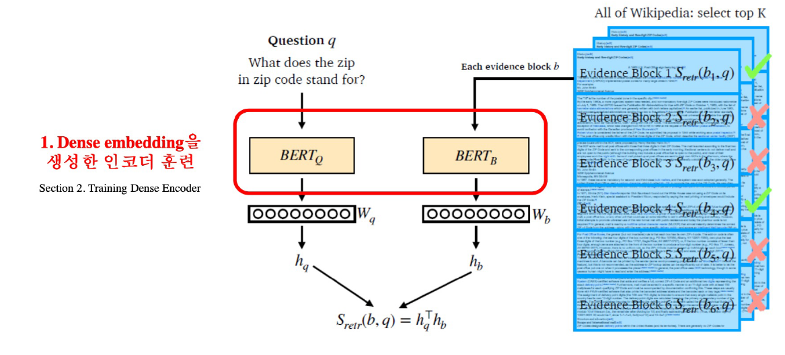

# **Day 1**
- 학습 강의 : MRC 1 ~ 2강

## 1. 강의 복습
### **MRC** <br/>

**1강 : MRC Intro & Python Basics**
- 기계 독해(Machine Reading Comprehension) : 주어진 지문(context)를 이해하고, 주어진 질의(Query/Question)의 답변을 추론하는 문제
    - Extractive Answer Datasets : 질의(Question)에 대한 답이 항상 주어진 지문(Context)의 segment(or span)으로 존재
        - Cloze Tests(CNN/Daily Mail, CBT)
        - Span Extraction(SQuAD, KorQuAD, NewsQA)
    - Descriptive/Narrative Answer Datasets : 답이 지문 내에서 추출한 span이 아니라, 질의를 보고 생성된 sentence(or free-form)의 형태 ex) MS MARCO, Narrative QA
    - Multiple-choice Datasets : 질의에 대한 답을 여러 개의 answer candidates 중 하나로 고르는 형태 ex) MCTest, RACE, ARC
- Challenges in MRC 
    - Paraphrasing : 같은 의미의 문장, but 다른 단어로 구성
    - Coreference Resolution
    - Unanswerable questions
    - Multi-hop reasoning : 여러 개의 문서에서 조합하여 질의에 대한 답을 도출
- MRC의 평가 방법
    - Exact Match & F1 score : Extractive Answer, Multiple-choice answer datasets
        - Exact Match or Accuracy : 에측한 답과 GT가 정확히 일치하는 샘플의 비율
        - F1 score : 에측한 답과 GT 사이의 token overlap을 F1으로 계산
        
    - ROUGE-L / BLEU : Descriptive Answer Datasets
        - ROUGE-L score : 예측한 값과 GT 사이의 overlap recall(Longest Common Subsequence 기반, LCS)
        - BLEU : 예측한 답과 GT 사이의 precision
- **Unicode** : 전 세계의 모든 문자를 일관되게 표현하게 다룰 수 있도록 만들어진 문자셋, 각 문자마다 숫자 하나에 매핑

- 인코딩 : 문자를 컴퓨터에서 저장 및 처리할 수 있게 이진수로 바꾸는 것
- UTF-8(Unicode Transformation Format) : 문자 타입에 따라 다른 길이의 바이트를 할당
- **Python에서 Unicode 다루기**
    - ord : 문자를 유니코드로 변환, chr : 유니코드를 문자로 변환
- **토크나이징** : 텍스트를 토큰 단위로 나누는 것 / 단어(띄어쓰기 기준), 형태소, subword 등 여러 토큰 기준 사용
    - Subword 토크나이징 : 자주 쓰이는 글자 조합은 한 단위로 취급, 자주 쓰이지 않는 조합은 subword로 쪼갠다. --> "##"은 디코딩을 할 때 해당 토큰을 앞 토큰에 띄어쓰기 없이 붙인다는 것을 의미
    
    - tokenization 방법론은 모델의 일부이다.(해당 모델이 학습했던 방법과 똑같이 tokenize를 해주어야 하기 때문)
- BPE(Byte-Pair Encoding) : 데이터 압축용으로 제안된 알고리즘
    1. 가장 자주 나오는 글자 단위 Bigram(or Byte pair)를 다른 글자로 치환 
    2. 치환된 글자 저장 
    3. 위 과정 1 ~ 2번 반복
- HuggingFace datasets 라이브러리를 이용해 KorQuAD dataset을 빠르게 불러올 수 있다.
```python
from datasets import load_dataset
dataset = load_dataset('squad_kor_v1', split='train')
```

<br/>

**2강 : Extraction-based MRC**
- Extraction-based MRC : 질문의 답변이 항상 주어진 지문 내에 span으로 존재 ex) SQuAD, KorQuAD, NewsQA, Natural Questions, etc.
- F1 score 계산 예시

- Pre-processing
    - Tokenization : WordPiece Tokenizer 사용
    - Attention Mask, Token_type_ids --> pad는 0으로 처리
- 모델 출력값 : 연속된 단어토큰(span)에서 시작과 끝 위치를 예측
- Fine-tuning

    - 전체 토큰 중 가장 높은 값을 가지는 값이 출력된다.
- Post-processing
    - 불가능한 답 제거하기 : candidate list 제거
    - 최적의 답안 찾기

<br/>

## 2. 새로 알게된 내용 / 고민한 내용 (강의, 과제, 퀴즈)
- **실습코드 : MRC Practice 1 - Looking into KorQuAD**
    - KorQuAD 데이터셋 살펴보기
    - `' '.join(tokenizer.tokenize(example_text)).replace(' ##', '')`로 역토크나이징 할 수 있다.(Bert 기반 Tokenizer)
    - tokenizer의 parameter 중 `return_overflowing_tokens=True`를 하면 context 문장이 짤리면 지정한 stride만큼 슬라이딩하여 뒤 문장을 tokenizer한다. --> tokenizing 한 후 key를 살펴보면 `'overflow_to_sample_mapping'`가 추가되어 있다.
    
    - `return_offsets_mapping=True`를 이용하면 text를 tokenize했을 때 각 token에 대한 index가 원래 text 기준으로 나온다. 이를 이용하면 answer의 index를 tokenize했어도 찾을 수 있다.
    
- **실습코드 : MRC Practice 2 - Extraction-based MRC**
    - HuggingFace의 datasets에서 load_metric을 통해 metric 함수를 불러올 수 있다.
    - max_seq_length를 정의하는 것이 중요하다.

## 3. 참고할 만한 자료
- **Further Reading**
    - [문자열 type에 관련된 정리글](https://kunststube.net/encoding/)
    - [KorQuAD 데이터 소개 슬라이드](https://www.slideshare.net/SeungyoungLim/korquad-introduction)
    - [Naver Engineering: KorQuAD 소개 및 MRC 연구 사례 영상](https://tv.naver.com/v/5564630)
    - [SQuAD 데이터셋 둘러보기](https://rajpurkar.github.io/SQuAD-explorer/)
    - [BERT: Pre-training of Deep Bidirectional Transformers for Language Understanding](https://arxiv.org/abs/1810.04805)
    - [The Illustrated BERT, ELMo, and co. (How NLP Cracked Transfer Learning)](http://jalammar.github.io/illustrated-bert/)
    - [Huggingface datasets](https://huggingface.co/datasets)

## 4. 피어세션
- 강의 계획과 대회 계획 세우기
- 대회 관련 자료 공유
- 자세한 내용은 [Peer Session](https://diagnostic-offer-ddb.notion.site/10-12-38a08ed4616b46de852735be5f3902a4) 참조

---
---
# **Day 2**
- 학습 강의 : MRC 3 ~ 4강

## 1. 강의 복습
### **MRC** <br/>

**3강 : Generation-based MRC**
- MRC 문제를 푸는 방법
    - 1) Extraction-based mrc : 지문 내 답의 위치를 예측 --> 분류 문제
    - 2) Generation-based mrc : 주어진 지문과 질의를 보고, 답변을 생성 --> 생성 문제
- Generation-based MRC는 Seq2seq PLM 구조이다. (Extraction은 PLM + Classifier 구조)
- BART에서는 입력시퀀스에 대한 구분이 없기 때문에 token_type_ids가 존재하지 않는다.
- BART : 기계 독해, 기계 번역, 요약, 대화 등 Seq2seq 문제의 pre-training을 위한 denoising autoencoder

    - BART의 인코더는 BERT처럼 bi-directional, 디코더는 GPT처럼 uni-directional(autoregressive)
    
    - BART는 텍스트에 노이즈를 주고 원래 텍스를 복구하는 문제로 Pre-training 되었다.
    
- Generation-based mrc는 Decoder를 이용해 텍스트를 생성하기 때문에 이전 출력이 다음 스텝의 입력값으로 들어간다. 이 때 Decoding 방법론에는 Greedy Search, Exhaustive Search, Beam Search가 있다.

<br/>

**4강 : Passage Retrieval - Sparse Embedding**
- Passage Retrieval : 질문에 맞는 문서를 찾는 것
- Passage Retrieval을 MRC과 연결하게 되면 Open-domain Question Answering이 가능하다. --> Passage Retrieval로 질문과 관련된 지문을 찾은 후 MRC Model에 넘기면 질문과 지문은 Model이 읽은 후 답을 도출하게 된다.(2-Stage pipeline)

- Passage Retrieval은 다음과 같은 과정으로 이루어 진다.

    - Query와 Passage를 임베딩한 뒤 유사도 순으로 Passage를 선택한다.
    - Passage쪽은 미리 임베딩을 해서 효율성을 높인다.
- **Passage Embedding Space**

    - 벡터화된 Passage를 이용해 Passage 간 유사도 등을 알고리즘으로 계산할 수 있다.
- **Sparse Embedding**

    - unigram으로 BoW를 구성하게 되면 한 문서 당 embedding vector의 크기가 vocab size만큼 커지게 된다. Bigram의 경우 vocab size의 제곱만큼 커지게 된다.
    - Term value를 결정할 때 위 그림처럼 등장 유무로 결정하는 방법도 존재하고 Term이 몇 번 등장하는지로 value를 결정하기도 한다.(TF-IDF)
- Sparse Embedding의 특징
    - Dimension of embedding vector = number of terms
        - 등장하는 단어가 많아질수록 즐가한다, N-gram의 n이 커질수록 증가한다.
    - Term Overlap을 정확하게 잡아 내야 할 때 유용하다.
    - 의미가 비슷하지만 다른 단어인 경우 비교가 불가능하다.
- **TF-IDF**
    - Term Frequency(TF) : 단어의 등장 빈도
        - 해당 문서 내 단어의 개수를 Count, 이후 Normalization을 진행
    - Inverse Document Frequency(IDF) : 단어가 제공하는 정보의 양 ex) It, was, the 등의 단어는 자주 등장하지만 제공하는 정보량이 적다.
        - $I D F(t)=\log \frac{N}{D F(t)}$ (Document Frequency(DF) = Term t가 등장한 document의 개수, N = 총 document의 개수)
    - Combine TF & IDF : $TF(t, d) \times IDF(t)$
        - 'a', 'the' 등 관사는 TF는 높지만 IDF가 0에 가깝다 --> Low TF-IDF
        - 자주 등장하지 안흔 고유 명사는 IDF가 커진다. --> High TF-IDF
- TF-IDF를 이용해 유사도 구하기
    1. 사용자가 입력한 질의를 토큰화하고 기존 vocab에 없는 토큰은 제외
    2. 질의를 하나의 문서로 생각하고 이에 대한 TF-IDF 계산
    3. 질의 TF-IDF 값과 각 문서별 TF-IDF 값을 곱하여 유사도 계산
    4. 가장 높은 점수를 가진 문서 선택
- **BM25** : TF-IDF의 개념을 바탕으로 문서의 길이까지 고려하여 점수를 매김
    - TF값에 한계를 지정해 일정한 범위를 유지
    - 평균적인 문서의 길이보다 더 작은 문서에서 단어가 매칭된 경우 그 문서에 가중치 부여
    - 검색엔진, 추천 시스템 등에서 아직까지도 많이 사용되는 알고리즘
<br/>   

## 2. 새로 알게된 내용 / 고민한 내용 (강의, 과제, 퀴즈)
- **실습코드 : MRC Practice 3 - Generation-based MRC**
    - max_target_length를 지정해주어서 실제 타켓 텍스트의 길이에 제한을 둔다.
- **실습코드 : MRC Practice 4 - TF-IDF Passage RetrievalC**
    - 사이킷런을 이용해서 TF-IDF를 쉽게 구할 수 있다.
    ```python
    from sklearn.feature_extraction.text import TfidfVectorizer
    vectorizer = TfidfVectorizer(tokenizer=tokenizer_func, ngram_range=(1,2))
    vectorizer.fit(corpus)  # 문서 전체의 term을 보고 TF-IDF를 구할 vocab을 결정
    sp_matrix = vectorizer.transform(corpus) # 문서를 sparse embedding vector로 변환
    sp_matrix.shape
    > (9606, 1272768) # 9606개의 문서내에 등장하는 총 vocab이 1272768개(unigram + bigram)
    ```
    - 위 sp_matrix는 희소행렬로 Compressed Sparse Row matrix로 변환되어 출력된다. --> `sp_matrix.indptr : 0이 아닌 행 위치`, `sp_matrix.indices : 0이 아닌 열 위치`, `sp_matrix.data : 0이 아닌 원소 값` 등의 method가 존재한다.

## 3. 참고할 만한 자료
- **Further Reading**
    - [Introducing BART](https://sshleifer.github.io/blog_v2/jupyter/2020/03/12/bart.html)
    - [BART: Denoising Sequence-to-Sequence Pre-training for Natural Language Generation, Translation, and Comprehension](https://arxiv.org/abs/1910.13461)
    - [Exploring the Limits of Transfer Learning with a Unified Text-to-Text Transformer (T5)](https://arxiv.org/abs/1910.10683)
    - [Pyserini BM25 MSmarco documnet retrieval 코드](https://github.com/castorini/pyserini/blob/master/docs/experiments-msmarco-doc.md)
    - [Sklearn feature extractor](https://scikit-learn.org/stable/modules/feature_extraction.html#text-feature-extraction)

## 4. 피어세션
- 실습 코드 에러에 대한 이야기
- Retrieval Model과 MRE Model에 대한 토론
- 자세한 내용은 [Peer Session](https://diagnostic-offer-ddb.notion.site/10-13-2d214fe7f95c47d591e06669f62a5999) 참조

---
---

# **Day 3**
- 학습 강의 : MRC 5 ~ 6강

## 1. 강의 복습
### **MRC** <br/>

**5강 : Passage Retrieval - Dense Embedding**
- Limitations of sparse embedding 
    - 차원의 수가 매우 크다. --> compressed format으로 극복 가능
    - 유사성을 고려하지 못한다.
- **Dense Embedding**
    - 더 작은 차원의 고밀도 벡터(length = 50 ~ 1000)
    - 각 차원이 특정 term에 대응되지 않는다.
    - 대부분의 요소가 non-zero 값
    
- Dense Embedding의 과정을 간략히 보면 다음과 같다.

    - 그런 후 질문과 Passage의 유사도를 비교해 관련 문서를 추출한다.
- Dense Encoder의 경우 MRC처럼 모든 토큰의 output을 사용하는 것이 아닌 [CLS] token의 output을 사용한다.
- **Dense Encoder 학습**
    - 학습 목표 : 연관된 question과 passage dense embedding 간의 거리를 좁히는 것 --> Positive
    - Challenge : 연관된 question / passage를 어떻게 찾을까? --> 기존 MRC 데이터셋을 활용
    
    - Negative Sampling : 연관되지 않은 question과 passage 간의 embedding 거리는 멀어야 한다. --> Negative
        - 1. Corpus 내에서 랜덤하게 뽑기
        - 2. 헷갈리는 negative 샘플 뽑기(높은 TF-IDF 스코어를 가지지만 답을 포함하지 않는 샘플)
    - Objective function : Positive passage에 대한 Negative Log Likelihood(NLL) loss 사용
    
- Passage Retrieval with Dense Encoder
    - Inference : Passage와 Query를 각각 embedding한 후 유사도를 비교해 Passage의 순위를 매긴다.
    
    - Retriever를 통해 찾아낸 Passage를 활용해 MRC 모델에 태운 후 답을 도출한다.
    
- 학습 방법 개선(DPR), 인코더 모델 개선(BERT보다 크고 정확한 PLM), 데이터 개선(추가적인 데이터 + 전처리) 등을 이용해 더 나은 Dense encoding을 할 수 있다.
<br/>

**6강 : Scaling up with FAISS**
- MIPS(Maximum Inner Product Search) : 주어진 질문 벡터 q에 대해 Passage 벡터 v들 중 가장 질문과 관련된 벡터를 찾는데, 이 때 내적값이 가장 큰 값을 선정
    - 실제로 검색해야할 데이터는 방대하기 때문에 모든 문서 임베딩을 일일히 보면서 검색하는 것은 불가능
- Tradeoffs of similarity search
    1. Search Speed
        - 쿼리 당 유사한 벡터를 k개 찾는데 얼마나 걸리는지? --> 가지고 있는 벡터량이 클수록 오래 걸림
    2. Memory Usage
        - 벡터를 사용할 때, 어디에서 가져올 것인지? --> RAM에 모두 올리면 RAM 용량이 과부하, 디스크에서 불러오면 속도가 느려짐
    3. Accuracy 
        - brute-force 검색 결과와 얼마나 비슷한지? --> 속도를 증가시키려면 정확도를 희생해야 한다.
    
- **Approximating Similarity Search**
    - Compression - Scalar Quantization(SQ) : vector를 압축하여, 하나의 vector가 적은 용량을 차지 --> 압축량 ↑, 메모리 ↓, 정보 손실↑
        - Scalar Quantization : 4byte floating point --> 1byte(8bit) unsigned integer로 압축 (4배 가량의 메모리 절약)
    - Prining - Inverted File(IVF) : Search space를 줄여 search 속도 개선(dataset의 subset만 방문) --> Clustering + Inverted file을 활용한 search
        - Clustering : 전체 vector space를 k개의 cluster로 나눔 ex) k-means clustering
        - Inverted file(IVF) : Vector의 index = inverted list structure --> 각 cluster의 centroid id와 해당 cluster의 vector들이 연결되어 있는 형태
        
        - 주어진 query vector에 대한 근접한 centroid 벡터를 찾음 --> 찾은 cluster의 inverted list 내 vector들에 대해 서치 수행
        
- FAISS : Library for efficient similarity search
    1) Train index and map vectors
    
        - 적절하게 clustering 해주기 위해서는 학습이 필요
        - SQ를 진행함에 있어서도 float number의 min, max를 파악하고 scale, offset 등을 결정하여야 하기 때문에 학습이 필요하다.
        - 학습을 한 후 cluster와 vector를 투입한다.
    2) Search based on FAISS index (npobe : 몇 개의 가장 가까운 cluster를 방문하여 search 할 것인지)
    

<br/>

## 2. 새로 알게된 내용 / 고민한 내용 (강의, 과제, 퀴즈)
- **실습코드 : MRC Practice 5 - Dense Passage Retrieval (In-batch)**
    - Query Encoder와 Passage Encoder를 활용해 sparse embedding이 아닌 dense embedding을 생성
    - negative sampling을 할 때 batch 내에서 GT가 아닌 다른 context를 활용하는 방법을 In-batch라고 한다.
    - `torch.argsort()`를 하면 입력 텐서의 값을 정렬시켰을 때 인덱스 값을 반환한다.
- **실습코드 : MRC Practice 6 - Scaling up with FAISS (In-batch)**
    - faiss를 사용할 때 clustering, SQ, PQ 등을 이용하기 위해서는 train 과정이 필요하다.

    ```python
    import faiss
    num_clusters = 16 # cluster 개수
    niter = 5 # Query 당 살펴볼 cluster 개수
    k = 5 # 최종적으로 가져올 passage 개수

    # Clustering
    emb_dim = p_embs.shape[-1] # p_embs = (960, 768) (Passage 개수, hidden_dim)
    index_flat = faiss.IndexFlatL2(emb_dim)

    # 1. Clustering
    clus = faiss.Clustering(emb_dim, num_clusters)
    clus.verbose = True
    clus.niter - niter
    clus.train(p_embs, index_flat)
    centroids = faiss.vector_float_to_array(clus.centroids)
    centroids = centroids.reshape(num_clusters, emb_dim)

    quantizer = faiss.IndexFlatL2(emb_dim)
    quantizer.add(centroids)
    
    # 2. SQ8 + IVF indexer (IndexIVFScalarQuantizer)
    indexer = faiss.IndexIVFScalarQuantizer(quantizer, quantizer.d, quantizer.ntotal, faiss.METRIC_L2)
    indexer.train(p_embs)
    indexer.add(p_embs)
    
    # 3. Search using indexer
    D, I = indexer.search(q_embs, k)
    ```

## 3. 참고할 만한 자료
- **Further Reading**
    - [Dense Passage Retrieval for Open-Domain Question Answering](https://arxiv.org/abs/2004.04906)
    - [Open domain QA tutorial: Dense retrieval](https://github.com/danqi/acl2020-openqa-tutorial/blob/master/slides/part5-dense-retriever-e2e-training.pdf)
    - [FAISS blog](https://engineering.fb.com/2017/03/29/data-infrastructure/faiss-a-library-for-efficient-similarity-search/)
    - [FAISS github](https://github.com/facebookresearch/faiss)
    - [FAISS tutorial](https://github.com/facebookresearch/faiss/tree/main/tutorial/python)
    - [Getting started with Faiss](https://www.pinecone.io/learn/faiss-tutorial/)

## 4. 피어세션
- 실습 코드 질문 공유
- 자세한 내용은 [Peer Session](https://diagnostic-offer-ddb.notion.site/10-14-aaf11fe8e88a458a8d6a62075c2feb4f) 참조

---
---

# **Day 4**
- 학습 강의 : MRC 7 ~ 8강

## 1. 강의 복습
### **MRC** <br/>

**7강 : MRC Practice 7- Open-Domain Question Answering**
- 기본 MRC는 지문의 주어진 상황에서 질의응답 하는 것을 말한다.
- Open-domain Question Answering(ODQA)는 지문이 따로 주어지지 않고 방대한 World Knowledge에 기반해서 질의응답 하는 것을 말한다.
- History of ODQA
    1) Question processing
        - Query formulation : 질문으로부터 키워드를 선택 / Answer type selection
        
    2) Passage retrieval 
        - 기존의 IR(Information Retrieval) 방법을 활용해서 연관된 document를 뽑고, passage 단위로 자른 후 선별(Naemd entity / Passage 내 question 단어의 개수 등과 같은 hand-crafted features 활용)
        
    3. Answering processing
        - Hand-crafted features와 heuristic을 활용한 classifier, 주어진 question과 선별된 passage들 내에서 답을 선택
        
- **Retriever-Reader Approach**
    - Retriever : 데이터베이스에서 관련있는 문서를 검색함
        - 입력 : 문서셋(Document corpus), 질문(query)
        - 출력 : 관련성 높은 문서(document)
        - TF-IDF, BM25 : 학습 X, Dense : 학습 O
    - Reader : 검색된 문서에서 질문에 해당하는 답을 찾아냄
        - 입력 : Retrieved된 문서(document), 질문(query)
        - 출력 : 답변(answer)
        - SQuAD와 같은 MRC 데이터셋으로 학습
        - 학습 데이터를 추가하기 위해서 Distant supervision 활용
    - Distant supervision : 질문-답변만 있는 데이터셋(CuratedTREC, WebQuestions, WikiMovies)에서 MRC 학습 데이터 만들기, Supporting document가 필요함
        1. 위키피디아에서 Retriever를 이용해 관련성 높은 문서를 검색
        2. 너무 짧거나 긴 문서, 질문의 고유명사를 포함하지 않는 등 부적합한 문서 제거
        3. answer가 exact match로 들어있지 않은 문서 제거
        4. 남은 문서 중에 질문과 (사용 단어 기준) 연관성이 가장 높은 단락을 supporting evidence로 사용
    - Inference 
        - Retriever가 질문과 가장 관련성 높은 5개 문서 출력
        - Reader는 5개 문서를 읽고 답변 예측
        - Reader가 예측한 답변 중 가장 score가 높은 것을 최종 답으로 사용
- Different granularities of text at indexing time
    - 위키피디아에서 각 Passage의 단위를 문서, 단락 또는 문장으로 정의할지 정해야 한다.
    
    - Retriever 단계에서 몇 개(top-k)의 문서를 넘길지 결정
    - Granularity에 따라 k가 다르다. (article --> k=5, paragraph --> k=29, sentence --> k=78)
    
- Single-passage training ***VS*** Multi-passage training
    - Single-passage : k개의 passages들을 reader가 각각 확인
    - Multi-passage : k개의 passagees 전체를 하나의 passage로 취급하여 reader가 그 안에서 answer span 하나를 도출
        - 단점 : 문서가 너무 길어져 GPU 메모리 요구량이 증가, 연산량 증가
- Importance of each passage 
    - Retriever 모델에서 추출된 top-k passage들의 retrieval score를 reader 모델에 전달
    
<br/>

**8강 : Extraction-based MRC**
- 
<br/>

## 2. 새로 알게된 내용 / 고민한 내용 (강의, 과제, 퀴즈)
- **실습코드 : MRC Practice 7- Open-Domain Question Answering**
    - 실습 1 ~ 4강 종합적으로 적용
    - Retriever model로 유사도가 높은 문서(corpus)를 가져오고 이 문서와 질문을 MRC model에 태워 최종 답변을 출력

## 3. 참고할 만한 자료
- **Further Reading**
    - [Reading Wikipedia to Answer Open-domain Questions](https://arxiv.org/abs/1704.00051)
    - [A survey on Machine Reading Comprehension](https://arxiv.org/abs/2006.11880)
    - [ACL 2020 ODQA tutorial](https://slideslive.com/38931668/t8-opendomain-question-answering)

## 4. 피어세션
- Project 역할 분담
- Special Mission 질문 공유
- 자세한 내용은 [Peer Session](https://diagnostic-offer-ddb.notion.site/10-15-eea8084d97b74031a790b3936b4f9725) 참조

---
---

# **Day 5**
- 학습 강의 : MRC 9 ~ 10강

## 1. 강의 복습
### **MRC** <br/>

**9강 : MRC Intro & Python Basics**
- 

**10강 : Extraction-based MRC**
- 
<br/>

## 2. 새로 알게된 내용 / 고민한 내용 (강의, 과제, 퀴즈)
- **실습코드 : **
    - 

## 3. 참고할 만한 자료
- **Further Reading**
    - 

## 4. 피어세션
- 
- 자세한 내용은 [Peer Session]() 참조

---
---

# **주간 회고**
1. 이번주는 저번 Pstage와는 다르게 주어진 강의와 Special Mission을 모두 수행했다. 본격적으로 다음주부터 대회가 시작되는데 어느정도 지식은 갖춘 것 같아서 뿌듯하다. 이대로 꾸준히 해나가자!
2. 밀린 것들을 슬슬 처리해야 할 것 같다. 우선적으로는 KLUE 9강을 제대로 정리하지 못했다. 이번 주말에 KLUE 9강과 밀린 학교 강의를 다 듣자! 그리고 Retriever model 부분을 맡았는데 이 부분에 대해서 논문을 조금씩 살펴봐야 할 것 같다. 이 부분도 주말에 봐야할 것 같다!
3. 오피스아워를 보고 좀 더 가독성 좋은 코드가 무엇인지 생각하게 되고 Pythonic하게 코드를 짜는 법에 대해 관심이 생겼다. 앞으로 코드를 작성할 때 Typing을 이용한 Type Hint와 Doc string을 깔끔하게 쓰는 습관을 만들어야 겠다. 또한 코드 내 함수 실행 시간을 측정하는 것에 대한 Decorator도 간단하게 조사했었다. 이 부분도 코드를 만질 때 적용해보자!
4. 이번 Pstage는 4주라는 기간이 있어서 저번과는 달리 약간의 여유(?)를 가질 수 있었다.(2주는 너무 짧다 ...) 남은 기간에 잘 준비해서 대회 성적, 코드의 가독성, 학교 시험까지 세 마리의 토끼를 잡는 것이 목표이다. **힘들어도 하나씩 해나가자!!!**
