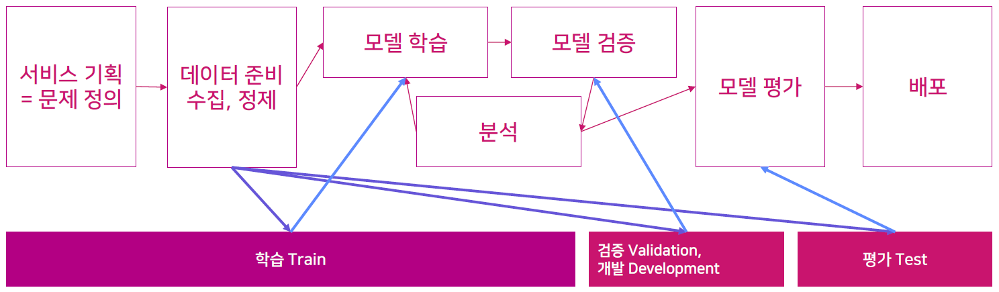
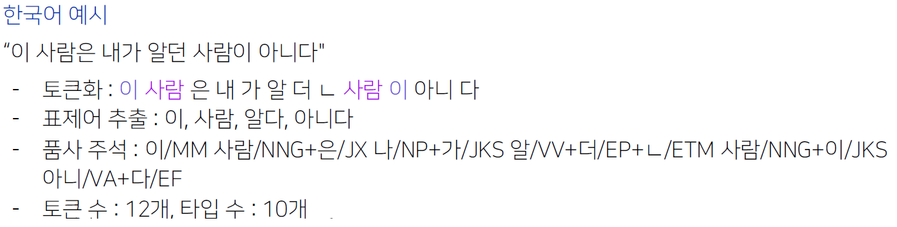
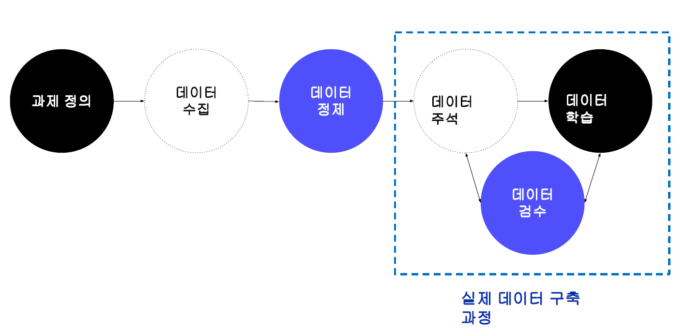
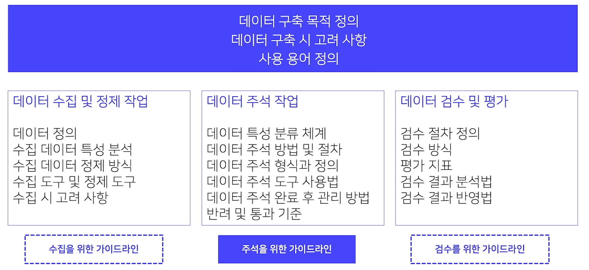

# **Day 1**
- 학습 강의 : 데이터제작(NLP) 1 ~ 2강

## 1. 강의 복습
### **데이터제작(NLP)**  

**1강 : 데이터 제작의 A to Z**
- 인공지능 서비스 개발 과정과 데이터

- 데이터 관련 작업에 소요되는 시간은 전체 프로젝트의 **80%**
- 데이터 구축 과정 : 원시 데이터 선정 및 확보 → 구축 및 가공 프로세스 확립 → 구축 및 가공 지침 작성 → 데이터 구축 및 가공 → 데이터 검수
- AI 데이터 설계 구성 요소 : 데이터 설계 + 데이터 수집-가공 설계
  - 데이터 설계 : 데이터의 유형, 데이터의 In/Out 형식, 데이터(train, dev, test)별 규모와 구분 방식, 데이터 주석(annotaion) 유형
  - 데이터 수집-가공 설계 : 원시 데이터 선정, 작업자 선정, 구축 및 검증 방법 설계, 가이드라인 작성
- **자연어 처리**는 자연어 이해(NLU, natural language understanding)와 자연어 생성(NLG, natural language generation)으로 구성된다.
- 자연어 처리 데이터 분류 방식
  - 원천 데이터 장르(도메인) : 문어(뉴스, 도서 등), 구어(대화 등), 웹(메신저 대화, 게시판 등)
  - 과제의 유형 : 자연어 이해(형태 분석, 구문 분석, 문장 유사도 평가 등), 자연어 생성(기계 번역, 추상 요약 등), 혼합(챗봇 등)

 

**2강 : 자연어처리 데이터 기초**
- 데이터의 종류 : 말뭉치 류(실제 텍스트 기반의 데이터), 사전/데이터베이스 류(텍스트 분석 시 참조로 사용되는 자원 ex. 온톨로지, 지식그래프)
- 언어 모델 평가를 위해 종합적인 벤치마크가 등장(GLUE, Super GLUE, KILT, GEM, KLUE 등)
- 텍스트 아카이브는 특별한 기준없이 모든 텍스트를 모아놓은 것이고 말뭉치 corpus는 특정 기준에 맞춰 구조화되고 설계된 텍스트들의 모음이다.
- 한국어는 단어는 9품사로 분석된다.(명사, 수사, 대명사, 동사, 형용사, 관형사, 부사, 조사, 감탄사)
- 타입 vs 토큰

- 한국어에서 N-gram의 종류로는 글자수 n-gram, 형태소 n-gram, 어절 n-gram 등이 있다.
- 표상이란 자연어를 컴퓨터가 이해할 수 있는 기법으로 표시한다는 의미이고 사전학습모델(PLM), word2vec 등이 있다.
- Text 데이터를 다룰 때 CSV파일보다는 TSV파일을 쓰는 것이 좋다.

 

## 2. 새로 알게된 내용 / 고민한 내용 (강의, 과제, 퀴즈)
- 

## 3. 참고할 만한 자료
- **Further Reading**
    - 

## 4. 피어세션
-  [Peer Session]() 참조

---
---
# **Day 2**
- 학습 강의 : 데이터제작(NLP) 3 ~ 4강

## 1. 강의 복습
### **데이터제작(NLP)**  

**3강 : 자연어처리 데이터 소개 1**
- 

 

**4강 : 자연어처리 데이터 소개 2**
- 

 

## 2. 새로 알게된 내용 / 고민한 내용 (강의, 과제, 퀴즈)
- 

## 3. 참고할 만한 자료
- **Further Reading**
    - 

## 4. 피어세션
-  [Peer Session]() 참조

---
---

# **Day 3**
- 학습 강의 : 데이터제작(NLP) 5 ~ 6강

## 1. 강의 복습
### **데이터제작(NLP)**  

**5강 : **
- 

 

**6강 : 데이터 구축 작업 설계**
- 데이터 구축 프로세스

- The MATTER cycle : Model(Project 전체 구조), Annotate, Train, Test, Evaluate, Revise
  - MAMA : Model-Annotate-Model-Annotate
- **데이터 주석 유형**
  - 분류 : 문장 또는 텍스트에 대한 분류 레이블을 주석하는 유형 ex) 감성 분석, 주제 분류, 자연어 추론 등(구축 난이도는 낮은 편)
  - 특정 범위(span) 주석 - NER : 텍스트의 일부를 선택하여 특정한 레이블을 주석하는 유형 ex) 개체명, 형태 분석
  - 대상 간 관계 주석- 개체명 연결 : 대상 간 관계를 주석하는 유형 ex) 관계 추출, 개체명 연결, 구문 분석 등
  - 텍스트 생성 - 번역 : 주어진 텍스트에 대한 텍스트 또는 발화를 생성하는 유형 ex) 대화문, 번역, 요약 등
  - 그 외 - 복합 유형 : 앞선 유형의 데이터 구축 방식을 복합적으로 사용하여 다양한 정보를 주석하는 유형 ex) 질의 응답, 슬롯필링 대화 등
- 데이터 검수
  - 가이드라인 정합성 : 각 주석 절차 및 주석 내용이 가이드라인에 부합하는지 확인
  - 데이터 형식 : 메타 정보, 태그, 텍스트 내용 등의 형식이 맞는지 확인
  - 통계 정보 : 메타 정보 및 레이블의 분포, 문장 길이, 단위 별 규모 확인
  - 모델 성능 확인 : 모델 학습을 통해 결과값 확인
- 오류 원인 분석
  - 구축방법 측면의 오류 원인
  - 가이드라인 측면의 오류 원인
  - 데이터셋 측면의 오류 원인
  - 학습모델 측면의 오류 원인
- 데이터 검수 유형 : 표본 추출과 전수 검사
- 데이터 평가 : 작업자 간 일치도(IAA, Inter-Annotator Agreemen), 모델 평가(Evaluation)

 

## 2. 새로 알게된 내용 / 고민한 내용 (강의, 과제, 퀴즈)
- 

## 3. 참고할 만한 자료
- **Further Reading**
    - [Natural language annotation](https://doc.lagout.org/science/Artificial%20Intelligence/Machine%20learning/Natural%20Language%20Annotation%20for%20Machine%20Learning_%20A%20Guide%20to%20Corpus-...%20%5BPustejovsky%20%26%20Stubbs%202012-11-04%5D.pdf)
    - [Natural language annotation - Short version](https://www.cs.brandeis.edu/~cs140b/CS140b_slides/NLAML_CS140b-2015.pdf)
    - [Fleiss' Kappa](https://hrcak.srce.hr/89395)
    - [Krippendorff's Alpha](https://repository.upenn.edu/cgi/viewcontent.cgi?article=1043&context=asc_papers#:~:text=2011.1.25-,Krippendorff's)

## 4. 피어세션
-  [Peer Session]() 참조

---
---

# **Day 4**
- 학습 강의 : 데이터제작(NLP) 7 ~ 8강

## 1. 강의 복습
### **데이터제작(NLP)**  

**7강 : 데이터 구축 가이드라인 작성 기초**
- 가이드라인의 유형
  - 목적 : 수집을 위한, 주석을 위한, 검수를 위한
  - 제시 방식 : 문서형, 화면 노출형(튜토리얼형) 
- 가이드라인의 구성 요소

- 가이드라인 버전 관리 : 구축과 검수 과정을 통해 지속적으로 개정
- 가이드라인 작성 도구 : Google Docs, Notion, 워드 및 한글 등
- 가이드라인 작성 시 유의 사항 
  - 가이드라인의 유형별 특성을 이해하고 그에 알맞는 정보를 작성
  - 작업자의 작업 이해도를 고려하여 작성
  - 작업자에게 공개해야 하는 필수 정보와 부가적인 정보가 무엇인지 사전에 고려
  - 가이드라인 구성 요소의 배치를 효율적으로
  - 작업자의 가독성을 고려

 

**8강 : **
- 

 

## 2. 새로 알게된 내용 / 고민한 내용 (강의, 과제, 퀴즈)
- 

## 3. 참고할 만한 자료
- **Further Reading**
    - 

## 4. 피어세션
-  [Peer Session]() 참조

---
---

# **Day 5**
- 학습 강의 : 데이터제작(NLP) 9 ~ 10강

## 1. 강의 복습
### **데이터제작(NLP)**  

**9강 : **
- 

 

**10강 : **
- 

 

## 2. 새로 알게된 내용 / 고민한 내용 (강의, 과제, 퀴즈)
- 

## 3. 참고할 만한 자료
- **Further Reading**
    - 

## 4. 피어세션
-  [Peer Session]() 참조

---
---