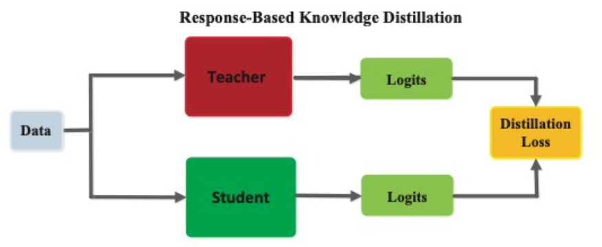
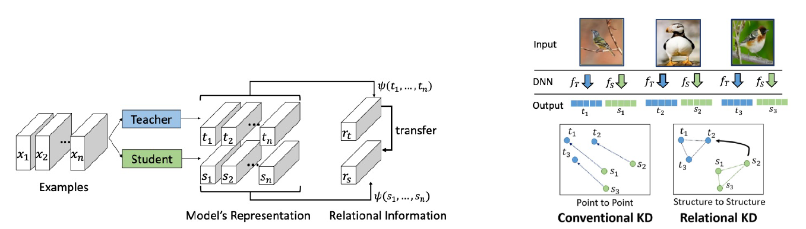
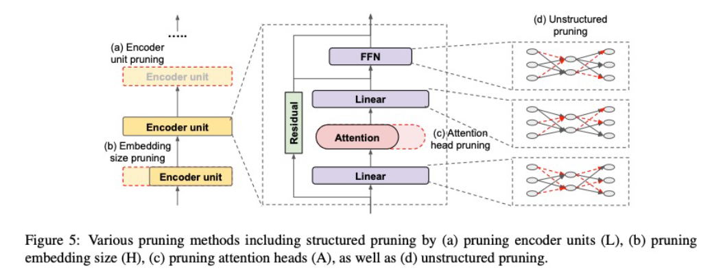

# **Day 1**
- 학습 강의 : 모델 최적화 1 ~ 2강

## 1. 강의 복습
### **모델 최적화**  

**1강 : 최적화 소개 및 강의 개요**
- 경량화의 목적
    1. On device AI : Power usage(Battery), RAM Memory usage, Storage, Computing power의 제약
    
    2. AI on cloud(or server) : latency나 throughput의 제약
- 경량화란?
    - 모델의 연구와 별개로, 산업에 적용되기 위해서 거쳐야 하는 과정
    - 요구조건(하드웨어 종류, latency 제한, 요구 throughput, 성능)들 간의 trade-off를 고려하여 모델 경량화/최적화를 수행
- 경량화, 최적화의 종류
    - 네트워크 구조 관점
        1. Efficient Architecture Design(+AutoML;Neural Architecture Search(NAS))
        2. Network Pruning : 중요도가 낮은 파라미터를 제거(가지치기)
        3. Knowledge Distillation : 학습된 큰 규모의 Teacher Network의 지식을 student Network에 전달
        4. Matrix/Tensor Decomposition : Matrix/Tensor를 더 작은 단위의 Matrix/Tensor로 표현
    - Hardware 관점
        5. Network Quantization : 더 작은 데이터 단위(fp16)로 mapping
        6. Network Compiling
1. Efficient Architecture Design + AutoML, Neural Architecture Search(NAS)
    - 각 모듈 블록마다의 특성이 다름(성능, 파라미터 수, 연산횟수 등)
    
    - AutoML, Neural Architecture Search(NAS)
        - Software 1.0 : 사람이 짜는 모듈, 
        - Software 2.0 : 알고리즘이 찾는 모듈
        - 모델을 찾는 네트워크(controller)
        
        - 사람의 직관보다 상회하는 성능의 모듈들을 찾아낼 수 있다.
        
2. Network Pruning : 찾은 모델 줄이기
    - 중요도가 낮은 파라미터 제거
    - 좋은 중요도를 정의, 찾는 것이 주여 연구 토픽(e.g. L2 norm이 크면, loss gradient 크면, 등)
    - structured/unstructured pruning으로 나뉘어짐
    
    - **Structured pruning**
        - 파라미터를 그룹 단위로 pruning하는 기법들을 총칭(그룹 : channel, filter, layer 등)
        - Dense computation에 최적화된 소프트웨어 또는 하드웨어에 적합한 기법
        
    - **Unstructured pruning**
        - 파라미터 각각을 독립적으로 pruning하는 기법
        - Pruning을 수행할 수록 네트워크 내부의 행렬이 점차 회소(sparse)해짐
        - Sparse computation에 최적화된 소프트웨어 또는 하드웨어에 적합한 기법
        
3. Knowledge distillation
    - 학습된 큰 네트워크를 작은 네트워크의 학습 보조로 사용하는 방법
    - Soft targets(soft outputs)에는 GT보다 더 많은 정보를 담고 있음(e.g. 특정 상황에서 레이블 간의 유사도 등)
    
    - 1) Student network와 GT label의 cross-entropy + 2) Teacher network와 Student network의 inference 결과에 대한 KLD loss로 구성
    $$\mathcal{L}_{K D}=(1-\alpha) C E\left(\hat{y}^{S}, y\right)+\alpha T^{2} K L\left(\sigma\left(\left(\hat{y}^{T} / T\right), \lambda\left(\left(\hat{y}^{S} / T\right)\right)\right.\right.$$
    - $T$는 large teacher network의 출력을 smoothing(soften)하는 역할은 한다.
    - $\alpha$는 두 loss의 균형을 조절하는 파라미터
4. Matrix/Tensor decomposition
    - 하나의 Tensor를 작은 tensor들의 operation들의 조합(합, 곱)으로 표현하는 것
    - Cp decomposition : rank 1 vector들의 outer product의 합으로 tensor를 approximation
    
5. Network Quantization
    - 일반적인 float32 데이터타입의 Network의 연산과정을 그보다 작은 크기의 데이터타입(e.g. float16, int8, 등)으로 변환하여 연산을 수행
    
    - 사이즈는 감소, 성능은 일반적으로 약간 하락, 속도는 Hardware 지원 여부 및 사용 라이브러리에 따라 다름(향상 추세)
6. Network Compiling
    - 학습이 완료된 Network를 deploy하려는 target hardware에서 inference가 가능하도록 compile하는 것(+ 최적화가 동반)
    - **속도에 가장 큰 영향**을 미치는 기법
    - e.g. TensorRT(NVIDIA), Tflite(Tensorflow), TVM(apache) 등
    - 각 compile library마다 성능차이가 발생
        - Compile 과정에서 layer fusion(graph optimization) 등의 최적화가 수행됨
        - tf의 경우 200개의 rule이 정의되어 있음
        
        - Framework와 hardware backends 사이의 수많은 조합
        - HW마다 지원되는 core, unit 수, instruction set, 가속 라이브러리 등이 다름
        - Layer fusion의 조합에 따라 성능차이가 발생하기도 함(동일회사의 hw 임에도)
        
    - AutoML로 graph의 좋은 fusion을 찾아내자 (e.g. AutoTVM(Apache))
        
 

**2강 : 대회 및 데이터셋 소개**
- Inference 속도를 대회 기준으로 결정
- 연산횟수(FLOPs)는 속도 결정의 간접적인 factor 중 하나
- 추천 논문 : ShuffleNetv2, 속도에 영향을 주는 요소에 대한 insight
- 대회 데이터셋
    - TACO : 대회용 데이터셋의 reference
        - 쓰레기 이미지의 label과 bbox, segmentation이 포함된 open image dataset
        - COCO farmat으로 제공됨
    - 국내용 데이터
        - 국내에서 발생한 쓰레기에 총 6개의 category로 분류된 데이터(COCO format)
- 간단 EDA
    - Category 분석
        - 총 6개의 Category
        - Train + valid = 20851
        - Test : 5217(2611(Private) + 2606(Public))
        - 전체 데이터셋에 대해 상위 3개의 category가 전체의 약 79%를 차지
- Cropped image 데이터셋의 문제점
    - Overlap 되는 이미지 다수 존재
    - Aspect ratio가 지나치게 불균형한 데이터 존재
- Customizing을 통한 완화
    - 기존 Dataset에서 General Trash, Battery 등 불균형 심한 Class 제거
    - loU 40% 이상의 Cropped 이미지의 경우 둘 중 큰 이미지는 제거
    - 특정 비율 이상의 심한 Aspect Ratio의 이미지 제거

 

## 2. 새로 알게된 내용 / 고민한 내용 (강의, 과제, 퀴즈)
- 다양한 경량화 기법에 대해 기초적인 부분을 알 수 있었다.

## 3. 참고할 만한 자료
- **Further Reading**
    - [[Paper] ShuffleNet V2: Practical Guidelines for Efficient CNN Architecture Design](https://arxiv.org/abs/1807.11164v1)

## 4. 피어세션
-  [Peer Session](https://diagnostic-offer-ddb.notion.site/11-22-4d74374c4d4b4675b1ac5ba397b5bbbb) 참조

---
---

# **Day 2**
- 학습 강의 : 모델 최적화 3 ~ 4강

## 1. 강의 복습
### **모델 최적화**  

**3강 : 작은 모델, 좋은 파라미터 찾기: AutoML 이론**
- Data Engineering

- 반복적인 Tuning 과정

- AutoML : **"True"** End-to-end learning

    - 데이터셋이 주어지고 알고리즘과 configuration이 정의되어 있을 때 loss를 가장 작게 만들어 주는 Hyperparameter configuration을 찾는 것
- DL model Configuration의 특징
    1. 주요 타입 구분
        - Categorical : optimizer(Adam, SGD, AdamW), module(Conv, BottleNeck, InvertedResidual), ...
        - Continuous : learning rate, regularizer param, ...
        - Integer : batch_size, epochs, ...
    2. **Conditional** : 선택한 configuration에 따라 search space가 달라진다.
        - Optimizer의 sample(e.g. SGD, Adam 등)에 따라서 optimizer parameter의 종류, search space도 달라짐(e.g. optimizer에 따른 learning rate range 차이, SGD : momentum, Adam : alpha, beta1, beta2)
        - Module의 sample(e.g. Vanilla Conv, BottleNeck, InvertedResidual)에 따라서 해당 module의 parameter의 종류, search space도 달라짐
- 기존의 모델을 경량화하자(Pruning, Tensor decomposition) **vs** 새로운 경량 모델을 찾자(NAS, AutoML)
- 일반적인 AutoML Pipeline

- Bayesian Optimization

    - Gaussian Process Regression
    - Tree-structed Parazen Estimator
- Surrogate Model(Function) : $f(\lambda)$의 Regression model
    - Objective $f(\lambda)$ 값을 예측하는 모델
    - Objective를 estimate하는 surrogate model을 학습, 다음 좋은 $\lambda$ 를 선택하는 기준으로 사용
    - 대표적인 Surrogate model에는 Gaussian Process Regression(GPR) Model이 존재
- Acquisition Function : 다음은 어디를 trial하면 좋을까?
    - Surrogate model의 output으로부터, 다음 시도해보면 좋을 $\lambda$ 를 계산하는 함수
    - Exploration **vs** Exploitation : 불확실한 지점과 알고있는 가장 좋은 곳의 trade off
    - Acquisition function의 max 지점을 다음 iteration에서 trial
    - Ex) Upper Confidence Bound(UCB)
    
- 연구 키워드
    - Hyperparameter Gradient Descent(탐색과 학습을 동시에)
    - Meta-learning(Auto "AutoML")
    - Multi-fidelity optimization
        - Data의 subset만을 활용
        - 적은 epoch
        - RL을 활용한 적은 trial
        - Image Downsampling
 

**4강 : 작은 모델, 좋은 파라미터 찾기: AutoML 실습**
- AutoML : 기준 성능을 잘 만족하는 적절한 모델, 파라미터 탐색

- 이론과 코드의 연결

 

## 2. 새로 알게된 내용 / 고민한 내용 (강의, 과제, 퀴즈)
- Optuna API를 어떻게 사용하는지 알 수 있었다.

## 3. 참고할 만한 자료
- **Further Reading**
    - [[Optional][Gaussian process 참고자료] Bayesian Deep Learning; 최성준 교수님](https://www.edwith.org/bayesiandeeplearning/lecture/24811?isDesc=false)
    - [[Optional] A Visual Exploration of Gaussian Processes](https://distill.pub/2019/visual-exploration-gaussian-processes/)
    - [Towards automating machine learning - Dr Thorben Jensen](https://www.youtube.com/watch?v=7lvwCZsrTn4)
    - [[Paper] Algorithms for Hyper-Parameter Optimization](https://papers.nips.cc/paper/2011/file/86e8f7ab32cfd12577bc2619bc635690-Paper.pdf)
    - [[Code] pytorch/vision](https://github.com/pytorch/vision)
    - [Optuna](https://optuna.org/)

## 4. 피어세션
-  [Peer Session](https://diagnostic-offer-ddb.notion.site/11-23-3ed2bdd2ab37458180673e18dc5f9527) 참조

---
---

# **Day 3**
- 학습 강의 : 모델 최적화 5강, 경량화기법101 1 ~ 3강

## 1. 강의 복습
### **모델 최적화**  

**5강 : 작은 모델, 좋은 파라미터 찾기: Data Augmentation & AutoML 결과 분석**
- Data Augmentation
    - 기존 훈련 데이터에 변화를 가해, 데이터를 추가로 확보
    - 데이터가 적거나 Imbalance된 상황에서 유용
    - 직관적으로 모델에 데이터의 불변하는 성질을 전달 --> robust해짐 ex) 강아지 이미지는 '회전하거나', '늘리거나', '일부부만 보이거나' 해도 강아지 이미지
- Object detection에서의 대표적인 Augmentation 기법들

- Image classification에서의 대표적인 Augmentation 기법들

    - ShearX(Y) : 이미지를 비틈
    - Invert : 255에서 기존 pixel값을 뺀 것
    - Equalize : 히스토그램 균일화
    
    - posterize : 더 적은 bit수로 color를 표현
- Image Augmentation 관련 논문 리뷰
    - Task, Dataset의 종류에 따라 적절한 Augmentation의 종류, 조합, 정도
    - AutoAugment 논문 : AutoML로 augmentation policy를 찾자 --> 너무 많은 시간과 큰 자원이 필요
    - RandAugment 논문 : 2개의 parameter(N:한 번에 몇 개 적용, M:공통 magnitude)로 search space를 극단적으로 줄임

### **경량화기법101**  

**1강 : 모델 경량화 기법 101 - CV**
- 주요 경량화 기법 
    - 효율적인 Architecture(MobileNet, EfficientNet 등 + NAS)
    - Pruning(Structured/Unstructured)
    - Knowledge Distillation
    - Weight Factorization(Tucker decomposition)
    - Quantization
- **Pruning** : 중요도가 낮은 파라미터를 제거하는 것(단위, 기준, Global/local 적용, 학습 전/후 phase 적용 등이 중요하게 작용하는 요소이다)
    - Structured Pruning
        - Saling factor $\gamma$
            - BN(Batch Norm)의 scaling factor $\gamma$는 Conv의 Out Channel에 곱해지는 형태
            - $\gamma$ 에 L1-norm을 Regularizer로 사용, Insignificant Channels은 자연스럽게 Prune
            
        - Feature map output : 각 filter에 SVD를 적용, Rank를 계산하여 기준을 매김
    - Unstructured Pruning
        - Lottery Ticket Hypothesis : Dense, randomly-initalized, feed-forward net은 기존의 original network와 필적하는 성능을 갖는 sub networks(winning tikcets)를 갖는다. --> 10~20%의 weight만으로, 원 network와 동일한 성능을 냄
        - Identifying winning tickets
        
        - Weight Rewinding
            - 데이터셋 또는 네트워크의 크기가 클 경우, k번째  epoch에서 학습한 파라미터로 네트워크를 초기화하면 학습이 안정화 됨
            
        - Learning Rate Rewinding
            - Weight rewinding 대신, weight는 그대로 유지하고 학습했던 learning rate scheduling을 특정 시점(k)로 rewinding
            
        - Deconstructing Lottery Ticket 
            - LTH는 $w_f$의 L1 norm으로 줄을 세워서 masking하는데 $w_i$도 함께 고려하자
            
        - Pruning at initialization
            - Train 이전에 **중요도(떡잎)**을 보고 Pruning을 수행하면 Training 시간이 훨씬 절약
            - SNIP : Gradient와 Weight의 곱의 절대값
            - GraSP : Hessian-gradient product와 Weight의 곱
            - SynFlow : 전부 1로 된 가상 데이터를 Forward해서 Gradient와 Weight의 곱
        - Pruning at initialization on NAS
            - Pruning at initialization의 기법들을 일종의 score로 network를 정렬
            - 각 기법의 score와 실제 학습 결과의 상관 관계(Spearman 상관 계수)를 확인할 결과 높은 상관계수를 가진다.
            - **학습이 필요없는, 간접적으로 모델을 평가하는 기법으로써 활용이 될 가능성이 높다.**
- **Knowledge Distillation** : teacher의 정보를 어떻게 빼내는가?

    - Response-Based Knowledge Distillation
        - Teacher model의 last output layer를 활용하는 기법, 직접적인 final prediction을 활용
        
    - Feature-Based Knowledge Distillation
        - Teacher의 layer의 중간 중간의 intermediate representation(feature)를 student가 학습하도록 유도
        - $F_t(x)$, $F_s(x)$ 를 각각 teacher, student의 feature map이라고 하고, $T_t$, $T_s$ 를 각각 teacher, student의 transformation function이라고 하고, distance $d$가 있을 때, featured based KD의 loss는 아래처럼 정의
        - 간단하게는 $d$는 L2 norm, $T_t$는 identity, $T_s$를 learnable한 linear transformation matrix로 정의(차원을 맞춰주기 위해)
        
    - Relation-Based Knowledge Distillation
        - 다른 레이어나, Sample"들" 간의 관계를 정의하여 knowledge distillation을 수행
        - 기존 기법은 point to point 개념이라면 Relation-Based는 structured to structured 개념
        
- 크기가 문제가 아닌 성능이 문제라면 → Self-training with noisy student improves imagenet classification(추가논문)
    - Noisy Student Training
    
    - KD와 차이점
        - Noise를 추가(Input noise : RandAug, Model noise : dropout, stochastic depth function)
        - Student가 점점 커지는 framework
        - Soft target을 사용한다는 점에서는 KD와 유사성 존재

 

**2강 : 모델 경량화 기법 101 - NLP Part 1**
- CV 경량화와 NLP 경량화의 차이점
    - Original tast → Target task로의 fine tuning하는 방식이 주된 흐름
    - 기본적으로 transformer 구조
    - 장점 : Large model → small model 방식의 KD와 좋은 궁합 + 모델 구조가 거의 유사해서 논문 재현 가능성이 높고 코드 재사용성도 높다.
    - 단점 : Resource가 많이 필요하다.
- Pruning 
    - Structured : encoder unit, embedding size, attention head
    - Unstructured : sparsify each weight matrix
    
    - Structured Pruning
        - Multi-Head Attention(MHA)를 없애도 성능 감소가 크지 않다.
        
        - Attention Head에 중요도를 매겨 순서대로 Pruning을 하자
        
        
    - Unstructured Pruning
        - Movement Pruning
            - Transfer learning에서 Weigth의 변화는 크지 않음
            - 값이 큰 Weight은 그대로 값이 큼(Weight 값은 많이 변하지 않음)
            - Original model에서의 큰 Weight은 Original Task에서 중요한 의미를 갖는 Weight일 가능성이 큼, But Fine-tuned model에서 큰 Weight은 **Target task에서 중요하지 않은 Weight일 수도 있음**
            - Magnitude Pruning에서는 Original task에서만 중요했던 Weight들이 살아남을 수 있다. → **Movement Pruning : Transfer Learning 과정에서, Weight의 움직임을 누적해가며 Pruning할 Weight을 결정하자**
            - Movement Pruning에서 W가 0에서 멀어진다는 것은 S가 커진다는 것을 의미한다.
            
            - KD가 접목될 경우 성능이 눈에 띄게 향상된다.
- Weight Factorization & Weight Sharing
    - ALBERT : 모델을 더 효율적으로 만들어서, 더 큰(더 좋은) 모델을 쓰는 것이 목표
        - 모델 크기는 똑같지만 Weight Sharing으로 용량만 감소, Inference 속도는 동일
        - Cross-layer parameter sharing
        - Sentence Ordering Objectives
        
            - NSP로 학습한 건 SOP를 못하지만, SOP로 학습한 건 NSP도 어느정도 할 줄 안다. → SOP가 좀 더 어려운 task
        - Factorized Embedding Parameterization
        
            - 일반적인 경우 파라미터 개수 : 23M / By factorization 파라미터 개수 : 3.07M

 

**3강 : 모델 경량화 기법 101 - NLP Part 2**
- Knowledge Distillation

    - DistilBERT
        - Triple loss = MLM + Hinton + Cosine embedding
        
    - TinyBERT
        - Transformer distillation method 
            1) From the output embedding layer(Feature-Based)
            2) From the hidden states and attention matrices(Feature-Based)
            3) From the logits output by the prediction layer(Response-Based : Hinton loss)
            
        - 3 types of loss
        
        
        - TinyBERT Learning
        
- Quantization
    - Q-BERT
        - mixed-precision quantization : 민감도가 높은 layer는 큰 precision, 낮은 layer는 작은 precision 
        - Hessian의 top eigenvalues의 크기가 해당 레이어의 민감도와 연관이 있다.
        - Group-wise Quantization method
            - Multi-Head 별로 Quantization range를 설정 → Quantization error 감소
- 총정리

 

## 2. 새로 알게된 내용 / 고민한 내용 (강의, 과제, 퀴즈)
- 

## 3. 참고할 만한 자료
- **Further Reading**
    - [Automl 리포트 예시](https://wandb.ai/placidus36/automl101/reports/Automl101--Vmlldzo0NzI1MTc)
    - [[Paper] AutoAugment: Learning Augmentation Policies from Data](https://arxiv.org/abs/1805.09501v3)
    - [[Paper] RandAugment: Practical automated data augmentation with a reduced search space](https://arxiv.org/abs/1909.13719v2)

## 4. 피어세션
-  [Peer Session](https://diagnostic-offer-ddb.notion.site/11-24-f33554998f7e4bdc8778cf7c5cab26a7) 참조

---
---

# **Day 4**
- 학습 강의 : 데이터제작(NLP) 7 ~ 8강

## 1. 강의 복습
### **데이터제작(NLP)**  
**6강 : **
- 

 

**7강 : 데이터 구축 가이드라인 작성 기초**
- 

 

**8강 : 관계 추출 과제의 이해**
- 

 

## 2. 새로 알게된 내용 / 고민한 내용 (강의, 과제, 퀴즈)
- 

## 3. 참고할 만한 자료
- **Further Reading**
  - 
  
## 4. 피어세션
-  [Peer Session](https://diagnostic-offer-ddb.notion.site/11-10-479e9e5ee2c7414cb5c864ab800f0a1f) 참조

---
---

# **Day 5**
- 학습 강의 : 데이터제작(NLP) 9 ~ 10강

## 1. 강의 복습
### **데이터제작(NLP)**  

**9강 : 관계 추출 관련 논문 읽기**
- 

 

**10강 : 관계 추출 데이터 구축 실습**
- 

 

## 2. 새로 알게된 내용 / 고민한 내용 (강의, 과제, 퀴즈)
- 

## 3. 참고할 만한 자료
- **Further Reading**
  - 

## 4. 피어세션
-  [Peer Session]() 참조

---
---