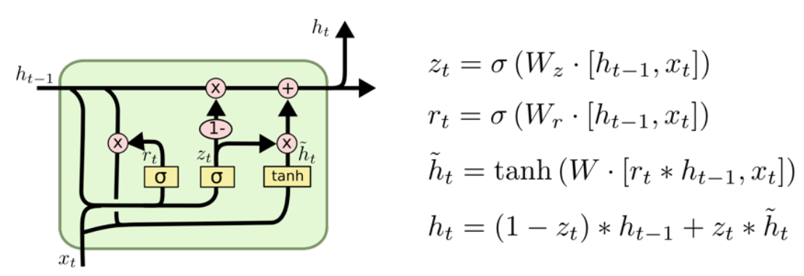

**Day 1**
===

- 학습 강의 : DL Basic 1 ~ 2강, Data Viz 1강(1-1, 1-2, 1-3)
- 과제 : [필수과제] MLP Assignment

## 1. 강의 복습
### **DL Basic**  

**1강 : 딥러닝의 기본 용어 설명 - Historical Review**

- 딥러닝에서 중요한 4가지 요소 :
  1. Data
  2. Model
  3. Loss function
  4. Algorithm
- 논문을 볼 때도 위 요소에 근거하여 보면 이해하기 쉽다.
- Model이란 이미지, 텍스트가 주어졌을 때 우리가 알고 싶어하는 것으로 바꿔주는 것을 의미!
- Loss function은 모델이 정해지고 데이터가 정해졌을 때 모델을 어떻게 학습할 지 결정해 주는 것이다.
  - 데이터의 noise가 클 경우가 존재하면 그로 인해 전체 네트워크의 학습률이 떨어질 수 있다. -> ***적절한 Loss function 선정과 그 관계를 파악하는 것이 중요하다.***
- Loss function에는 Regression에서 많이 사용되는 MSE, Classification에서 많이 사용되는 CE(Cross Entropy), Probabilistic에서 많이 사용되는 MLE가 존재한다.  
 

**2강 : 뉴럴 네트워크 - MLP(Multi-Layer Perceptron)**
- Neural Networks : 인간의 뇌를 모방하는 시스템
  - 실제 비행기를 생각해봤을 때, 새를 모방하는 것에서 시작했지만 현재는 새 모양은 아니다. -> 딥러닝도 마찬가지로 인간의 뇌를 모방하는데서 시작했지만 반드시 인간의 뇌를 모방할 필요는 없다.
- Neural Networks의 정확한 표현은 행렬과 비선형 연산이 반복적으로 일어나는 A function approximators이다.
- Active functions :
  1. Rectified Linear Unit(ReLU)
  2. Sigmoid
  3. Hyperbolic Tangent
- 어떤 것이 좋은 Active function인지는 문제마다 다르다.
- Multi-Layer Perceptron : 행렬과 비선현 연산이 반복적으로 일어나는 형태

### Data Viz  

**1강 : Introduction to Visualization**
- 데이터 시각화란 **데이터**를 **그래픽 요소**로 **매핑**하여 **시각적**으로 표현하는 것
  - 데이터 시각화에서 중요한 요소는 목적, 독자, 데이터, 스토리, 방법, 디자인 등이 있다.
- 데이터셋의 종류 :
  1. 정형 데이터 : 일반적인 CSV 파일, 통계적 특성과 feature 사이의 관계를 시각화
  2. 시계열 데이터 : 시간 흐름에 따른 데이터(기온, 주가, 음성, 비디오 등), 시간 흐름에 따른 추세, 계절성, 주기성 등을 시각화
  3. 지리 데이터 : 지도 정보와 시각화를 조합
  4. 관계형 데이터 : 객체와 객체 간의 관계를 시각화할 때 mapping 방법이 중요
  5. 계층적 데이터 : 관계 중에서 표함관계가 분명한 데이터
- 데이터의 종류 : 수치형(연속형, 이산형) / 범주형(명목형, 순서형)
- **mark**는 점, 선, 면으로 이루어진 시각화에서 가장 기본적인 요소, **channel**은 mark에 변형을 줄 수 있는 요소
- 전주의적 속성(Pre-attentive Attribute) : 주의를 주지 않아도 인지하게 되는 요소
  - 시각적 분리(visual popout) : 가독성이 좋다
- matplotlib 사용법 : 기본적으로 figure라는 틀 안에 ax를 추가하는 방식으로 사용한다.  

## 2. 새로 알게된 내용 / 고민한 내용 (강의, 과제, 퀴즈)
- 오늘 BPTT(BackPropagation Through Time)에 대해 주로 공부를 많이 했다.
    - Chain rule이 굉장히 중요하다.
- 내 컴퓨터의 GPU를 쓸 수 있도록 가상환경을 만들고 Pytorch를 설치하는 법을 배웠다.
- 딥러닝의 성장 과정(AlexNet 등)에 관해 배웠다.
- 데이터 시각화의 요소와 간단한 Matplotlib 사용법을 배웠다.

## 3. 참고할 만한 자료
- **슬랭 공유 자료 및 참고 자료**
  - [크로스 엔트로피](https://theeluwin.postype.com/post/6080524){:target="_blank"} 
  - [BTPP](https://github.com/go2carter/nn-learn/blob/master/grad-deriv-tex/rnn-grad-deriv.pdf){:target="_blank"} 
  - [RNN backprop](https://www.youtube.com/watch?v=4jgHzgxBnGY&list=PL1H8jIvbSo1q6PIzsWQeCLinUj_oPkLjc&index=15){:target="_blank"} 

## 4. 피어세션
- 지난주 선택 과제 2번에 대한 공부한 내용 공유
- 금주 수업 계획
- 자세한 내용은 [Peer Session](https://github.com/round26/round26/wiki/Week2-Day1){:target="_blank"}{:target="_blank"} 참조

---
---

**Day 2**
===

- 학습 강의 : DL Basic 3강, Data Viz 2강(2-1, 2-2, 2-3)
- 과제 : [필수과제] Optimization Assignment

## 1. 강의 복습
### **DL Basic**  

**3강 : Optimization**
-  

### **Data Viz**  

**2강 : 기본적인 차트의 사용**
- Bar Plot(막대 그래프)에 대한 설명 : 범주에 따른 수치 값을 비교하기 적합
  - 막대의 방향에 따라 수직, 수평
  - Multiple Bar Plot -> Stack 방식, 겹처서 표현하는 방식, 이웃하여 표현하는 방식
  - Principle of Proportion lnk : 실제 값과 그에 표현되는 그래픽으로 표현되는 잉크 양은 비례
  - x축의 시작은 반드시 ***zero(0)!!***
- Line Plot(꺽은선 그래프)에 대한 설명 : 연속적으로 변화하는 값을 표현하는 데 적합
  - 시간/순서에 대한 변화에 용이(시계열 분석)
  - .line이 아니라 .plot()
  - 선을 구분하는 요소에는 color, marker, markersize, linestyle, linewidth가 있다.
  - 데이터 전처리로 smoothing을 사용
  - 추세에 집중하고 간격을 잘 설정해야 한다.
  - 이중축 사용(한 데이터의 다른 단위에 적합, 다른 데이터를 이중축으로 표현하는 것은 지양)
- Scatter Plot(산점도)에 대한 설명 : 두 feature 간의 관계를 파악하는데 적합
  - color, marker, size를 이용해 5차원까지 확장할 수 있다.
  - 상관 관계를 확인
  - 군집, 갑 사이의 차이, 이상치
  - 인과관계와 상관관계에 대해 주의할 것
 

## 2. 새로 알게된 내용 / 고민한 내용 (강의, 과제, 퀴즈)
- matplotlib를 사용하여 Bar, Line, Scatter Plot을 그리는 법에 대해 알게 되었다.
- 각 데이터의 특징을 파악하여 그 특징에 맞는 그래프를 이용해 시각화하는 것이 중요하다.
- 

## 3. 참고할 만한 자료
- **부스트코스 제공 자료**
  - [TimeseriesCV](https://towardsdatascience.com/time-series-nested-cross-validation-76adba623eb9){:target="_blank"}
  - [RAdam github](https://github.com/LiyuanLucasLiu/RAdam){:target="_blank"}
  - [AdamP github](https://github.com/clovaai/AdamP){:target="_blank"}

- **슬랭 공유 자료 및 참고 자료**
  - [Optimizer](https://www.slideshare.net/yongho/ss-79607172){:target="_blank"}
  - [Attention Is All You Need 논문](https://arxiv.org/abs/1706.03762){:target="_blank"} 
  - [Attention Is All You Need 분석자료](http://nlp.seas.harvard.edu/2018/04/03/attention.html){:target="_blank"} 

## 4. 피어세션
- Model과 Optimizer의 개념에 대한 설명
- CV에서 Transformer를 이용한 예시 공유
- 자세한 내용은 [Peer Session](https://github.com/round26/round26/wiki/Week2-Day2){:target="_blank"}{:target="_blank"} 참조

---
---

**Day 3**
===

- 학습 강의 : DL Basic 4, 5, 6강
- 과제 : [필수과제] CNN Assignment

## 1. 강의 복습
### **DL Basic**  

**4강 : Convolution은 무엇인가?**
- Convoltion의 수학적 정의 

- Input data의 채널과 convolution 필터의 채널의 크기는 같아야 한다. -> 하나의 필터만 있을 경우 Ouput data의 채널의 크기는 **'1'** 
- 필터를 거친 Output의 W, H 크기 : $W_2(H_2) = {W_1(H_1) - F + 2 \times P \over S}+1$
- CNN(Convolution Neural Networks)
  - Convolution, pooling layers는 이미지에서 유용한 정보를 추출한다.
  - Fully connected layer는 최종적인 결과값을 출력해준다.
  - Fully connected layer가 없어지는 추세 -> parameter 숫자에 dependent하기 때문
- Neural Network를 분석할 때 각 layer별 parameter의 수, 전체 parameter의 수를 대략적으로 파악하는 것은 중요하다.
- Stride, Padding에 관한 개념(CNN 시각화 자료를 살펴보면 좋다)
- spatial dinmension은 w, h 차원의 dimension을 의미하고 일반적으로 CNN에서 dimension은 channel을 의미한다.  
 

**5강 : Modern CNN - 1X1 convolution의 중요성**
- ILSVRC(ImageNet Large-Scale Visual Recognition Challenge)의 1등 수상작 : 

1. AlexNet
  - ReLU 활성화 함수 사용 -> 기울기 소실 문제를 해결
  - 2 GPU 사용
  - Data augmentation과 Dropout 사용
2. VGGNet
  - 3X3 convolution만 활용했다.
    - convolution 크기를 고려했을 때 크기가 커지면 하나의 필터에 고려되는 Input의 크기가 커진다 -> Receptive field
    - 3X3 convolution을 2번 진행하면 5X5 convolution한 것과 같은 Receptive field의 크기를 가지지만 parameter의 수는 더 작다!
3. GoogleNet
  - 1X1 convolution을 활용해 channel을 줄여 parameter 수를 줄이는 효과를 얻었다.
  
4. ResNet
  - 층이 깊어질 수록 학습 효과가 떨어지는 것을 해결 -> identitiy map : 입력값을 출력값에 다시 더해준다.
  
  - Bottleneck architecture : 1X1 convolution을 이용해 Input 채널을 줄일 수 있다.
5. DenseNet
  - ResNet에서 더하는 것을 연산을 단순히 concatenation하는 것(Dense Block)
  - 채널이 기하급수적으로 거치기 때문에 1X1 convolutino을 이용해 채널을 조절(Transition Block)     

- ***Key point : 네트워크는 깊게 쌓고 파라미터 수는 줄이는 방향으로 발전!***  
 

**6강 : Computer Vision Applications**
- Semantic Sementation : 픽셀마다 분리하는 것

- Full Convolutional Network는 Fully connected layer와 달리 Input spatial dimension에 independent하다.
- feature의 spatial dimension을 늘리기 위해 Deconvultion 기법을 사용
- Detection :  

1. R-CNN : 이미지 안에서 bounding box를 여러 개 뽑는다.
2. SPPNet : CNN을 전체 이미지에 대해서 한 번만 돌리고 돌린 feature map에서 bounding box만 region별로 뜯어온다.
3. Fast R-CNN : SPPNet과 거의 동일하고 뒷단에 Neural Network를 추가했다.(Rol feature vector)
4. Fater R-CNN : bounding box를 뽑는 것도 학습시키자! -> Region Proposal Network 
5. YOLO : Region Proposal step후 네트워크를 돌려 class를 찾는 단계를 한 번에 동시에 처리하여 속도를 높였다.
 

## 2. 새로 알게된 내용 / 고민한 내용 (강의, 과제, 퀴즈)
- CNN 기본 동작 원리에 대해 자세하게 알 수 있었다.
- 과제를 할 때 CNN 차원에 대해 손으로 계산해보면서 channel과 layer 깊이에 대해 파악하는 것이 많은 도움이 되었다.
- Networks들이 어떤 방향으로 발전해왔고 어떤 문제를 해결함으로써 성능을 개선시켰는지 알 수 있었다.(층은 깊게 쌓고 파라미터는 줄이는 방향)
- egoing님의 git 특강을 통해 pull과 fetch, merge에 대한 개념을 좀 더 명확하게 할 수 있었다.

## 3. 참고할 만한 자료
- **부스트코스 제공 자료**
  - [cs231n 수업 (Andrej Karpathy 버전)](https://www.youtube.com/watch?v=LxfUGhug-iQ){:target="_blank"}
  - [Receptive field 참고 자료](https://cs231n.github.io/convolutional-networks/#conv){:target="_blank"}

- **슬랭 공유 자료 및 참고 자료**
  - [Convolution Neural Networks](https://cding.tistory.com/5?category=670644){:target="_blank"}
  - [Basic of CNN](https://itrepo.tistory.com/32#Receptive-Field){:target="_blank"}
  - [CNN 시각화](https://poloclub.github.io/cnn-explainer/){:target="_blank"}
  - [Convolution arithmetic](https://github.com/vdumoulin/conv_arithmetic){:target="_blank"}
  - [egoing님의 git강의](https://seomal.com/map/1){:target="_blank"}
  - [YOLO에 대한 설명](https://blog.naver.com/sogangori/220993971883){:target="_blank"}

## 4. 피어세션
- Fully Convolutional Network와 Fully connected layer의 특징과 차이
- Domain Adaptation에 관한 내용 공유
- 멘토링 시간 질문 정리
- 자세한 내용은 [Peer Session](https://github.com/round26/round26/wiki/Week2-Day3){:target="_blank"} 참조

---
---

**Day 4**
===

- 학습 강의 : DL Basic 7, 8강
- 과제 : [필수과제] LSTM Assignment, Multi-headed Attetion Assignment Assignment

## 1. 강의 복습
### **DL Basic**  

**7강 : Sequential Models - RNN**
- Sequence data의 특징 : 길이가 언제 끝날지 모르기 때문에 Input의 차원을 알 수 없다.
- Autoregressive model : 과거의 고정된 길이만 확인 
  - Markov model(first-order autoregressive model) : 직전의 시간만 확인
  - Latent autoregressive model : Hidden state가 추가되어 과거의 정보를 요약
- Recurrent Neural Network의 Long term-dependency가 떨어진다는 단점을 해결하고자 LSTM(Long Short Term Memory)가 등장

- LSTM
  - Previous cell state가 t까지의 정보를 요약해주는 역할을 한다.
  - Previous hidden state(이전의 출력값과), Previous cell state, $X_t$가 입력으로 들어가고 Output을 만들어 낸다.
  - **Forget gate** : $X_t$와 $h_{t-1}$이 들어가서 시그모이드 함수를 거쳐 $f_t$로 나오고 이 함수가 Previous cell state에서 나오는 정보를 버리거나 살리는 역할을 한다.
  - **Input gate** : $X_t$와 $h_{t-1}$이 들어가는데 이 정보 중 어떤 것을 Previous cell state에 올릴 지 결정
  - **Ouput gate** : 다시 한 번 계산을 해서 출력값을 결정한다.
  - Update cell : Forget gate와 Input gate에서 뽑아낸 정보를 합하여 cell state를 업데이트 한다.
- Gated Recurrent Unit

- reset gate와 update gate 두개로 이루어져 있고 cell state가 사라졌다.
- 적은 parameter로 동일한 성능을 뽑아낼 수 있다.(Generalization Performance가 올라간다)

 

**8강 : Sequential Models - Transformer**
- Sequential Model은 trimmed, omitted, Permuted한 문제들이 존재
- Transformer : Self-Attention라는 구조를 사용
  
  - Input sequence와 Output sequence의 숫자가 다를 수 있고 도메인이 다를 수 있다.
  - RNN이 여러 번 재귀적으로 처리하는데 비해 n개의 단어를 한 번에 처리한다.
  - Self-Attention에 n개 입력이 들어가서 n개의 출력이 나오는데 이 때 한 개의 입력은 n-1개의 입력 정보를 활용하여 출력이 생성한다.(dependency 가 존재)
  - Feed Forward Network는 dependency가 없다.
  
- 문장 내에서 단어를 설명할 때에는 문장 내 단어 간의 관계가 중요하다.(ex. it, they 등등)
- Self-Attention 구조는 Query, Key, Value라고 하는 3 개의 벡터를 만들어낸다.
  - encoding을 하고자 하는 Query 벡터(1개의 단어)와 자신을 포함한 다른 모든 Key 벡터를 각각 내적하여 각 Score를 뽑아낸다. -> 다른 단어와의 유사도를 파악하는 것
  - 계산한 score벡터를 Key 벡터의 dimension으로 나누어서 nomalize를 한다. -> score 값이 너무 커지는 것을 막아준다.
  - nomalize한 score를 Softmax함수를 취해준다.
  - 마지막으로 value 벡터의 weight sum을 한 것이 한 단어의 embedding 벡터의 encoding된 최종 출력값이 된다.
  - Query 벡터와 Key 벡터는 차원이 동일해야 한다.(내적을 하기 때문), Value 벡터는 달라도 된다.
  
- Tranformer 구조는 Input이 고정되더라도 다른 Input이 달라짐에 따라서 출력이 달라질 수 있다. -> 그만큼 표현할 수 있는 것이 많아진다! But 메모리를 많이 쓴다는 단점이 존재한다.
- Multi-headed attention(MHA) : Attention을 여런 번 하는 것
  - n번 Attention을 하게 되면 n개의 encoding된 벡터가 나오고 이를 Concatenate하여 최종 가중치 행렬과 곱해서 출력을 뽑는다.
- Position encoding을 통해 입력값에 특정 값을 더해준다. -> 단순히 attention은 순서에 대한 정보를 가질 수 없기 때문에 이를 해결하기 위해 position encoding을 진행
- Eecoder의 최상위 층의 Key, Value 벡터를 decorder에서도 그대로 사용한다.
- CV에서도 Transformer가 활용되고 있다.

 

## 2. 새로 알게된 내용 / 고민한 내용 (강의, 과제, 퀴즈)
- Transformer에 대한 전체적인 원리를 배웠다.
- egoing님의 git 특강을 통해 branch 생성, merge 방법, 충돌이 생겼을 때 해결하는 방법, Github의 issue와 pull request를 사용하는 방법을 배웠다.
- 실습 코드를 보면서 차원에 대한 부분만 이해하려고 했다. 전체적인 코드 부분은 차주 Pytorch 강의를 듣고 다시 한 번 확인해보면 도움이 될 것 같다.

## 3. 참고할 만한 자료
- **부스트코스 제공 자료**
  - [Illustrated transformer (번역)](https://nlpinkorean.github.io/illustrated-transformer/){:target="_blank"}
  - [Pytorch official Transformer tutorial](https://pytorch.org/tutorials/beginner/transformer_tutorial.html){:target="_blank"}

## 4. 피어세션
- 캐글에 대한 기본적인 설명
- 남는 시간에 대한 추후 피어세션 활용법에 대한 고민
- 자세한 내용은 [Peer Session](https://github.com/round26/round26/wiki/Week2-Day4){:target="_blank"}{:target="_blank"} 참조

---
---

**Day 5**
===

- 학습 강의 : DL Basic 9, 10강

## 1. 강의 복습
### **DL Basic**  

**9강 : Generative Models 1**
- Generative Model이라고 해서 이미지를 생성하는 것이 다가 아니다.
  - Generation : sampling
  - Density estimation : 이미지를 구분할 수 있다.(anomaly detection) -> explicit model
  - Unsupervised representation learning : feature leaning
- Categorical distribution의 경우 : m개의 side가 존재한다면 필요한 parameter 수는 m-1개(모두 합쳐서 1이 되야 하기 때문)
- Independence라는 가정하에 parameter 수는 매우 줄어든다. But 불가능한 가정에 가깝다. -> Conditional Independence
  - Chain rule : $p\left(x_{1}, \ldots, x_{n}\right)=p\left(x_{1}\right) p\left(x_{2} \mid x_{1}\right) p\left(x_{3} \mid x_{1}, x_{2}\right) \cdots p\left(x_{n} \mid x_{1}, \cdots, x_{n-1}\right)$
  - Bayes' rule : $p(x \mid y)=\frac{p(x, y)}{p(y)}=\frac{p(y \mid x) p(x)}{p(y)}$
  - Conditional Independence(가정) : If $x \perp y \mid z$, then $p(x \mid y, z)=p(x \mid z)$
- Chain rule을 적용했을 때 paremeter의 수는 $2^n-1$
- Markov 가정($X_{i+1} \perp X_{1}, \ldots, X_{i-1} \mid X_{i}$)을 적용하면 chain rule의 형태가 $p\left(x_{1}, \ldots, x_{n}\right)=p\left(x_{1}\right) p\left(x_{2} \mid x_{1}\right) p\left(x_{3} \mid x_{2}\right) \cdots p\left(x_{n} \mid x_{n-1}\right)$ 형태로 바뀌면서 필요한 파라미터의 수는 $2n-1$이다.
- 결국 Conditional Independence assumption을 어떻게 주는가에 따라서 parameter 수가 달라진다. -> Auto-regressive model
- Auto-regressive model은 ordering이 중요하다. ordering하는 거에 따라서 성능이 달라지고 방법론이 달라진다.
- NADE(Neural Autoregressive Density Estimator) : i번 째 입력은 i-1개의 입력에 dependent하다.
  - 입력이 dependent하기 때문에 입력 차원이 계속 바뀌고 그에 따라 Weight의 크기도 달라진다. 
 

**10강 : Generative Models 2**
- 
 

## 2. 새로 알게된 내용 / 고민한 내용 (강의, 과제, 퀴즈)
-  

## 3. 참고할 만한 자료
- **부스트코스 제공 자료**
  - [1시간 만에 GAN 완전 정복하기](https://www.youtube.com/watch?v=odpjk7_tGY0&t=69s)
  - [An Introduction to Variational Autoencoders(저자)](https://arxiv.org/abs/1906.02691)
  
- **슬랭 공유 자료 및 참고 자료**

## 4. 피어세션
- ㅇ

---
---

# **주간 회고**
