**Day 1**
===

- 학습 강의 : Part 1 - Bag of Words & Word Embedding 1강, 2강
- 과제 : [필수과제] Data Preprocessing

## 1. 강의 복습
### **NLP**  

**1강 : Intro to NLP, Bag-of-Words**
- NLP는 Natural Language Understanding(NLU)와 Natural Language Generating(NLG)의 task로 구성되어 있다.
- **Natural Language processing**
    - Low-level parsing
        - Tokenization
        - Stemming(어미가 달라지더라도 그 변화를 없애고 어근을 추출하는 것)
    - Word and phrase level
        - Named entitiy recognition(NER) : 여러 단어로 이루어져있는 고유 명사 ex) New York Times
        - Part-of-speecn(POS) tagging : 문장 내의 품사나 성분 등을 알아내는 작업
    - Sentence Level
        - Sentiment analysis : 문장의 긍정, 부정을 분석
        - Machine translation
    - Multi-sentence and paragraph level 
        - Entailment prediction : 두 문장 간의 논리적인 내포나 모순 관계를 예측
        - Question answering
        - Dialog systems : 대화할 수 있는 시스템 ex) 챗봇
        - Summarization : 문서를 요약
- **Text mining**
    - Document clustering
    - computation social science : 사회과학적인 Insight
- **Information retrieval**
    - 추천 시스템
- Bag-of-Words Representation
    - Step 1. 문장에서 단어들을 모아서 Vocabulary를 구축
    - Step 2. 각각의 단어들을 one-hot vector로 인코딩한다. 
    
        - 주어진 단어들 사이의 유클리드 거리는 모두 $\sqrt2$이다.
        - consine similarity(내적값)는 모두 0이다.
    - 각 단어들의 one-hot vector를 더함으로써 문장이나 문서를 나타낼 수 있다.
    
- NaiveBayes Classifier
    - Conditional independence assumption에 의해 다음 식이 성립
    

 

**2강 : Word Embedding**
- Word Embedding이란 문장 속의 단어들을 특정 차원에서의 벡터로 변환해주는 것이다.
- 의미가 비슷한 단어는 가까운 거리를, 의미가 다른 단어는 먼 거리를 가지는 좌표값으로 변환된다.
- Word Embedding을 학습하는 방법에는 Word2Vec, GloVe가 있다.
- **Word2Vec**
    - 같은 문장에서 나타난 인접한 단어들 간에는 관련성이 있다는 가정을 사용
    - 한 단어가 주변에 등장하는 단어들을 통해 그 의미를 추론할 수 있다.
    
        - cat이란 단어가 주어졌을 때 그 단어와의 연관성을 확률적으로 나타내면 위와 같다.
    - Word2Vec Algorithm Works
    
        - window size에 따라 학습 데이터가 결정된다. window 사이즈가 3이라고 하면 `(I, study), (study, I), (study, math), (math, study)`와 같이 구성될 수 있다.
        - `(study, math)`로 예를 들면  x에 `[0, 1, 0]` vector가 들어가고 Ground Truth는 `[0, 0, 1]` vector가 나온 것을 확인할 수 있다. Softmax를 통해 나온 확률분포 vector와 GT로 주어지는 vector 간의 거리가 가까워지는 방향으로 학습이 진행된다.
        - 단어가 Embedding된 one hot vector와 선형변환 Metrix($W_1$)이 곱해지는 것을 embedding layer라 한다. 
        - one hot vector와 Metrix($W_1$)의 연산은 one hot vector의 index 부분과 그 index와 일치하는 Metrix의 column vector를 가져온 것과 동일하다. -> 즉 오른쪽 그림에서 파란색 부분의 유사도는 크게 만들어주고 흰색 부분의 유사도는 낮게 만들어주는 방향으로 학습이 진행된다.
        - https://ronxin.github.io/wevi/ 참고
    - 이렇게 학습된 Word2Vec은 word간의 의미론적 관계를 잘 표현한다. ex) [Korean Word2Vec](http://w.elnn.kr/search), 
    
    - Intrusion Detection(문장 내에서 가장 의미가 안 어울리는 단어를 찾는 작업)에서도 Word2Vec이 사용된다. 각 단어와 다른 모든 단어 사이의 평균 거리를 구하고 그 중 가장 큰 값을 가지는 단어
- **GloVe**
    - 입력 / 출력 단어에 대해서 한 window 내에서 두 단어가 얼마나 동시에 등장했는지를 사전에 계산 -> Word2Vec에서의 중복된 계산을 줄여주는 효과
    

 

## 2. 새로 알게된 내용 / 고민한 내용 (강의, 과제, 퀴즈)
- CBOW(Continuous Bag of Words)는 주변의 단어로 중심 단어를 예측하는 방식
- Skip-Gram은 중심 단어를 통해 주변 단어를 예측하는 방식
- window size를 이용해 word embedding을 하는 것
- `from konlpy import tag`를 통해 다양한 tokenizer를 불러올 수 있다.

## 3. 참고할 만한 자료
- **부스트코스 제공 자료**
  - [Word2Vec, NeurIPS'13](https://arxiv.org/abs/1310.4546)
  - [GloVe, EMNLP'14](https://aclanthology.org/D14-1162/)

- **슬랭 공유 자료 및 참고 자료**
  - [이종혁 캠퍼님 논문리뷰](https://jonhyuk0922.notion.site/Deep-Neural-Networks-for-YouTube-Recommendations-3f70420b77254c57a86449bc20fe6095)

## 4. 피어세션
- 협업툴 상의 -> 노션 !
- 모더레이터 역할 설정
- Ground rule 설정
- To Do List 작성
- 자세한 내용은 [Peer Session](https://diagnostic-offer-ddb.notion.site/9-6-4bbb9980d82c461d9005ece5284fcc17) 참조

---
---

**Day 2**
===

- 학습 강의 : Part 2 - RNN, LSTM, and GRU 3강, 4강
- 과제 : [필수과제] RNN-based Language Model

## 1. 강의 복습
### **NLP**  

**3강 : Recurrent Neural Network and Language Modeling**
- 기본적인 RNN 구조는 다음과 같다.
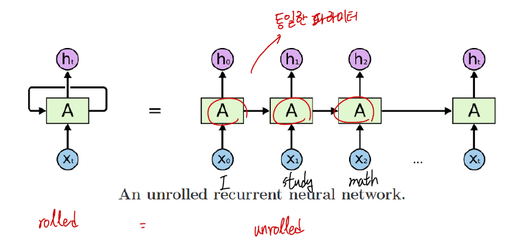
    - 시퀀스 데이터가 입력값으로 들어간다.(I study math)
- RNN의 hidden state는 $h_{t}=f_{W}\left(h_{t-1}, x_{t}\right)$ 로 계산할 수 있다.
    - $h_{t-1}$ : 이전 상태의 hidden state
    - $x_t$ : Input vector
    - $h_t$ : 현재 시점의 hidden state
    - $f_W$ : $W$라는 linear matrix와 같이 연산하는 RNN 함수
    - $y_t$ : 매 순간 계산하거나 마지막에서만 계산할 수 있다.
    - **매 순간 적용되는 Linear matrix($W$)는 동일하다.**
- RNN의 연산 과정은 다음과 같다.
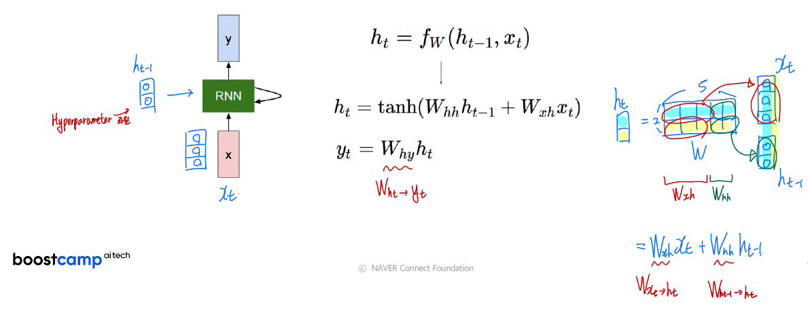
    - 전체 $W$를 $W_{xh}$와 $W_{hh}$로 나누어서 생각할 수 있다.
    - hidden state의 차원은 Hyperparameter로 직접 설정해야 한다.
- RNN의 종류에는 대표적으로 5가지의 경우가 있다.
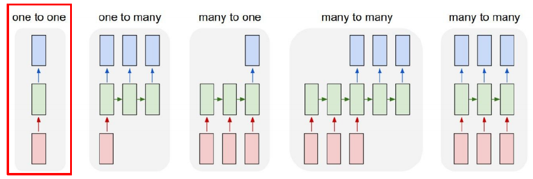
    - One-to-one : 기본적인 Standard Neural Networks를 의미한다.
    - One-to-many : Image가 들어가서 text가 나오는 것으로 생각할 수 있다.(Image Captioning)
    - Many-to-one : Sentiment Classification 혹은 감정 분석으로 단어가 들어갔을 때 부정인지 긍정인지 분류해주는 task를 예로 들 수 있다.
    - Many-to-many : 문장을 다 읽고 난 후 출력이 나오는 경우 ex) Machine Translation / 단어가 들어올 때마다 출력이 나오는 경우 ex) POS tagging
- Charater-level Language Model
    - 단어가 주어졌을 때 중복되는 문자를 제거하여 Vocab을 만들고 각 문자를 학습시켜 다음 문자를 예측할 수 있도록 해야한다. -> h, e, l, l이 들어가면 e, l, l, o가 나올 수 있도록 !
    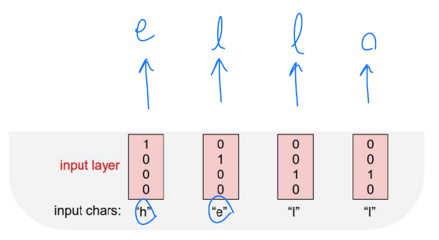
    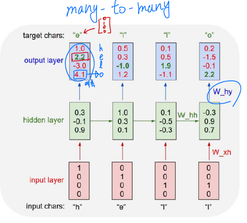
    - 위 경우에는 h가 입력으로 들어갔을 때 실제 출력은 "o"이지만 원하는 target은 "e"이다. 이 경우 출력값과 타켓값을 줄이는 방향으로 학습이 진행된다.
    - 추론을 할 때에는 한 문자가 들어가고 그 문자에 대한 출력이 다음 입력값으로 들어가는 형태이다.
- BPTT : RNN 모델에 입력되는 Sequence가 길어질 수록 BPTT를 할 때에 많은 GPU 리소스를 사용하게 된다. 이를 해결하기 위해 sequence를 여러 chunk로 나누어서 BPTT를 진행한다.(Trucated BPTT)
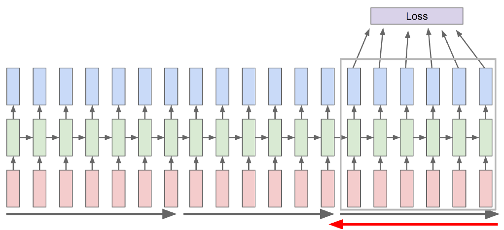
- hidden state의 특정 차원을 cell이라고 하고 이 cell을 고정시켰을 때 추후 결과를 살펴보면 고정 시킨 cell이 어떤 정보를 가지고 있는지 알 수 있다.(역추적)
- RNN은 BPTT 과정에서 gradient가  vanishing / exploding 하는 경우가 발생할 수 있다. 이를 해결하기 위해 LSTM, GRU를 사용한다. ex) [RNN / LSTM 비교](https://imgur.com/gallery/vaNahKE)

 

**4강 : LSTM and GRU**
- LSTM은 Cell state를 추가하여 기존의 RNN의 long-term dependency 문제를 해결했다.
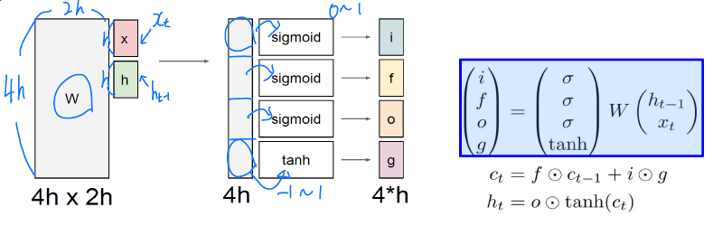
    - i : Input gate
    - f : Forget gate
    - o : Output gate
    - g : Gate gate
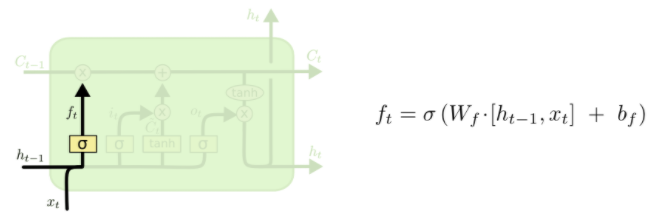
    - 이전 hidden state와 현재 입력 $x_t$와 선형 변환을 하고 시그모이드 함수를 씌운 것이 f가 되고 이 값이 $C_{t-1}$과 곱해진다. 이는 이전 Cell state의 정보 중 특정 비율만큼만 취한다는 의미이다.
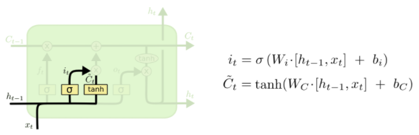
    - $\widetilde{C}_{t}$는 $tanh$을 취했으므로 -1 ~ 1의 값을 가진다.
    - $\widetilde{C}_{t}$에 $i$를 곱해주는 이유는 $\widetilde{C}_{t}$에서 한 번 선형 변환으로는 $C_{t-1}$에 더해줄 정보를 얻는 것이 힘들기 때문이다.
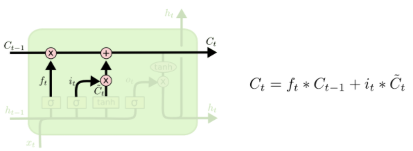
    - 결국 forget gate를 통해 구한 이전 cell state + Input gate와 Gate gate를 통해 구한$\widetilde{C}_{t}$를 통해 현재 cell state($C_t$)를 계산한다.
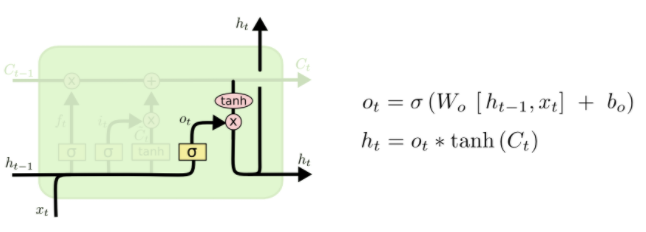
    - 최종적으로 구한 $C_t$에 $tanh$을 취하고 $o_t$(0~1의 값)를 곱함으로 적절한 비율만큼 정보를 뽑아내서 $h_t$를 구성할 수 있다.
- 요약해보면 **$C_t$는 기억해야할 필요가 있는 모든 정보를 담고 있는 벡터**이고 **$h_t$는 현재 시점에서 예측값에 직접적으로 필요한 정보만을 담고 있는 벡터**로 해석할 수 있다. 즉, $C_t$에서 원하는 정보만을 filtering 한 것이다.
- Gated Recurrent Unit(GRU)는 LSTM에서 Cell state를 없애고 hidden state만 이용했다.
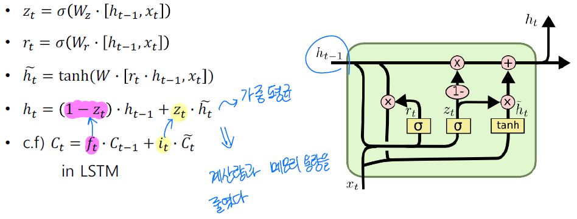
    - 결국 LSTM에서 cell state역할을 hidden state가 하게 되고 현재 시점의 hidden state는 가중 평균을 통해 구하게 된다 -> 독립적인 두 개의 게이트($f_t$, $i_t$)에서 하나의 게이트($z_t$)로 줄였다.
    - LSTM에 비해 성능은 크게 차이나지 않지만 계산량과 메모리 사용량을 줄였다는 장점이 있다.
- LSTM, GRU의 Backpropagation 과정에서는 덧셈의 연산이 존재하기 때문에 RNN과 비교하여 gradient가 vanishing / exploding하는 경우를 없앨 수 있다.

 

## 2. 새로 알게된 내용 / 고민한 내용 (강의, 과제, 퀴즈)
- 실습 코드 : 3_basic_rnn
    1. pytorch.nn.RNN의 Input은 `batch_first = False`가 default이고 이 때 ($L, N, H_{in}$)으로 입력받는다. ($L$ : sequence length, $N$ : batch size)
    2. pack_padded_sequence를 이용해 불필요한 연산을 제거할 수 있다. 
    3. packing한 것을 풀어줄 때에는 pad_packed_sequence을 이용한다.
- 실습 코드 : 4_fancy_rnn
    1. LSTM, GRU, Bidirectional의 동작 원리에 대해 실습할 수 있었다.
- 필수과제 : RNN-based Language Model
    - embedding vector와 decoding vector의 차원을 살펴보면서 Text의 차원에 대한 감을 익혔다.
    - 간단하게 말해서 [35, 20, 200] 차원의 벡터가 RNN의 입력으로 주어진다면 이는 20개의 문장이 존재하고 문장 속에 35개의 squence가 입력이 되고 이 때 각 단어의 입력은 200차원의 one hot vector(또는 nn.embedding layer를 통과한 vector)이다.(batch size : 20)

## 3. 참고할 만한 자료
- **부스트코스 제공 자료**
  - [The Unreasonable Effectiveness of Recurrent Neural Networks](http://karpathy.github.io/2015/05/21/rnn-effectiveness/)
  - [CS231n(2017)_Lecture10_RNN](http://cs231n.stanford.edu/slides/2017/cs231n_2017_lecture10.pdf)
  - [Understanding LSTM Networks](http://colah.github.io/posts/2015-08-Understanding-LSTMs/)

- **슬랭 공유 자료 및 참고 자료**
    - [pack_padded_sequence](https://simonjisu.github.io/nlp/2018/07/05/packedsequence.html)
    - [BPTT](https://davi06000.tistory.com/92)

## 4. 피어세션
- 정유석 캠퍼님의 당일 강의 요약 발표
- 실습 코드 리뷰
- TMI 이야기(기억에 남는 여행지)
- 자세한 내용은 [Peer Session](https://diagnostic-offer-ddb.notion.site/9-7-bdb392dec0d341bfaf421c4591bc9191) 참조

---
---

**Day 3**
===

- 학습 강의 : Part 3 - Seq2seq with Attention, Beam Search and BLEU Score 5강
- 과제 : [필수과제] RNN-based Language Model

## 1. 강의 복습
### **NLP**  

**5강 : Sequence to Sequence with Attention**
- Seq2seq 모델은 Encoder와 Decoder로 이루어져 있고 파라미터 값을 공유하지 않는다.
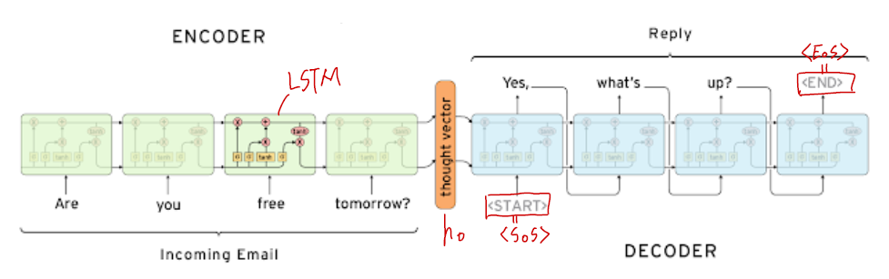
    - Encoder의 마지막 step의 hidden state vector는 그동안 들어온 입력값에 대한 정보를 가지고 있다. 이 정보는 Decoder로 전달돼 가장 초기 hidden state vector($h_0$)가 된다.
    - Decoder의 시작토큰으로 `<SoS>` 를 넣어주고 종료토큰으로 `<EoS>`를 넣어준다.
    - 일반적인 Seq2seq 모델의 문제점은 hidden state의 고정된 차원으로 인해 모든 정보를 담는 것이 어렵고 그로 인해 가장 초기에 입력된 값의 정보가 변질, 소실될 우려가 있다는 것이다.
    - 이를 해결한 것이 Attention 모듈이다.
- Attention 모듈은 마지막 hidden state vector 뿐만 아니라 모든 hidden state vector를 통해 정보를 얻는다. ex) [번역 예시](https://google.github.io/seq2seq/)   
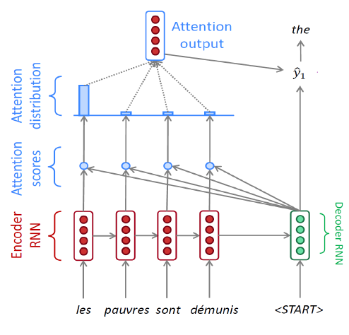
    - Decoder는 Encoder의 마지막 hidden state vector와 start token의 embedding vector를 입력으로 해서 새로운 hidden state vector($h_1$)를 생성한다.
    - Encoder의 각 sequence마다 hidden state vector가 존재하고 이 vector들과 Decoder의 $h_1$과 각각 내적하여 Attention score를 구한다.
    - score 값들을 softmax를 통과시키면 확률값을 가지고 이는 Encoder hidden state vector의 가중치 역할을 히게 되고 Attention vector라고 한다.
    - 결국 Decoder의 $h_1$과 Attention output vector가 합쳐져서 최종 출력값을 예측한다.
    - Decoder의 timestep에 따라 다른 hidden state vector를 통해 Attention 모듈을 계산하게 된다.
    - **Decoder의 hidden state vector는 output layer의 입력으로 사용됨과 동시에 Attention 모듈의 가중치를 결정해주는 역할을 한다.(필요한 정보를 취사선택)**
    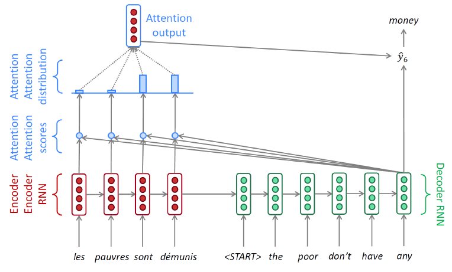
    - 위 과정에서 학습시킬 때 입력값으로 이전 출력값이 아닌 GT(Ground Truth)를 넣어주는 것을 Teacher forcing이라고 한다. 
    - Teacher forcing을 통해 학습시키면 학습 속도가 빠르게 진행된다는 장점이 있지만 실제 추론 과정과 다르기 때문에 괴리가 생긴다.
    - 때문에 초반에는 Teacher forcing을 통해 학습시키고 어느정도 학습이 진행된 후에는 이전 예측값을 다음 timestep의 입력값으로 넣어주는 방식으로 학습을 진행한다.
- Encoder의 hidden state vector들과 Decoder의 hidden state vector 간의 유사도를 구하는 방식은 내적뿐만 아니라 generalized dot product, concat 방식 등이 있다.
$$\operatorname{score}\left(\boldsymbol{h}_{t}, \overline{\boldsymbol{h}}_{s}\right)= \begin{cases}\boldsymbol{h}_{t}^{\top} \overline{\boldsymbol{h}}_{s} & \text { dot } \\ \boldsymbol{h}_{t}^{\top} \boldsymbol{W}_{a} \overline{\boldsymbol{h}}_{s} & \text { general } \\ \boldsymbol{v}_{a}^{\top} \tanh \left(\boldsymbol{W}_{\boldsymbol{a}}\left[\boldsymbol{h}_{t} ; \overline{\boldsymbol{h}}_{s}\right]\right) & \text { concat }\end{cases}$$
    - **generalized dot product**는 행렬을 이용해 서로 다른 차원에서 가중치를 전달해줄 수 있다. 또한 학습 가능한 파라미터가 존재하게 되어 최적화가 가능하다.
    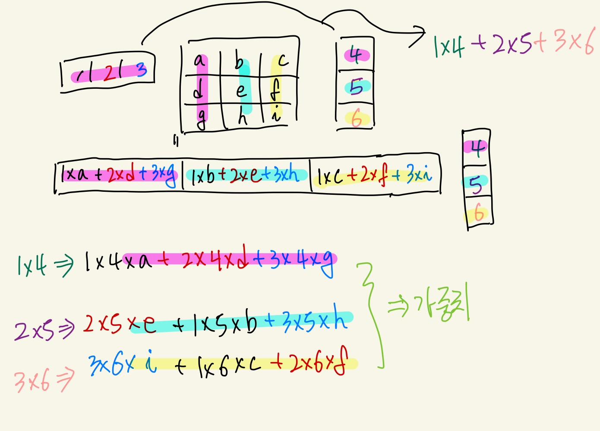
    - **concat**으로 구성하게 되면 layer를 이용하기 때문에 Attention score를 구할 때에도 학습 가능한 파라미터가 존재할 수 있게 된다. -> 최적화가 가능하다.
    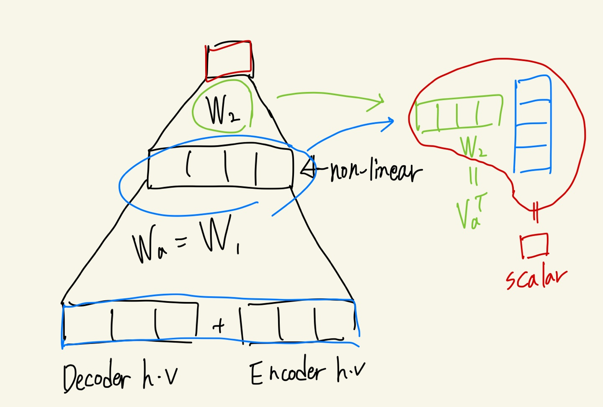
 

## 2. 새로 알게된 내용 / 고민한 내용 (강의, 과제, 퀴즈)
- 

## 3. 참고할 만한 자료
- **부스트코스 제공 자료**
  - [The Unreasonable Effectiveness of Recurrent Neural Networks](http://karpathy.github.io/2015/05/21/rnn-effectiveness/)
  - [CS231n(2017)_Lecture10_RNN](http://cs231n.stanford.edu/slides/2017/cs231n_2017_lecture10.pdf)
  - [Understanding LSTM Networks](http://colah.github.io/posts/2015-08-Understanding-LSTMs/)

- **슬랭 공유 자료 및 참고 자료**
    - [pack_padded_sequence](https://simonjisu.github.io/nlp/2018/07/05/packedsequence.html)
    - [BPTT](https://davi06000.tistory.com/92)

## 4. 피어세션
- 
- 자세한 내용은 [Peer Session](https://diagnostic-offer-ddb.notion.site/9-7-bdb392dec0d341bfaf421c4591bc9191) 참조

---
---

# **주간 회고**
