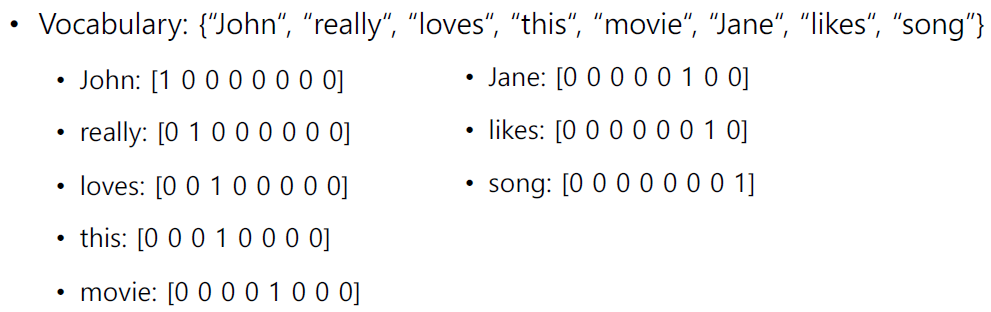
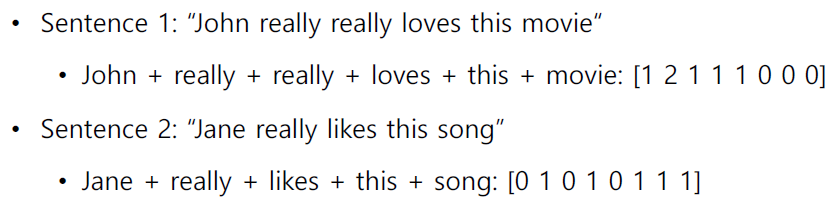
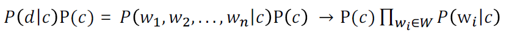
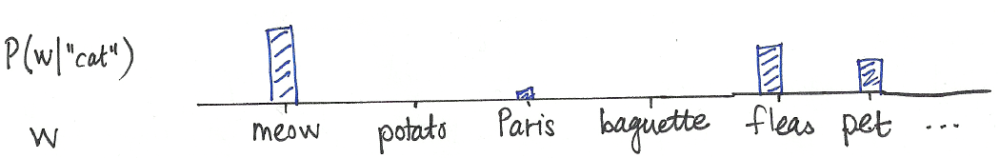
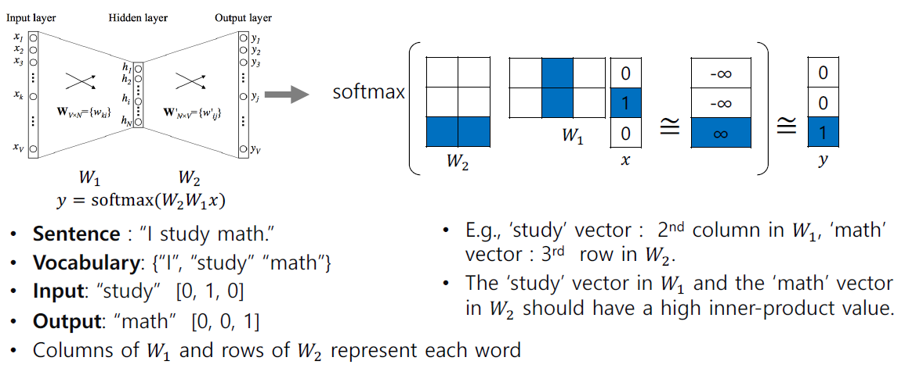
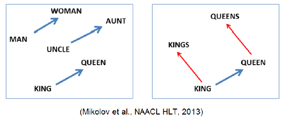
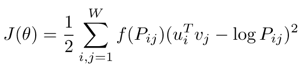

**Day 1**
===

- 학습 강의 : Part 1 - Bag of Words & Word Embedding 1강, 2강
- 과제 : [필수과제] Data Preprocessing

## 1. 강의 복습
### **NLP**  

**1강 : Intro to NLP, Bag-of-Words**
- NLP는 Natural Language Understanding(NLU)와 Natural Language Generating(NLG)의 task로 구성되어 있다.
- **Natural Language processing**
    - Low-level parsing
        - Tokenization
        - Stemming(어미가 달라지더라도 그 변화를 없애고 어근을 추출하는 것)
    - Word and phrase level
        - Named entitiy recognition(NER) : 여러 단어로 이루어져있는 고유 명사 ex) New York Times
        - Part-of-speecn(POS) tagging : 문장 내의 품사나 성분 등을 알아내는 작업
    - Sentence Level
        - Sentiment analysis : 문장의 긍정, 부정을 분석
        - Machine translation
    - Multi-sentence and paragraph level 
        - Entailment prediction : 두 문장 간의 논리적인 내포나 모순 관계를 예측
        - Question answering
        - Dialog systems : 대화할 수 있는 시스템 ex) 챗봇
        - Summarization : 문서를 요약
- **Text mining**
    - Document clustering
    - computation social science : 사회과학적인 Insight
- **Information retrieval**
    - 추천 시스템
- Bag-of-Words Representation
    - Step 1. 문장에서 단어들을 모아서 Vocabulary를 구축
    - Step 2. 각각의 단어들을 one-hot vector로 인코딩한다. 
    
        - 주어진 단어들 사이의 유클리드 거리는 모두 $\sqrt2$이다.
        - consine similarity(내적값)는 모두 0이다.
    - 각 단어들의 one-hot vector를 더함으로써 문장이나 문서를 나타낼 수 있다.
    
- NaiveBayes Classifier
    - Conditional independence assumption에 의해 다음 식이 성립
    

 

**2강 : Word Embedding**
- Word Embedding이란 문장 속의 단어들을 특정 차원에서의 벡터로 변환해주는 것이다.
- 의미가 비슷한 단어는 가까운 거리를, 의미가 다른 단어는 먼 거리를 가지는 좌표값으로 변환된다.
- Word Embedding을 학습하는 방법에는 Word2Vec, GloVe가 있다.
- **Word2Vec**
    - 같은 문장에서 나타난 인접한 단어들 간에는 관련성이 있다는 가정을 사용
    - 한 단어가 주변에 등장하는 단어들을 통해 그 의미를 추론할 수 있다.
    
        - cat이란 단어가 주어졌을 때 그 단어와의 연관성을 확률적으로 나타내면 위와 같다.
    - Word2Vec Algorithm Works
    
        - window size에 따라 학습 데이터가 결정된다. window 사이즈가 3이라고 하면 `(I, study), (study, I), (study, math), (math, study)`와 같이 구성될 수 있다.
        - `(study, math)`로 예를 들면  x에 `[0, 1, 0]` vector가 들어가고 Ground Truth는 `[0, 0, 1]` vector가 나온 것을 확인할 수 있다. Softmax를 통해 나온 확률분포 vector와 GT로 주어지는 vector 간의 거리가 가까워지는 방향으로 학습이 진행된다.
        - 단어가 Embedding된 one hot vector와 선형변환 Metrix($W_1$)이 곱해지는 것을 embedding layer라 한다. 
        - one hot vector와 Metrix($W_1$)의 연산은 one hot vector의 index 부분과 그 index와 일치하는 Metrix의 column vector를 가져온 것과 동일하다. -> 즉 오른쪽 그림에서 파란색 부분의 유사도는 크게 만들어주고 흰색 부분의 유사도는 낮게 만들어주는 방향으로 학습이 진행된다.
        - https://ronxin.github.io/wevi/ 참고
    - 이렇게 학습된 Word2Vec은 word간의 의미론적 관계를 잘 표현한다. ex) [Korean Word2Vec](http://w.elnn.kr/search), 
    
    - Intrusion Detection(문장 내에서 가장 의미가 안 어울리는 단어를 찾는 작업)에서도 Word2Vec이 사용된다. 각 단어와 다른 모든 단어 사이의 평균 거리를 구하고 그 중 가장 큰 값을 가지는 단어
- **GloVe**
    - 입력 / 출력 단어에 대해서 한 window 내에서 두 단어가 얼마나 동시에 등장했는지를 사전에 계산 -> Word2Vec에서의 중복된 계산을 줄여주는 효과
    

 

## 2. 새로 알게된 내용 / 고민한 내용 (강의, 과제, 퀴즈)
- CBOW(Continuous Bag of Words)는 주변의 단어로 중심 단어를 예측하는 방식
- Skip-Gram은 중심 단어를 통해 주변 단어를 예측하는 방식
- window size를 이용해 word embedding을 하는 것
- `from konlpy import tag`를 통해 다양한 tokenizer를 불러올 수 있다.

## 3. 참고할 만한 자료
- **부스트코스 제공 자료**
  - [Word2Vec, NeurIPS'13](https://arxiv.org/abs/1310.4546)
  - [GloVe, EMNLP'14](https://aclanthology.org/D14-1162/)

- **슬랭 공유 자료 및 참고 자료**
  - [이종혁 캠퍼님 논문리뷰](https://jonhyuk0922.notion.site/Deep-Neural-Networks-for-YouTube-Recommendations-3f70420b77254c57a86449bc20fe6095)

## 4. 피어세션
- 협업툴 상의 -> 노션 !
- 모더레이터 역할 설정
- Ground rule 설정
- To Do List 작성

---
---

# **주간 회고**
