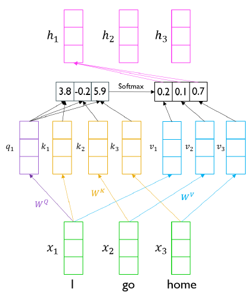
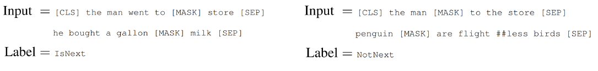

**Day 1**
===

- 학습 강의 : Part 4 - Transformer 7강
- 과제 : [선택과제 2] NMT training with Fairseq

## 1. 강의 복습
### **NLP** <br/>

**7강 : Transformer (1)**
- RNN은 Long-Term Dependency가 존재해서 이를 해결하기 위한 트릭으로 Bi-Directional RNNs 가 등장

    - 하지만 모델이 너무 무거워지고 학습하는데 많은 시간이 걸린다는 문제점이 존재
- Transformer model은 이러한 RNN model을 단점을 해결하기 위한 등장한 모델로 기존 Seq2seq with attention에서처럼 추가적인 module로 Attention을 활용하는 것이 아닌 Self-Attention만을 사용하여 학습을 할 수 있도록 구성했다.

    - 각 단어의 embedding vector가(I, go, home) Self-Attention을 거치면서 encoding되고 전체 문장의 sequence를 잘 반영한 output vector($h_1$, $h_2$, $h_3$)가 생성된다.
    - **$W^Q$ Metrix를 이용해 embedding vector를 선형변환한 것을 query vector라 한다.** 선형변환을 통해 query vector를 생성함으로써 다양한 가중치를 줄 수 있게 됐다. Seq2seq with attention에서 decoder의 hidden state vector 역할을 한다.
    - **$W^K$ Metrix를 이용해 embedding vector를 선형변환한 것을 key vector라 한다.** 이 벡터는 query vector와 내적연산을 통해 전체 sequence를 고려한 유사도를 구한다. Seq2seq with attention에서 encoder의 각 time step의 hidden states vector 역할을 한다.
    - 위에서 구한 유사도 vector를 softmax를 취해주면 가중치 vector가 된다.
    - **$W^V$ Metrix를 이용해 embedding vector를 선형변환한 것을 value vector라 한다.** 이 벡터를 가중치 벡터와 연산하여 선형 결합해주면 최종적인 encoder vector가 나온다.
    - 같은 embedding vector(I, go, home)이더라도 $W^Q$, $W^K$, $W^V$를 통해 Linear transformation을 진행해줌으로써 서로 다른 역할을 하는 벡터(Query, Key, Value)가 될 수 있다. 이러한 확장성 때문에 유연하게 유사도를 구하는 것이 가능해졌다.
    - key vector와 value vector 간의 관계를 살펴보자. query vector와 $k_1$이라는 key vector가 내적연산을 통해 유사도를 구하게 되면 이 유사도는 $v_1$이라는 value vector에 적용이 되어서 최종 결과가 나타난다. **즉 key vector의 개수와 value vector의 개수는 일치해야 한다는 것을 의미한다.**하지만 개수가 일치한다고 해서 둘의 차원이 같을 필요는 없다. value vector의 차원이 곧 output vector의 차원을 의미한다. value vector에 곱해지는 수치는 결국 key vector를 통해 구한 가중치 값(scalar)이기 때문이다.
    - 결론적으로 출력으로 나오는 output vector들은 전체 sequence의 각 단어 embedding vector에 대한 정보를 가중치에 따라 평균낸 vector이다.
    - 이는 sequence의 길이에 영향없이 sequence의 모든 정보를 취합할 수 있기 때문에 RNN의 Long-Term dependency를 근본적 해결했다고 볼 수 있다.
- 위 경우는 하나의 query vector에 따른 Self-Attention을 보여준 것이고 실제 행렬 연산 관점에서 바라보면 다음과 같다.

- 위 내용을 간단하게 요약하면 다음과 같다.
    1. Inputs은 Query vector $q$와 전체 Key-Value vectors 쌍이다.
    2. Output은 Value vector에 대한 가중 평균이다.
    3. 가중 평균에 쓰이는 가중치는 Query vector와 Value vector에 해당하는 Key vector의 내적이다.
    4. Query vector와 Key vector는 내적을 하기 때문에 차원이 같다.
    5. Value vector의 차원은 Output vector의 차원을 결정하고 Key vector 차원과는 무관하다.
    
- Query vector를 한 개에서 다수의 Query로 보고 행렬 연산 관점에서 보면 다음과 같다.

    - 행렬 연산을 위해 Key Metrix를 Transpose한 것을 알 수 있다.
- 그림으로 표현하면 다음과 같다.

    - 최종적으로는 **Scaled Dot-Product Attention**을 사용한다.
    - $A(Q, K, V)=\operatorname{softmax}\left(\frac{Q K^{T}}{\sqrt{d_{k}}}\right) V$
    - Query vector와 Key vector의 차원에 따라 분산이 결정되는데 이 분산이 크면 Softmax 함수를 취했을 때 어느 값에 치우쳐지는 경향이 존재한다.
    - 그렇기 때문에 $\sqrt{d_{k}}$로 나눠서 Query vector와 Key vector의 차원에 관계없이 분산을 1로 유지해준다.

<br/>

## 2. 새로 알게된 내용 / 고민한 내용 (강의, 과제, 퀴즈)
- **실습코드 : 7_multi_head_attention**
  - embedding된 vector들 `(Batch_size, Sequence_Length, emb_dim)`을 선형 변환을 통해 $Q, K, V$로 변환한다.`(Batch_size, Sequence_Length, hidden_dim)`
  - Multi-Head Attention을 위해 $Q, K, V$의 hidden_dim을 Head의 개수로 나눠준다. `(B, L, num_heads, d_k)`
  - attention score를 구할 때는 $Q, K$를 행렬연산을 하는데 이 때 $K$의 전치행렬을 곱한다. `attn_scores = torch.matmul(q, k.transpose(-2, -1)) // math.sqrt(d_k)` 이 때 attn_score의 shape은 `(B, num_heads, L, L)`이다.
  - 
  - 그런 후 attention score에 softmax를 먹인 후 $V$와 행렬 연산을 통해 각 Multi-Head Attention의 encoding vector를 계산한다.
  ```python
  attn_dists = F.softmax(attn_scores, dim=-1) # (B, num_heads, L, L)
  attn_values = torch.matmul(attn_dists, v) # (B, num_heads, L, d_k)
  ```   
  - 마지막으로 각 Head의 결과를 concat하여 동일 차원으로 선형 변환을 시킨다.
  ```python
  attn_values = attn_values.transpose(1, 2).contiguous().view(batch_size, -1, d_model)  # (B, L, d_model)
  outputs = w_0(attn_values) # (B, L, d_model)
  ```
- **선택과제 2 : NMT training with Fairseq**
  - Fairseq에 대한 간단한 실습
  - Fine-tuning 과정


## 3. 참고할 만한 자료
- **부스트코스 제공 자료**
  - [Attention is all you need, NeurIPS'17](https://arxiv.org/abs/1706.03762)
  - [Illustrated Transformer](http://jalammar.github.io/illustrated-transformer/)

- **슬랭 공유 자료 및 참고 자료**
  - [논문 코드 구현](https://github.com/bentrevett)

## 4. 피어세션
- 
- 자세한 내용은 [Peer Session](https://diagnostic-offer-ddb.notion.site/9-13-12d1912a51dc46a48e6f9e8f009c57fc) 참조

---
---

**Day 2**
===

- 학습 강의 : Part 4 - Transformer 8강
- 과제 : [선택과제 3] Byte Pair Encoding

## 1. 강의 복습
### **NLP** <br/>

**8강 : Transformer (2)**
- 동일한 $Q, K, V$ vector에 대해서 병렬적으로 동시에 여러 개의 Attention을 중첩한 것이 Multi-Head Attention이다.

   - 각 Attention module마다 $W_Q, W_K, W_V$가 존재하고 각각 다른 파라미터 값을 가진다. 이러한 각각의 선형변환들을 Head라고 한다.
   - 각 Attention module마다 생성된 encoding vector를 concat하여 최종 encoding vector를 얻는다.
- Multi-Head Attention을 통해 동일한 sequence에서도 서로 다른 기준으로 다양한 정보를 가져올 수 있다. ex) 주체가 한 행동에 대한 정보를 가져오거나 혹은 주체가 있는 장소에 대한 정보를 가져온다.

  - 여러 개의 Head를 통해 여러 경우의 $Q, K, V$ vector를 얻고 이를 통해 각기 다른 정보를 가지는 encoding vector를 추출할 수 있다.
- 최종적으로 나온 encoding vector를 concat하고 다시 한 번 선형변환을 거쳐 최종 encoding vector를 생성한다.

- Layer Type에 따른 연산량을 비교해보면 다음과 같다.

  - n은 문장의 길이(sequence length)
  - d는 hidden dimension
  - k는 cnn의 kernal size
  - r은 attention에서 전체 길이가 아닌 r개 만큼의 길이만 본다는 것을 의미한다.
  - Self-Attention의 경우 코어 수만 뒷받침된다면 병렬화를 통해 $O(1)$의 연산이 가능하다.
  - 반면 RNN의 경우 이전 time-step의 결과가 넘어와야 연산이 가능하기 때문에 병렬화가 불가능해서 $O(n)$의 연산이 가능하다.
  -  Self-Attention은 squence 길이에 제곱하는 메모리가 필요하기 때문에 RNN에 비해 연산속도는 빨라도 요구하는 메모리 요구량이 많다는 것을 알 수 있다.
- 실제 Transformer는 Multi-Head Attention에 Residual connection을 해주고 layer normalize를 진행한 후 나온 encoding vector를 다시 Fully connected layer를 거치고 Residual connection, layer normalize를 한 구조이다.  

  - Residual connection은 깊은 층을 쌓을 때 gradient vanish문제를 해결하여 학습을 안정화하는 역할을 한다.
  - Residual connection을 위해서는 입력 차원과 출력 차원이 같아야 한다.
  - Normalize layer는 주어진 값들에 대해 평균과 분산을 0, 1로 맞춰주고 그런 후 원하는 평균과 분산을 가지도록 하는 선형변환(Affine transformation)으로 구성된다.
  
- 위에서 설명한 Transformer 구조에서는 문장의 sequence 정보를 반영할 수 없다. 이를 해결하기 위해 Positional Encoding을 적용한다. 
  - $P E_{(p o s, 2 i)}=\sin \left(p o s / 10000^{2 i / d_{m o d e l}}\right)$
  $P E_{(p o s, 2 i+1)}=\cos \left(\right.$ pos $\left./ 10000^{2 i / d_{\text {model }}}\right)$

    - 위 식을 토대로 input sequence 단어의 embedding vector에 단어의 위치에 해당하는 positional encoding vector를 더해줌으로써 위치 정보를 담는다.
- Transformer에서 사용된 Warm-up Learning Rate Scheduler

  - optimizer에 사용되는 learning rate를 주어진 식에 따라 동적으로 바꿔준다.
  - 초반에는 iteration이 증가함에 따라 learning rate가 증가하고 어느 시점 이후부터는 감소하는 것을 확인할 수 있다.
- Transformer의 Encoder block을 통해 나온 encoding vector들이 어떤 정보를 주로 얻어오는지 시각화하면 다음과 같다.

  - 한 단어가 sequence 내에서 특정 단어들의 정보를 많이 가져오는 것을 알 수 있다.
  - Head별로 추출하는 정보가 다른 것도 확인할 수 있다.
- Transformer의 Decoder를 살펴보면 다음과 같다.

  - Encoder와 다른 점을 살펴보면 Decoder는 Masked Multi-Head Attention을 이용하는 것을 알 수 있다.
  - Encoder에서 나온 hidden state vector(encoding vector)들이 decoder의 두 번째 Multi-Head Attention의 Key, Value vector로써 입력으로 들어가고 Query vector는 Masked Multi-Head Attention를 통과한 Decoder의 encoding vector가 들어간다.
  - 그렇게 해서 나온 최종 encoding vector를 linear layer를 거쳐 output를 얻을 수 있다.
- 실제 inference 과정을 살펴보면 단어가 순차적으로 주어지기 때문에 처음 Timestep에서의 단어는 이후의 입력으로 주어지는 단어에 대한 정보를 얻으면 안된다. 이에 대한 문제를 해결하기 위한 것이 Masked Multi-Head Attention이다.

  - 실제 training 과정에서는 Decoder에 입력을 동시에 주지만 이는 실제 Inference 때에는 순차적으로 주기 때문에 뒤에 들어오는 단어에 대한 정보를 없애주어야 한다. 

<br/>

## 2. 새로 알게된 내용 / 고민한 내용 (강의, 과제, 퀴즈)
- **실습코드 : 8_masked_multi_head_attention**
  - 
- **선택과제 3 : Byte Pair Encoding**
  - 
## 3. 참고할 만한 자료
- **부스트코스 제공 자료**
  - [Annotated Transformer](http://nlp.seas.harvard.edu/2018/04/03/attention.html)
  - [Group Normalization](https://openaccess.thecvf.com/content_ECCV_2018/papers/Yuxin_Wu_Group_Normalization_ECCV_2018_paper.pdf)
  - [Attention is not explanation](https://arxiv.org/pdf/1902.10186.pdf)
  - [Attention is not not explanation](https://aclanthology.org/D19-1002.pdf)

- **슬랭 공유 자료 및 참고 자료**
  - 

## 4. 피어세션
- 
- 자세한 내용은 [Peer Session](https://diagnostic-offer-ddb.notion.site/9-14-b04a05097f2840c1810b2be36c6ea94e) 참조

**Day 3**
===

- 학습 강의 : Part 5 - Self-supervised Pre-training Models 9강
- 과제 : [선택과제 3] Byte Pair Encoding

## 1. 강의 복습
### **NLP** <br/>

**9강 : Self-supervised Pre-training Models**
- 최신 모델은 Self-supervised learning을 통해 대규모 데이터를 학습한 후 이를 transfer learning 형태로 다양한 NLP Task에 Fine tunning 형태로 적용한다.
- 그러나 아직까지 greedy decoding(왼쪽부터 차례대로 단어를 생성한다) 단계에서 벗어나지 못했다는 한계점이 존재한다.
- **GPT-1**

  - special token을 이용해서 디양한 NLP Task에 적용할 수 있는 통합된 모델이다.
  - 단어 레벨에서는 다음 단어를 예측하는 Text Prediction의 방법으로 모델을 학습시켰다. -> Language Modeling
  - 문장 레벨에서는 주어진 문장에 Start, Delim(문장 연결), Extract Token을 추가하여 encoding vector를 생성했다. 그런 후 Extract token에서 생성된 encoding vector를 최종 Output layer의 입력으로 활용함으로써 문장 단위의 NLP Task에 적용했다. 
  - Extract Token이 Query vector로 사용해서 주어진 문장들의 정보를 가져오는 것이다.
  - 결국 GPT 1은 대용량 데이터를 Text Prediction 방법으로 Self-supervised learning, 소수의 라벨링된 데이터를 Task Classifier 형태로 학습시키는 통합적인 학습 모델이다.
  - 이렇게 학습된 GPT 1을 가져와서 downstream task에 적용할 때에는 그에 맞는 layer를 추가하여 layer가 추가된 전체 Network를 학습시키는 Fine-tuning 형태로 적용할 수 있다. 실제 main task에 적용할 layer의 학습은 충분하게 하도록 만들면서 기존 GPT 1의 기학습된 Network는 learning rate를 낮게 주는 방식으로 큰 변화가 발생하지 않도록 학습을 진행한다.
- **BERT**
  - BERT도 GPT와 마찬가지로 Language Modeling Task로써 문장에 존재하는 일부 단어를 예측하는 형태로 Pretrain이 진행되었다.
  - GTP의 경우 이전 단어가 주어지면 다음 단어를 예측하는 형태의 Language Modeling Task였다면 BERT는 앞뒤 문맥을 통해 중간의 단어를 맞추는 형태로 학습을 진행하였다.
  - 이러한 방법을 Masked Language Model(MLM)이라고 한다. 문장 내 단어의 15% 정도를 MASK로 치환하고 이를 맞추는 형태로 진행된다.
  
  - Masking을 높은 비율로 하게 되면 충분한 정보가 제공되지 않고 낮은 비율로 하게 되면 학습의 효율이나 속도가 떨어진다.(100단어 중 1단어를 예측하게 되면 1단어를 맞추기 위해 99단어를 봐야하기 때문)
  - 15 %의 Masking 된 단어들 중 80%만 실제 [Mask] 토근으로 바꾸고 나머지 10%는 random word, 나머지 10%는 기존 단어를 그대로 유지한다. -> Pre-training 시에 입력되는 문장과 downstream task에 사용될 입력과의 괴리를 극복하기 위해서!
  - 추가적인 학습 Task로써 Next Sentence Prediction(NSP)를 사용한다.
  
    - 문장 사이나 끝에 [SEP] Token를 추가하고 맨 앞에 [CLS] Token을 추가해준다. 그리고 [CLS] Token을 문장 전체의 정보를 담고있는 encoding vector로써 이용한다.
    - GPT와는 다르게 라벨링된 소수의 데이터가 아닌 입력 데이터로만 학습을 진행한다.
    - 데이터의 50%는 실제 연속된 문장을 가져오고 50%는 Random으로 뽑힌 문장(연속되지 않은 문장)을 가져와서 Self-supervised learning을 진행했다.
  - BERT는 추가적으로 segment embedding 기법을 이용했다.
  
    - 기존의 Position embedding vector도 학습하도록 구성했다.
    - segment embedding은 문장 단위로써의 위치를 반영한 vector로 볼 수 있다.
- **GPT**는 다음 단어를 예측하는 Task이기 때문에 이전 time step의 정보만을 반영해야 하고 이를 위해 Masked Multi-Head Attention을 활용한 **Decoder**를 사용하고 **BERT**는 모든 문장을 통해 중간 단어를 예측하기 때문에 Self-Attention module을 활용한 **Encoder**를 사용했다.

- BERT의 Fine-tuning 과정은 다음과 같다.

- **GPT** ***VS*** **BERT**
  - GPT는 800M words, BERT는 2500M words 데이터셋을 이용해서 Pre-train
  - BERT는 [SEP], [CLS] Token과 segment embedding을 활용
  - batch 사이즈는 BERT - 128,000 words, GPT - 32,000 words
  - Fine-tuning 과정에서 GPT는 고정된 5e-5의 learning rate를 사용했고 BERT는 Task마다 learning rate를 설정했다.
- Machine Reading Comprehension(MRC)에서의 BERT 모델 적용 과정
  **1. SQuAD 1.1**
  
    - 주어진 문단과 질문을 [SEP]을 통해 연결한다.
    - 연결한 데이터를 BERT 모델을 통해 단어에 대한 encoding vector를 구한다.(124개의 문장으로 구성되어 있다면 124개의 encoding vector가 생성)
    - 생성된 encoding vector를 새로 정의한 FC layer 1, FC layer 2에 적용해 sclar값을 뽑아낸다.(124개의 scalar값이 2 set)
    - set마다 softmax를 취해 첫 번째 set은 starting point, 두 번째 set은 ending point를 예측하게 한다. 
  **2. SQuAD 2.0**
  
    - 2.0 버전에서는 실제 No Answer라는 것이 존재한다. 이 때에는 [CLS] Token을 이용해서 BERT를 통과시킨다. [CLS] Token에 해당하는 encoding vector를 Binary Classification에 해당하는 layer를 통과시켜서 답이 있는지 없는지 파악한다.
    - 이 때 답이 있으면 위에서 했던 방식을 그대로 진행하여 예측값을 생성한다.
- SWAG 에서의 BERT 모델

  - MRC와 비슷한 방식으로, 각각의 문장을 연결하여 BERT 모델을 통과시킨 다음 FC layer를 통해 scalar값을 생성한다.
  - 모든 경우의 scalar 값들을 softmax를 취해서 결과값을 예측하는 형태로 학습을 진행한다.

<br/>

## 2. 새로 알게된 내용 / 고민한 내용 (강의, 과제, 퀴즈)
- **실습코드 : 9_transformers_1**
  - 

## 3. 참고할 만한 자료
- **부스트코스 제공 자료**
  - [GPT-1](https://openai.com/blog/language-unsupervised/)
  - [BERT : Pre-training of deep bidirectional transformers for language understanding, NAACL’19](https://arxiv.org/abs/1810.04805)
  - [SQuAD: Stanford Question Answering Dataset](https://rajpurkar.github.io/SQuAD-explorer/)
  - [SWAG: A Large-scale Adversarial Dataset for Grounded Commonsense Inference](https://leaderboard.allenai.org/swag/submissions/public)
  - [XLNet: Generalized Auto-regressive Pre-training for Language Understanding](https://arxiv.org/abs/1906.08237)

- **슬랭 공유 자료 및 참고 자료**
  - 

## 4. 피어세션
- 
- 자세한 내용은 [Peer Session](https://diagnostic-offer-ddb.notion.site/9-15-a552ba63f2b54c9b8d5c4594936c4c18) 참조

**Day 4**
===

- 학습 강의 : Part 5 - Self-supervised Pre-training Models 10강
- 과제 : [선택과제 3] Byte Pair Encoding

## 1. 강의 복습
### **NLP** <br/>

**10강 : Advanced Self-supervised Pre-training Models**
- **GPT-2**
  - 모델의 구조는 GPT-1과 동일하되, 더 많은 layer와 많은 양의 좋은 퀄리티의 데이터셋을 사용하였다.
  - down-stream task가 생성 모델에서의 Zero-shot setting으로 다루어질 수 있다.
  - [The Natural Language Decathlon : Multitask Learning as Question Answering](https://arxiv.org/abs/1806.08730)을 토대로 모든 NLP Task를 QA 관점으로 접근하였다.
  - Reddit에서 3개 이상의 좋아요를 받은 글과 외부 링크를 가지고 있는 경우 그 링크에 있는 문서의 Text를 학습 데이터로 사용했다.
  - Byte pair encoding(BPE)를 사용했다.
  - Layer들의 parameter를 random initialize를 할 때 layer의 index에 반비례해서 initialize 값을 작게 만들어주었다. -> 위쪽 레이어의 역할을 줄인다.
  - Fine-tuning 과정없이 Zero-shot setting으로 실험을 진행했을 때 어느 정도 성능이 나왔다.
    - Summarization의 경우 입력 문장 마지막에 TL;DR: 줌으로써 Summarization task가 가능하다.
- **GPT-3**
  - GPT-2와 비교해서 모델 구조는 동일하지만 parameter 수를 매우 늘렸다.
  - GPT-2에서의 zero-shot을 통해 본 가능성을 충분히 끌려올렸다는 것에 의의가 있다.
  
    - Zero-shot에서 Few-shot으로 갈수록 성능이 좋아졌다.
    - 별도의 Fine-tuning없이 입력 예시에서 패턴을 파악하여 동적으로 학습한 후 바로 inference를 진행한다.
  - 모델 사이즈를 키울 수록 Zero-shot, One-shot, Few-shot의 성능이 좋아지고 이 차이가 커지는 것을 알 수 있다.
  
    - 모델 사이즈가 클수록 동적인 적응능력이 뛰어나다는 것을 알 수 있는 부분이다.
- **ALBERT : A Lite BERT**
  - 기존 모델들은 많은 메모리 용량과 학습 시간이 요구되었지만 ALBERT는 성능의 하락없이 모델 사이즈를 줄이고 학습 시간을 빠르게 한 모델이다. 
  - **Factorized Embedding Parameterization**
  
    - embedding layer에서 word가 가지는 정보는 문맥 전체가 아닌 word에 대한 정보이므로 더 적은 차원만으로도 이를 표현할 수 있다.
    - ALBERT에서는 기존에 embedding size를 줄여주고 선형 변환 layer(ADD&NORM을 위해 차원을 맞춰주는 역할)를 추가해줌으로써 파라미터 수를 줄였다.
  - **Cross-layer Parameter Sharing**
    - Shared-FFN : feed forward network의 parameter만 공유한다.
    - Shared-attention : Attention block의 parameter만 공유한다.
    - All-shared : 모두 공유한다.
  - **Sentence Order Prediction**
    - BERT모델에서의 NSP(Next Sentence Prediction) pre-train task는 그다지 큰 효과가 없는 것을 파악하고 SOP(Sentence Order Prediction) pre-train task 기법을 사용해 성능을 증가시켰다.
    - 항상 연속된 두 문장을 가져오고 가져온 두 문장의 순서를 바꿔줌으로써 pre-train 할 때 문장의 순서가 올바른지 아닌지 예측하도록 하였다.
    - NSP에서는 두 문장 간의 논리성보다는 단순히 두 문장 간의 단어 유사도를 살피는 것만으로도 예측할 수 있었다. 이를 해결하기 위해서 SOP를 사용해 두 문장 간의 단어 유사도 가 아닌 문장 간의 논리적인 흐름을 파악할 수 있도록 하였다.
- **ELECTRA : Efficiently Learning an Encoder that Classifies Token Replacements Accurately**
  
  - Generator(BERT)를 통해 예측한 문장에서 실제 단어가 원래 존재했던 것인지 대체된 것인지를 예측하는 Discriminator(ELECTRA)라고 하는 두 번째 모델을 추가적으로 구성했다.
  - Discriminator는 각 단어별로 원래 존재한 것인지 대체된 것인지를 예측하는 Binary Classifiacation 모델이다.
  - Discriminator가 Fine-tuning을 통해 downstream task에 적용되는 Pre-trained model로 사용된다.
- 그 외적으로 경량화 모델로써 DistillBERT, TinyBERT 등이 존재한다.
  - Teacher Model, Student Model이 존재하고 Student model은 Teacher Model을 닮아가는 방향으로 학습한다.
  - DistillBERT는 Teacher Model에서 나오는 최종 Output (Vocab size의 softmax output)을 GT로 사용하여 학습한다.
  - TinyBERT는 최종 output뿐만 아니라 attention의 attention matrix($W^Q, W^K, W^V$), hidden states까지도 학습한다. 
    - Teacher Model에서의 hidden state size와 Student Model에서의 hidden state size가 다를 수 있는데 이를 학습 가능한 선형 변환 layer를 하나 더 추가함으로써 해결하였다.
- 최근에는 외부 지식, 상식 등을 Knowledge Graph로 정의하고 이를 Language Model에 어떻게 결합할 지에 대한 연구가 이루어지고 있다. (ERNIE, KagNET)
<br/>

## 2. 새로 알게된 내용 / 고민한 내용 (강의, 과제, 퀴즈)
- **실습코드 : 10_transformers_2**

## 3. 참고할 만한 자료
- **부스트코스 제공 자료**
  - [How to Build OpenAI’s GPT-2: “ The AI That Was Too Dangerous to Release”](https://blog.floydhub.com/gpt2/)
  - [GPT-2](https://cdn.openai.com/better-language-models/language_models_are_unsupervised_multitask_learners.pdf)
  - [Illustrated Transformer](http://jalammar.github.io/illustrated-transformer/)
  - [ALBERT: A Lite BERT for Self-supervised Learning of Language Representations, ICLR’20](https://arxiv.org/abs/1909.11942)
  - [ELECTRA: Pre-training Text Encoders as Discriminators Rather Than Generators, ICLR’20](https://arxiv.org/abs/2003.10555)
  - [DistillBERT, a distilled version of BERT: smaller, faster, cheaper and lighter, NeurIPS Workshop'19](https://arxiv.org/abs/1910.01108)
  - [TinyBERT: Distilling BERT for Natural Language Understanding, Findings of EMNLP’20](https://arxiv.org/abs/1909.10351)
  - [ERNIE: Enhanced Language Representation with Informative Entities, ACL'19](https://arxiv.org/abs/1905.07129)
  - [KagNet: Knowledge-Aware Graph Networks for Commonsense Reasoning, EMNLP'19](https://arxiv.org/abs/1909.02151)

## 4. 피어세션
- 
- 자세한 내용은 [Peer Session](https://diagnostic-offer-ddb.notion.site/9-15-a552ba63f2b54c9b8d5c4594936c4c18) 참조
