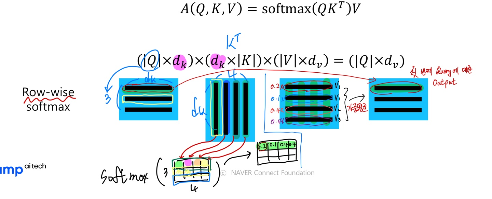

**Day 1**
===

- 학습 강의 : 
- 과제 : 

## 1. 강의 복습
### **NLP**  

**7강 : Transformer (1)**
- RNN은 Long-Term Dependency가 존재해서 이를 해결하기 위한 트릭으로 Bi-Directional RNNs 가 등장

    - 하지만 모델이 너무 무거워지고 학습하는데 많은 시간이 걸린다는 문제점이 존재
- Transformer model은 이러한 RNN model을 단점을 해결하기 위한 등장한 모델로 기존 Seq2seq with attention에서처럼 추가적인 module로 Attention을 활용하는 것이 아닌 Self-Attention만을 사용하여 학습을 할 수 있도록 구성했다.

    - 각 단어의 embedding vector가(I, go, home) Self-Attention을 거치면서 encoding되고 전체 문장의 sequence를 잘 반영한 output vector($h_1$, $h_2$, $h_3$)가 생성된다.
    - **$W^Q$ Metrix를 이용해 embedding vector를 선형변환한 것을 query vector라 한다.** 선형변환을 통해 query vector를 생성함으로써 다양한 가중치를 줄 수 있게 됐다. Seq2seq with attention에서 decoder의 hidden state vector 역할을 한다.
    - **$W^K$ Metrix를 이용해 embedding vector를 선형변환한 것을 key vector라 한다.** 이 벡터는 query vector와 내적연산을 통해 전체 sequence를 고려한 유사도를 구한다. Seq2seq with attention에서 encoder의 각 time step의 hidden states vector 역할을 한다.
    - 위에서 구한 유사도 vector를 softmax를 취해주면 가중치 vector가 된다.
    - **$W^V$ Metrix를 이용해 embedding vector를 선형변환한 것을 value vector라 한다.** 이 벡터를 가중치 벡터와 연산하여 선형 결합해주면 최종적인 encoder vector가 나온다.
    - 같은 embedding vector(I, go, home)이더라도 $W^Q$, $W^K$, $W^V$를 통해 Linear transformation을 진행해줌으로써 서로 다른 역할을 하는 벡터(Query, Key, Value)가 될 수 있다. 이러한 확장성 때문에 유연하게 유사도를 구하는 것이 가능해졌다.
    - key vector와 value vector 간의 관계를 살펴보자. query vector와 $k_1$이라는 key vector가 내적연산을 통해 유사도를 구하게 되면 이 유사도는 $v_1$이라는 value vector에 적용이 되어서 최종 결과가 나타난다. **즉 key vector의 개수와 value vector의 개수는 일치해야 한다는 것을 의미한다.**하지만 개수가 일치한다고 해서 둘의 차원이 같을 필요는 없다. value vector의 차원이 곧 output vector의 차원을 의미한다. value vector에 곱해지는 수치는 결국 key vector를 통해 구한 가중치 값(scalar)이기 때문이다.
    - 결론적으로 출력으로 나오는 output vector들은 전체 sequence의 각 단어 embedding vector에 대한 정보를 가중치에 따라 평균낸 vector이다.
    - 이는 sequence의 길이에 영향없이 sequence의 모든 정보를 취합할 수 있기 때문에 RNN의 Long-Term dependency를 근본적 해결했다고 볼 수 있다.
- 위 경우는 하나의 query vector에 따른 Self-Attention을 보여준 것이고 실제 행렬 연산 관점에서 바라보면 다음과 같다.

- 위 내용을 간단하게 요약하면 다음과 같다.
    1. Inputs은 Query vector $q$와 전제 Key-Value vectors 쌍이다.
    2. Output은 Value vector에 대한 가중 평균이다.
    3. 가중 평균에 쓰이는 가중치는 Query vector와 Value vector에 해당하는 Key vector의 내적이다.
    4. Query vector와 Key vector는 내적을 하기 때문에 차원이 같다.
    5. Value vector의 차원은 Output vector의 차원을 결정하고 Key vector 차원과는 무관하다.
    
- Query vector를 한 개에서 다수의 Query로 보고 행렬 연산 관점에서 보면 다음과 같다.

    - 행렬 연산을 위해 Key Metrix를 Transpose한 것을 알 수 있다.
- 그림으로 표현하면 다음과 같다.

    - 최종적으로는 **Scaled Dot-Product Attention**을 사용한다.
    - $A(Q, K, V)=\operatorname{softmax}\left(\frac{Q K^{T}}{\sqrt{d_{k}}}\right) V$
    - Query vector와 Key vector의 차원에 따라 분산이 결정되는데 이 분산이 크면 Softmax 함수를 취했을 때 어느 값에 치우쳐지는 경향이 존재한다.
    - 그렇기 때문에 $\sqrt{d_{k}}$로 나눠서 Query vector와 Key vector의 차원에 관계없이 분산을 1로 유지해준다.

 

## 2. 새로 알게된 내용 / 고민한 내용 (강의, 과제, 퀴즈)
- **실습코드 : **

## 3. 참고할 만한 자료
- **부스트코스 제공 자료**
  - [Attention is all you need, NeurIPS'17](https://arxiv.org/abs/1706.03762)
  - [Illustrated Transformer](http://jalammar.github.io/illustrated-transformer/)

- **슬랭 공유 자료 및 참고 자료**
  - [논문 코드 구현](https://github.com/bentrevett/pytorch-sentiment-analysis)

## 4. 피어세션
- 
- 자세한 내용은 [Peer Session](https://diagnostic-offer-ddb.notion.site/9-6-4bbb9980d82c461d9005ece5284fcc17) 참조

---
---
